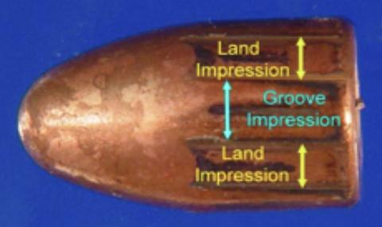
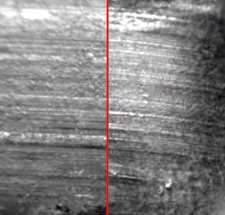

# Working with microscope scans

##  Outline

- working together
- file formats
- file access

## Working together

CSAFE has a github organization: https://github.com/CSAFE-ISU

Please email Sam (sctyner) your github handle to get signed up as members

The slides for today are in the *slides* repo (pull it/fork it) or follow along on https://csafe-isu.github.io/slides/01_intro-to-scans/intro-x3p.html


## A bit of motivation

Main goal: same source problem, i.e. were two bullets fired from the same barrel?

|          |             | 
| ------------- |:-------------:| 
|      |  | 


- Once class characteristics of two bullets are shown to be the same, individual characteristics are assessed.
- The striations that identify a bullet to a gun barrel are located in the **land engraved areas** (Xie 2009).
- traditionally comparison based on  #striae (e.g. CMS, Biasotti 1959) and width of striations


## Can we automate the process of matching individual characteristics?

Goal: fully automate the matching

pros: 

- removes subjectivity from the assessment
- assigns score rather than match/no-match(/inconclusive) + distribution
- identifies matching parameters


```{r,echo=FALSE, message=FALSE,warning=FALSE}
library(bulletr)
library(tidyverse)
library(ggplot2)
library(knitr)
library(plotly)
opts_chunk$set(fig.height=2.5, echo = FALSE)

```

## Data Format

- 3D topographical image of each land (here: a bullet has six lands)
- x3p format, array of surface measurements at the micrometer level (ISO/DIS 25178-72, OpenFMC)

```{r, echo = FALSE, warning = FALSE, fig.height = 4}
b1 <- read_x3p("data/Br1 Bullet 1-5.x3p")
surf.b1 <- b1[[2]]
minrows <- min(nrow(surf.b1))
surf.mat <- surf.b1[1:minrows,]

x_idx <- seq(1, nrow(surf.mat), by = 2)
y_idx <- seq(ncol(surf.mat),1, by = -2)
surface <- surf.mat[x_idx, y_idx]
p <- plotly::plot_ly(z = surface, type = "surface", showscale = FALSE, 
             lighting = list(ambient = 0.5, 
                             diffuse = 0.6, 
                             specular = 0.05, 
                             roughness = 0.9, 
                             fresnel = 0.2))
p
```

## x3p format

```{r, echo=TRUE}
b1 <- bulletr::read_x3p("data/Br1 Bullet 1-5.x3p")
str(b1)
b1$surface.matrix[1:5,1:9]
```

## Functions 

`fortify_x3p` turns x3p in x-y-value format:

```{r, echo=TRUE}
b1_df <- bulletr::fortify_x3p(b1) 
b1_df %>% glimpse()

summary(b1_df)
```

## Scan Profiles

At the *heel* (bottom) of the bullet there is some break-off
```{r, echo=TRUE}
b1_df %>% filter(between(x, 10,20)) %>%
  ggplot(aes(x = y, y = value)) + geom_point(size=.1)
```

## Profiles of bullets

Higher up there is a nicely expressed profile

```{r, echo=TRUE}
b1_df %>% filter(between(x, 100,110)) %>%
  ggplot(aes(x = y, y = value)) + geom_point(size=.1)
```


## Profiles of bullets

Even higher the profile becomes flatter:

```{r, echo=TRUE}
b1_df %>% filter(between(x, 500,510)) %>%
  ggplot(aes(x = y, y = value)) + geom_point(size=.1)
```

## Grooves and Shoulders

The chunks on the left and the right are the *shoulders*. The lowest spots just inside the shoulders are the *grooves*. Automatically identifying the grooves is problematic.

```{r, echo=TRUE, warning=FALSE}
b1_df %>% filter(between(x, 100,101)) %>% 
  bulletr::get_grooves()
```

## Finding grooves is problematic

```{r, echo=TRUE, warning=FALSE}
b1_df %>% filter(between(x, 100,110)) %>% 
  bulletr::get_grooves()
```

## Finding grooves is problematic

`get_crosscut` extracts the profile from the scan that is closest to the specified `x`

```{r, echo=TRUE, warning=FALSE}
get_crosscut(bullet = b1, x = 100) %>% bulletr::get_grooves()
```

## Your turn 

- Install `bulletr` from github: `devtools::github_install("erichare/bulletr")`
- Investigate object `br411`. Which format is it?
- Plot a profile for `br411` and identify grooves

## Accessing the data

Three major sources:

- NIST ballistics database: https://tsapps.nist.gov/NRBTD/Studies/Search
data in x3p
- database of processed Hamby study (just bullet lands)
- data from our local microscope

## Local database

You will need to log in to the RStudio server at https://isu-csafe.stat.iastate.edu/rstudio/

```{r, eval=FALSE, echo = TRUE}
library(RMySQL)

###
### DB Connection
###
dbname <- "bullets"
user <- "buser"
password <- readLines("buser_pass.txt")
host <- "127.0.0.1"

con <- src_mysql(dbname, host, user=user, password=password)
```

## Database schematic


## Your Turn

- Log into the csafe RStudio server at https://isu-csafe.stat.iastate.edu/rstudio/
- Open the file `scripts/database-access.R` (on the `slides` repo) and try out the code

## Our 'own' data

Files hosted temporarily on the Isilon server

smb://my.files.iastate.edu/las/research/csafe

Instructions for mounting file space: https://researchit.las.iastate.edu/how-mount-folders-isilon

## Reading local scans

Files are in x-y-value format `.dat`

```{r, eval = FALSE, echo = TRUE}
b2 <- read_dat("/Volumes/csafe/bullet-scans/land-replicate/H44-GX-1b.dat")
head(b2)
```
