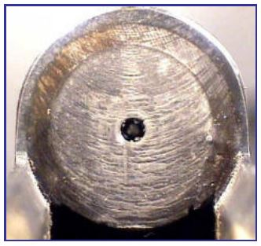
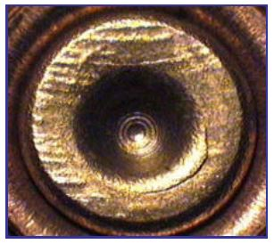
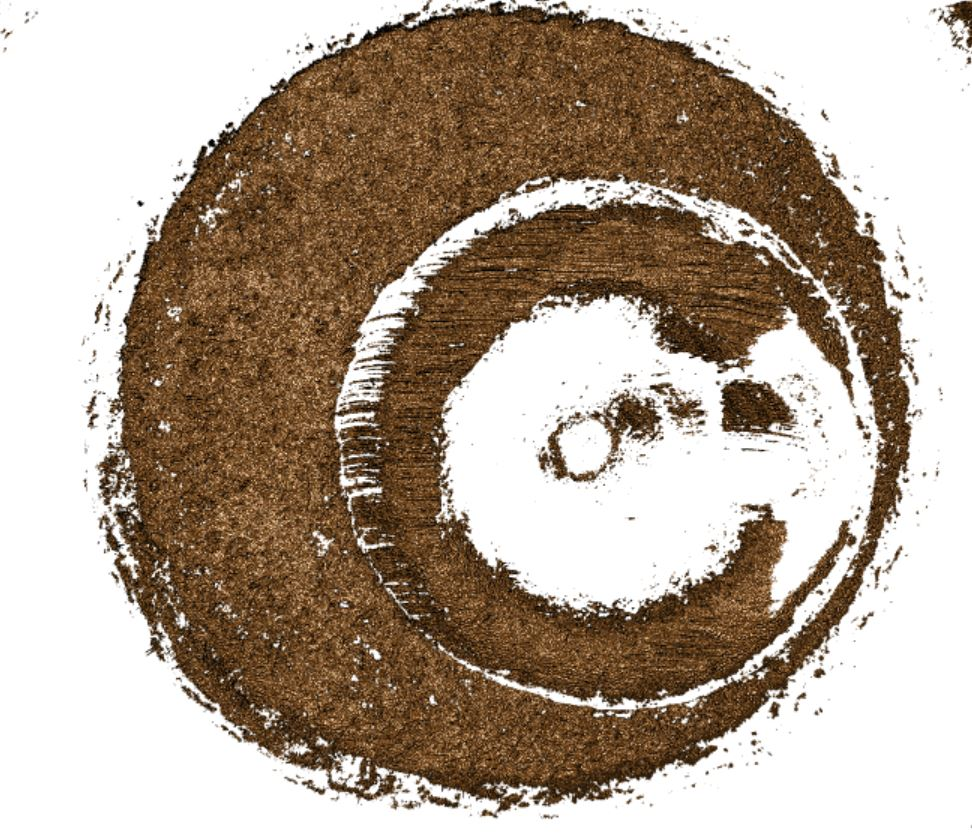
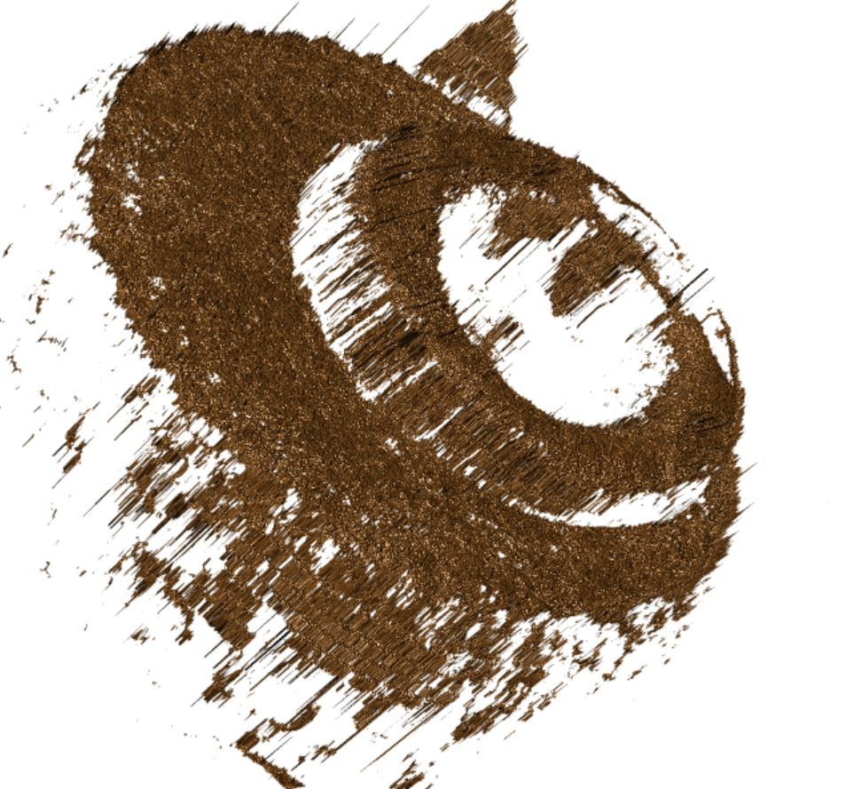
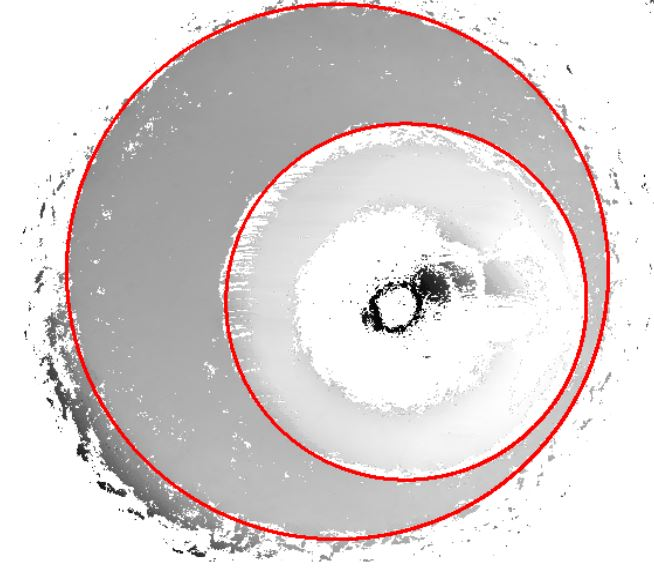
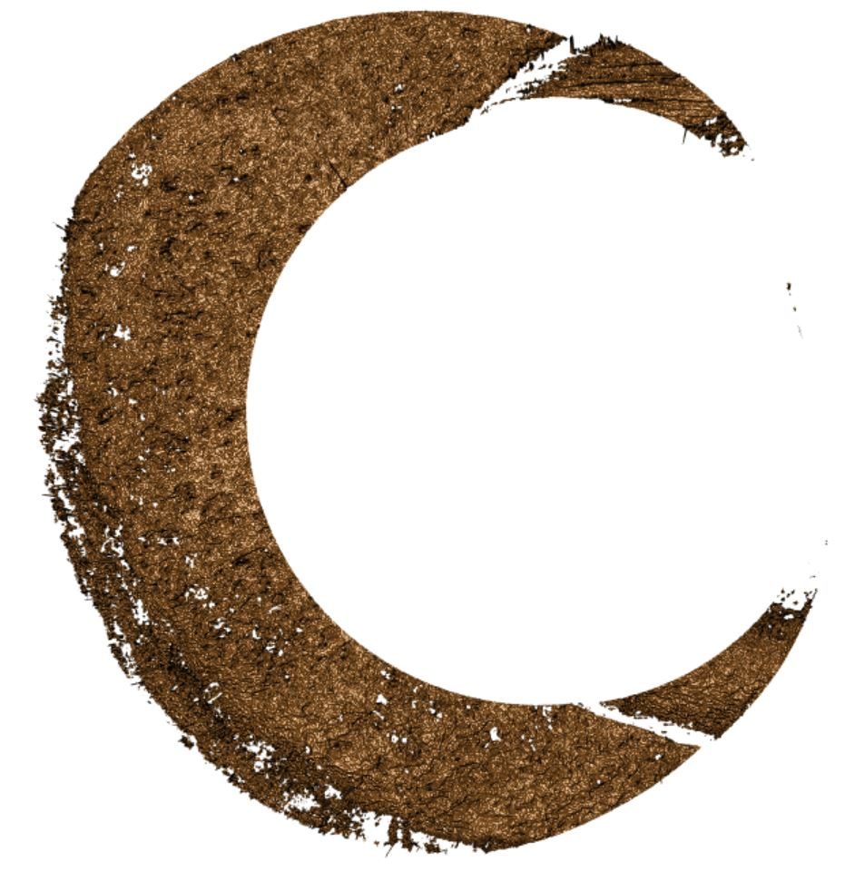

class: primary
# Overview
Faculty
- Heike Hofmann
- Susan VanderPlas

Graduate Students

- Ganesh Krishnan
- Kiegan Rice (& Nate Garton)
- Charlotte Roigers
- Joe Zemmels


Undergraduates

- Talen Fisher (fix3p)
- Mya Fisher, Allison Mark, Connor Hergenreter, Carley McConnell, Anyesha Ray (scanner)

---
class: primary
# News

- Talen was awarded with the **2019 Dean's High Impact Award for Undergraduate Research**

- Three summer REUs from HCI (Ganesh will supervise) [link to project description]

- AFTE is the week after Hands-on - proposals for abstracts are due April 15

---
class: primary
# Update from the lab

- **scans from bullet lands (about 20,000 total)**

    - LAPD: 4 bullets per barrel for 426 out of 626 firearms
    - Hamby Sets 10, 36, 44, 224, and a clone (35 bullets each)
    - Houston test sets (6 kits with 25 bullets each)
    - Houston persistence: 8 barrels with 40 fired bullets each
    - St Louis persistence: 2 barrels with 192 fired bullets each
    - most of the CSAFE persistence study 
    
- **and cartridge cases**

    - DFSC (about 2000)
    - getting ready to scan cartridges for CSAFE persistence
    
---
class: primary
# Computational tools

---
class: inverse
# Ganesh

---
class: primary   
# Project Updates

Projects
- *User Interface for Diagnostics in the Bullet matching pipeline*
 - Demonstration
- *Markov Random Field based identification of irregularities in Bullet Lands*
  - Completed an initial Implementation of an Unsupervised MRF and Expectation Maximization method.
  - Tested on one land png, Need to test on better quality data land surface matrix
  - working on improving Initial label set and Priors for the method, heavily affects the performance of the method. 
- *Book Chapter on Toolmarks*
  - Writing the book chapter on toolmarks for the ROpenSci book
- *Chumbley Non-random Bullet-to-Bullet scoring* 
  - Coerce all windows into a new statistical test for bullets


---
class: inverse
# Nate


---
class: primary
# Bayesian Changepoint Groove ID

- Automated groove detection using Bayesian changepoint analysis 
- Think of points where groove meets land as parameters in a model defined piecewise
- Likelihood is not continuous wrt the changepoint locations 
- Account for local structure with dependent errors 
    
---
class: primary
# bulletcp

- R package to perform the following steps
  - Potentially remove global structure using Kiegan's robust LOESS
  - Impute missing data so that observations are equally spaced
  - Run 4 MCMCs to fit a model with 0 grooves, 1 left or 1 right groove, and 2 grooves
  - Simultaneously select the number of grooves and the groove locations using MAP estimates
  
---
class: secondary
# bulletcp demo

```{r, eval = FALSE}
install.packages("bulletcp")
library(bulletcp)
library(ggplot2)
data(example_data)
d <- raw_data[seq(from = 1, to = nrow(raw_data), by = 15),]
grooves <- get_grooves_bcp(x = d$x, value = d$value, adjust = 20)

g <- ggplot(data = d) +
  geom_point(mapping = aes(x = x, y = value)) +
  geom_vline(mapping = aes(xintercept = grooves$groove[1])) +
  geom_vline(mapping = aes(xintercept = grooves$groove[2]))
g
```

---
class: secondary
# Issues

- Random walks are inefficient optimization tools
- Posterior is multimodal


---
class: inverse
# Kiegan

---
class: primary   
# Project Background
 
My responsibilities on the bullet project: 

- Automated groove ID methods 
    - Publishing work  
- Scanning Variability Study  
    - Pilot study data analysis  
    - Study design and implementation  
    - Model development  
    - Data analysis  
    - Publishing work  
- Neural nets applied to 3D scan processing  
    - This is a future project!  

---
class: primary   
# Project Updates: GROOVE ID 

Two papers in preparation:  

- AFTE Journal Paper on initial groove ID methods  
    - In the editing/submission preparation stage  
    - "Less" technical version, shorter 
- JFS or FSI Paper on "final" groove ID methods
    - Joint work with Nate
    - Two-Class Classification Method
    - Bayesian Changepoint Method (Nate)
    - Pairwise results comparison on 3 bullet test sets  

---
class: primary   
# Project Updates: VARIABILITY STUDY 

- *study background*  
- *study design*
- *data collection progress?*
- *pilot study data results*


---
class: inverse
# Joe

---
class: primary
# Project Updates

---
class: primary
# Cartridge Cases: Overview

  - A cartridge case is the metal casing that holds the component parts (projectile, propellant, etc.) of a cartridge together.

  - When the head or base of the cartridge case moves rearward, it strikes what is called the breech face of the firearm.

  - Forensic examiners claim that cartridge cases can be matched/identified by the impressions that are left on the cartridge case by the breech face of the firearm.
  



---
class: primary
## Cartridge Cases: Project Description

  - **Broadly:** Automate the process of matching/identifying cartridge cases based on breech face impressions.

  - **Currently:** Implement and improve upon a procedure developed by Xiao Hui, a CSAFE alumn from Carnegie Mellon, for 2D scans of cartridge cases to 3D topographical scans.

  - **Far down the road:** Develop new methods (a la Hare et. al) to match/identify cartridge cases.




---
class: primary
## Cartridge Cases: Implementation

(1) Automatically identify the breech face impression region

 - RANSAC, Canny edge detector + Hough transform, ideas?
 
--

(2) "Clean" the breech face impression region

 - Adjust for lighting, remove "circular symmetry" and outliers
 
--

(3) Match an unknown breech face scan to a set of known breech face scans by maximizing the cross-correlation function through rotations/translations.

  - **Issue:** CCF may be small over entire region, especially with inconsistent scans.

  - **Improvement:** Congruent Matching Cells method. Break up two breech face scans into regions and count the number of highly correlated regions. Call the breech face scans a match if this count exceeds some threshold.
  
--
  
(4) Non-parametrically calculate a "p-value" of obtaining a higher CCF score by chance using a known database of firearm-labeled cartridge cases.

  - **Issue:** To what distribution do we compare the similarity score? Do we consider all pairwise comparisons of cartridge cases of the same brand and fired by the same gun? Do we allow for different cartridge case brands or different guns?

---
class: primary
## Cartridge Cases: Hough Transform




---
class: inverse
# LateBreak


---
class: primary
# Late Break News
    
---
class: inverse
# Issues

---
class: secondary

- [Issues!!](https://github.com/CSAFE-ISU/slides/issues)
- One issue down, three to go.

```{r, eval=FALSE, echo=FALSE}
## Presenters
presenter <- 
  c("Soyoung", "Amy", "Ben", "Nick", 
    "Ganesh", "Nate", "Sam", 
    "James", "Kiegan", "Danica", "Susan", 
    "Miranda")

## Set seed as the date (mmdd)
set.seed(1105)

## Shuffle presenters
sample(presenter)
```

