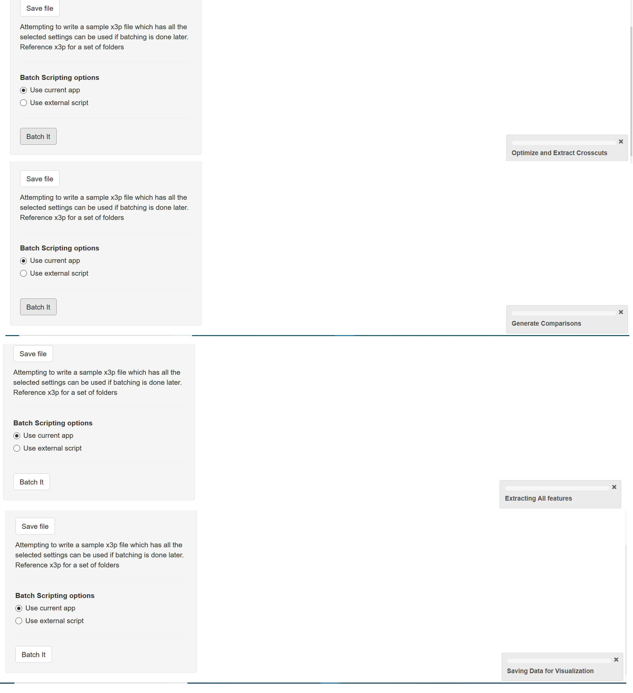

class: primary
# Overview
Faculty
- Heike Hofmann
- Susan VanderPlas

Graduate Students

- Ganesh Krishnan
- Kiegan Rice (& Nate Garton)
- Charlotte Roigers
- Joe Zemmels


Undergraduates

- Talen Fisher (fix3p)
- Mya Fisher, Allison Mark, Connor Hergenreter, Carley McConnell, Anyesha Ray (scanner)

---
class: primary
# News

- Talen was awarded with the **2019 Dean's High Impact Award for Undergraduate Research**

- Three summer REUs from HCI (Ganesh will supervise) [link to project description]

- AFTE is the week after All-Hands - proposals for abstracts are due April 15

---
class: primary
# Bullet projects - Big picture 

- **data collection**

- **computational tools**

- matching lands: 

    1. crosscut identification
    2. **groove location**
    3. curvature removal
    4. alignment of signatures
    5. feature extraction
    6. matching with trained Random Forest

- **analysis of results**

- **communication of results**

---
class: primary
# Update from the data collection

- **scans from bullet lands (about 20,000 total)**

    - LAPD: 4 bullets per barrel for 426 out of 626 firearms
    - Hamby Sets 10, 36, 44, 224, and a clone (35 bullets each)
    - Houston test sets (6 kits with 25 bullets each)
    - Houston persistence: 8 barrels with 40 fired bullets each
    - St Louis persistence: 2 barrels with 192 fired bullets each
    - most of the CSAFE persistence study 
    
- **and cartridge cases**

    - DFSC (about 2000)
    - getting ready to scan cartridges for CSAFE persistence
    
- **shooting range**
    
    - we are planning to go out to the range one more time to finish up the persistence study
---
class: primary
# Computational tools

- **fix3p**:  Chrome extension by Talen Fisher

    demo

- **x3ptools**

    - on CRAN in version 0.0.2 since Mar 27
    
    - working with masks: color images overlaid on top of the rendered scan surface
    


---
class: primary
# x3ptools

- change to the structure: x3p objects now have a slot called `mask` (raster image)

  
- **new functions**

  - `x3p_add_mask`: for a new mask (you shouldn't need that), but you can make changes to the mask with any image operation

  - `x3p_snapshot (file)`: save a snapshot of the active rgl device  in a (png) file

  - `x3p_darker`, `x3p_lighter`: darken/lighten the active rgl device
  
  - `x3p_show_xml`, `x3p_modify_xml()`: show and modify elements of the meta file

---
class: primary
# x3ptools

- **word of caution**:

  the addition of masks to `x3ptools` has impacts on a lot of other functionality. 

     - `sample_x3p` works fine (mask is being sub-sampled)
     
     - `y_flip_x3p` does NOT flip the mask. This is a bug and will be fixed.
  
  Please watch out for strange behavior and report.


- **immediate future changes**:

  all functions of the form `xxx_x3p` will be changed to `x3p_xxx` 

---
class: inverse
# Ganesh

---
class: primary   
# User Interfaces #1

*User Interface for the batching transformations on land images, striation extraction and batching*
  - Data generation, Initial Diagnostics for visualization
  - Process involves
    - View a sample bullet land
    - Identify the problems in scaling, transformations, or anyother issues
    - Select all bullet folders with corresponding lands that you seek to compare
    - Rectify or make changes to the sample, Batch operation
    
---
class: primary
# User Interfaces #1: Load view


---
class: primary
# User Interfaces #1


---
class: primary
# User Interfaces #1: Transformations


---
class: primary
# User Interfaces #1: Views


---
class: primary
# User Interfaces #1: Extraction stages




---
class: secondary
# User Interfaces 2

*Interactive User Interface for Diagnostics in the Bullet matching pipeline*
 - Uses the data generated by the previous app 
 - Identifications of problems by visualizing
  - Bullet-to-bullet scores
  - Land-to-land scores
  - Images with or without crosscut 
  - Signatures for Alignment
  - Profiles Groove cut-off position


---
class: primary
# User Interfaces 2


---
class: primary
# User Interfaces 2


---
class: primary
# User Interfaces 2


---
class: primary
# Book Chapter

- *Working on draft for a Book Chapter on Toolmarks*
  - Brief Introduction to toolmarks in forensics
  - Implementations in R and a brief overview of the algorithmic working of
   the chumbley score methods (Krishnan-Hofmann; Hadler-Morris)
  - One data set from Ames lab on screwdriver marks available
  - Diamond thresholding in Jeremy's thesis and making a use case example of it
  
---
class: primary
# Chumbley Non-random Bullet-to-Bullet scoring

*Chumbley Non-random Bullet-to-Bullet scoring* 
  - Expansion of the last paper 
  - Collecting all runs form previous paper

*To do*
  - Getting the results of the two most significant steps of the algorithm
  - Bullet wise land matching and then bullet to bullet sequential land matching (or n)
  - Coerce all windows corresponding to 6 lands of a bullet into a new nonparametric statistical test for bullets.


---
class: inverse
# Nate


---
class: primary
# Bayesian Changepoint Groove ID

- Automated groove detection using Bayesian changepoint analysis 
- Think of points where groove meets land as parameters in a model defined piecewise
- Likelihood is not continuous wrt the changepoint locations 
- Account for local structure with dependent errors 
    
---
class: primary
# bulletcp

- R package to perform the following steps
  - Potentially remove global structure using Kiegan's robust LOESS
  - Impute missing data so that observations are equally spaced
  - Run 4 MCMCs to fit a model with 0 grooves, 1 left or 1 right groove, and 2 grooves
  - Simultaneously select the number of grooves and the groove locations using MAP estimates
  
---
class: secondary
# bulletcp demo

```{r, eval = FALSE}
install.packages("bulletcp")
library(bulletcp)
library(ggplot2)
data(example_data)
d <- raw_data[seq(from = 1, to = nrow(raw_data), by = 15),]
grooves <- get_grooves_bcp(x = d$x, value = d$value, adjust = 20)

g <- ggplot(data = d) +
  geom_point(mapping = aes(x = x, y = value)) +
  geom_vline(mapping = aes(xintercept = grooves$groove[1])) +
  geom_vline(mapping = aes(xintercept = grooves$groove[2]))
g
```

---
class: secondary
# Issues

- Random walks are inefficient optimization tools
- Posterior is multimodal


---
class: inverse
# Kiegan

---
class: primary   
# Project Background
 
My responsibilities on the bullet project: 

- Automated groove ID methods 
    - Publishing work  
- Scanning Variability Study  
    - Pilot study data analysis  
    - Study design and implementation  
    - Model development  
    - Data analysis  
    - Publishing work  
- Neural nets applied to 3D scan processing  
    - This is a future project!  

---
class: primary   
# Project Updates: GROOVE ID 

Two papers in preparation:  

- AFTE Journal Paper on initial groove ID methods  
    - In the editing/submission preparation stage  
    - "Less" technical version, shorter 
- JFS or FSI Paper on "final" groove ID methods
    - Joint work with Nate
    - Two-Class Classification Method
    - Bayesian Changepoint Method (Nate)
    - Pairwise results comparison on 3 bullet test sets   

---
class: primary   
# Project Updates: VARIABILITY STUDY  

Goal of automated methods is to reduce human involvement in decision making.  

Some things need to be quantified about the automated bullet matching process:  
- Potential impact of different humans scanning LEAs 
- Potential impact of different machines 
- Whether differences impact raw data, processed data
- Whether differences impact similarity scores


---
class: primary   
# Project Updates: VARIABILITY STUDY  

Had some pilot study data to work with! I've shown this before as signatures:  
  


---
class: primary   
# Project Updates: VARIABILITY STUDY  

  


---
class: primary   
# Project Updates: VARIABILITY STUDY  

Data collection is in progress! 
- 9 bullets 
    - 3 bullets each from 3 barrels
- 5 operators
- 2 machines
- 5 repetitions per operator/machine  


---
class: primary   
# Project Updates  

What's up next?  
- Priority is *publishing*!!  
- Keeping an eye on data collection  
- Standard bullet scans  
- 3D alignment work  
- Getting pilot analysis code cleaned up   
- Thinking about framework for R&R, quality metrics   
   - Package, shiny application, etc...  
- Starting to look at "markup" LEA scans  
    - This data will be used for neural net project   
- Not bullets, but also diving back into the book!  


---
class: inverse
# Joe

---
class: primary
# Cartridge Cases: Overview

  - A cartridge case is the metal casing that holds the component parts (projectile, propellant, etc.) of a cartridge together.

  - When the head or base of the cartridge case moves rearward, it strikes what is called the breech face of the firearm.

  - Forensic examiners claim that cartridge cases can be matched/identified by the impressions that are left on the cartridge case by the breech face of the firearm.
  


---
class: primary
# Cartridge Cases: Project Description

  - **Broadly:** Automate the process of matching/identifying cartridge cases based on breech face impressions.

  - **Currently:** Implement and improve upon a procedure developed by Xiao Hui, a CSAFE alumn from Carnegie Mellon, for 2D scans of cartridge cases to 3D topographical scans.

  - **Far down the road:** Develop new methods (a la Hare et. al) to match/identify cartridge cases.


---
class: primary
# Cartridge Cases: Implementation

(1) Automatically identify the breech face impression region

 - RANSAC, Canny edge detector + Hough transform
 
--

(2) "Clean" the breech face impression region

 - Adjust for lighting, remove "circular symmetry" and outliers
 
--

(3) Match an unknown breech face scan to a set of known breech face scans by maximizing the cross-correlation function through rotations/translations.

  - **Issue:** CCF may be small over entire region, especially with inconsistent scans.

  - **Improvement:** Congruent Matching Cells method. Break up two breech face scans into regions and count the number of highly correlated regions. Call the breech face scans a match if this count exceeds some threshold.

---
class: primary
# Cartridge Cases: Implementation

(4) Non-parametrically calculate a "p-value" of obtaining a higher CCF score by chance using a known database of firearm-labeled cartridge cases.

  - **Issue:** To what distribution do we compare the similarity score? Do we consider all pairwise comparisons of cartridge cases of the same brand and fired by the same gun? Do we allow for different cartridge case brands or different guns?

---
class: primary
# Cartridge Cases: Hough Transform


---
class: primary
# Cartride Cases 

Using heights in scans: 


---
class: primary
# Cartride Cases 

Using heights in scans: 


---
class: primary
# Cartride Cases 

Using heights in scans: 


---
class: inverse
# Charlotte
---

class: primary
# Bullet Quality Overview

- **Goal:** To automate the process of identifying "good" and "bad" quality regions of bullet scans using computer vision algorithms.

- **Process:**
  - Prep images using gradient thesholding
  - Perform a Hough Transform on edges to identify 

- **Future:** 
  - Improve image separation process between Hough transforms and watershed segmentation
  - Re-run and canny edge detection and hough transform to try and actually detect striations
---
class: primary
# Edge Detection


---
class: primary
# Hough Transform


---
class: primary
# Watershed Algorithm


---

class: inverse
# LateBreak


---
class: primary
# Late Break News
    
---
class: inverse
# Issues

---
class: secondary

- [Issues!!](https://github.com/CSAFE-ISU/slides/issues)
- One issue down, three to go.

```{r, eval=FALSE, echo=FALSE}
## Presenters
presenter <- 
  c("Soyoung", "Amy", "Ben", "Nick", 
    "Ganesh", "Nate", "Sam", 
    "James", "Kiegan", "Danica", "Susan", 
    "Miranda")

## Set seed as the date (mmdd)
set.seed(1105)

## Shuffle presenters
sample(presenter)
```

