class: primary
# Overview
Faculty
- Heike Hofmann
- Susan VanderPlas

Graduate Students

- Ganesh Krishnan
- Kiegan Rice
- Charlotte Roigers
- Joe Zemmels


Undergraduates

- Talen Fisher (fix3p)
- Mya Fisher, Connor Hergenreter, Carley McConnell, Amy  (scanner)
- REU-sprite: Syema, Tiger, Emmanuelle
- REU-csafe: Andrew, Molly

---
class: primary
# Awards and other News

- Kiegan received a first prize for her poster at All Hands

- Talks at AFTE (Kiegan and Heike) went well, lots of good questions
- More bullets from Prof Hamby: Clones of HS 224 (complete and labelled)


---
class: primary
# Bullet projects - Big picture 

- **data collection**

- **computational tools**

- matching lands: 

    1. crosscut identification
    2. **groove location**
    3. curvature removal
    4. alignment of signatures
    5. feature extraction
    6. matching with **trained Random Forest**

- **analysis of results**

- **communication of results**

---
class: primary
# Update from the data collection

- **scans from bullet lands (about 20,000 total)**

    - **LAPD: 4 bullets per barrel for 526 out of 626 firearms**
    - **Variability study: ~2000 scans**
    - Hamby Sets 10, 36, 44, 224, and a clone (35 bullets each)
    - Houston test sets (6 kits with 25 bullets each)
    - Houston persistence: 8 barrels with 40 fired bullets each
    - St Louis persistence: 2 barrels with 192 fired bullets each
    - most of the CSAFE persistence study 
    
- **and cartridge cases**

    - DFSC (about 2000)
    - getting ready to scan cartridges for CSAFE persistence
    
- **shooting range**
    
    - **we were out on the range last week: barrels #4 to #7 (in record time!)**
    - **we are planning to go out to the range one more time to finish up the persistence study**

---
class: primary
# Shooting range

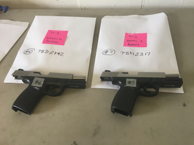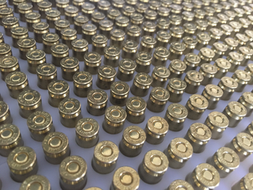
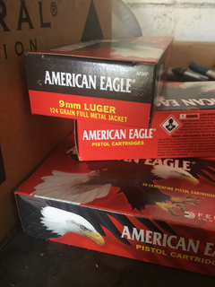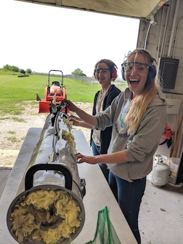

---
class: primary
# Groove identification

Two papers in preparation:  

- (Kiegan) Journal of Forensic Sciences paper on initial groove ID methods  
    - Getting into right format, submitting today or tomorrow!  
    
- (Kiegan and Nate) FSI Paper on advanced groove ID methods
    - Two-Class Classification Method
    - Bayesian Changepoint Method (Nate)
    - Pairwise results comparison on 3 bullet test sets   
    - Cleaning up, getting ready for submission  
    
- Future Work: Hough Transformation (Charlotte) 

---
class: primary
# Overview

Use magnitude thresholding and Hough transform to get groove estimates

.center[
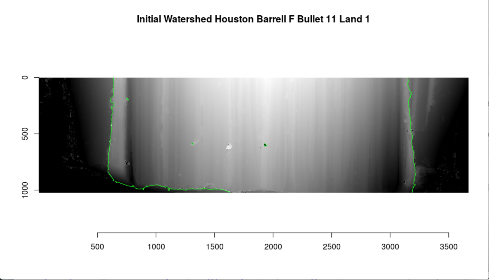
]

---
class: primary
# Hough Transforms

- A computer-vision algorithm that detects aligned points in an image
- Two points on the same line in an image will have the same rho, theta in the feature space.
- Strong edges will have a lot of points along it, therefore a lot of weight at that specific point.
  
.center[
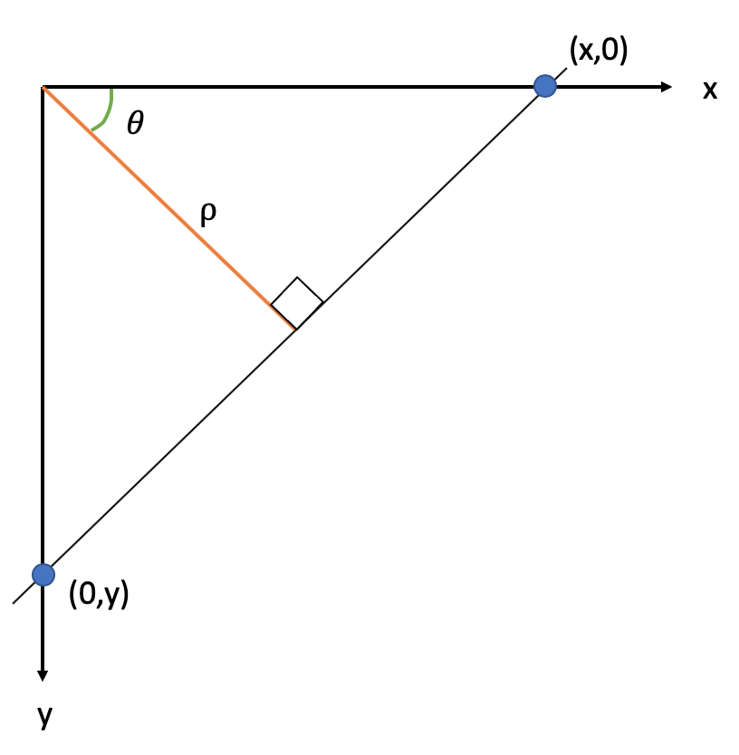
]


---
class: primary
# Hough Transform
.center[
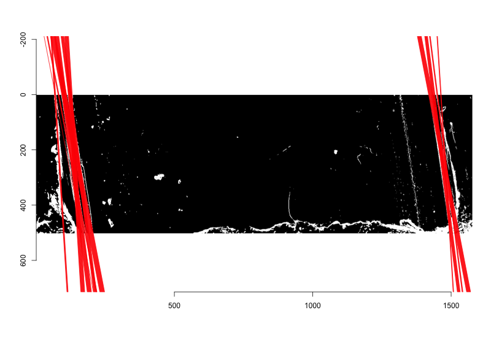
.caption[Hough Transform with Theta Filtering Hamby 252 Bullet 1 Land 3]
]

---
class: primary
# Hough Transform

.center[
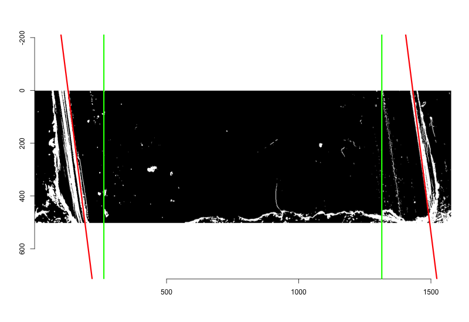
.caption[Hough line closes to middle two-thirds of bullet]
]

---
class: primary
# Hough Transform

- implemented as `get_grooves_hough` function


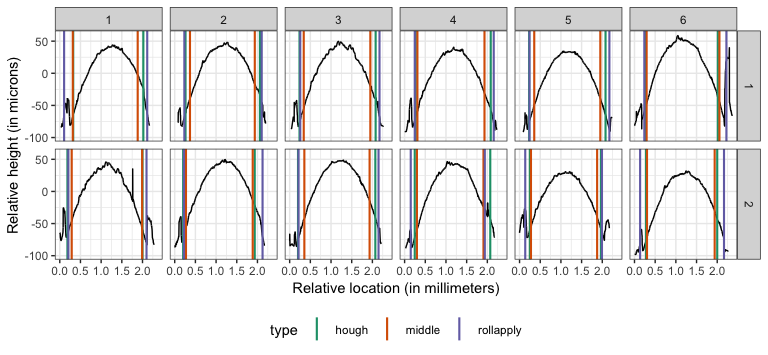

- next step: fine-tuning of parameters, comparison with other methods

---
class: primary
# Computational tools

- **fix3p**:  Chrome extension by Talen Fisher (updated)

- **x3ptools**

- **grooveFinder**

    - implementation of various techniques to identify groove locations
    - github: [heike/grooveFinder](https://heike.github.io/grooveFinder/)
    
    - pull request to `imager` to remove plyr dependency (Susan)

---
class: primary
# Database 

Demo

Specs? - Susan, could you fill some things in here?

---
class: inverse
# Kiegan

---
class: primary   
# Project Background
 
My responsibilities on the bullet project: 

- Automated groove ID methods  
    - **Publishing work**  
- Scanning Variability Study  
    - Pilot study data analysis  
    - Study design and implementation  
    - **Model development**  
    - **Data analysis**  
    - **Publishing work**  

General update:  

- Worked booth and gave a talk at AFTE conference
- Lots of good feedback from people  
- Interest in training for FA/TM examiners  


---
class: primary   
# Project Updates: VARIABILITY STUDY  

Goal of automated methods is to reduce human involvement in decision making.  

Some things need to be quantified about the automated bullet matching process:  
- Potential impact of different humans scanning LEAs 
- Potential impact of different machines 
- Whether differences impact raw data, processed data
- Whether differences impact matching scores


---
class: primary   
# Project Updates: VARIABILITY STUDY  

Data collection COMPLETE!!!!  
- 9 bullets 
    - 3 bullets each from 3 barrels
    - Hamby, Houston, CSAFE Persistence  
- 5 operators
- 2 machines
- 3-5 repetitions per operator/machine  
- ~ 2000 scans to work with. 


---
class: primary   
# Project Updates: VARIABILITY STUDY  


---
class: primary   
# Project Updates: VARIABILITY STUDY  


---
class: primary   
# Project Updates: VARIABILITY STUDY  

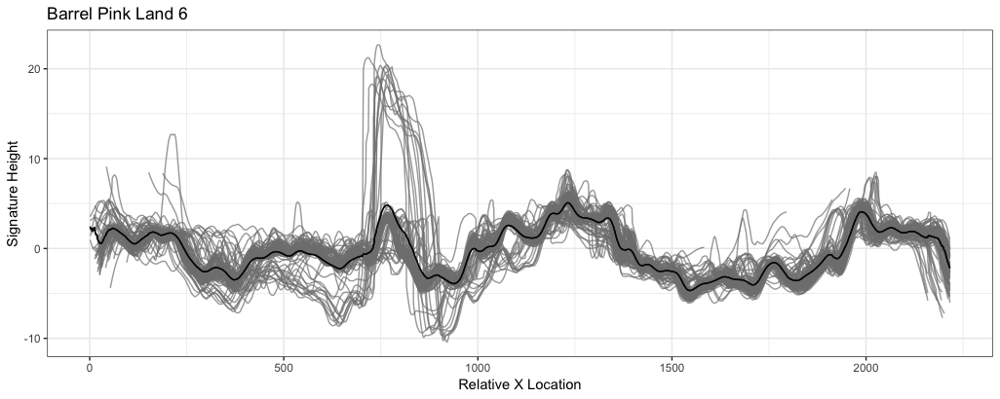

---
class: primary   
# Project Updates: VARIABILITY STUDY  

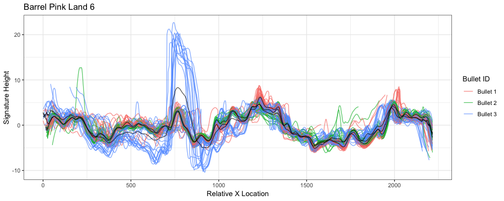


---
class: primary   
# Project Updates: VARIABILITY STUDY  

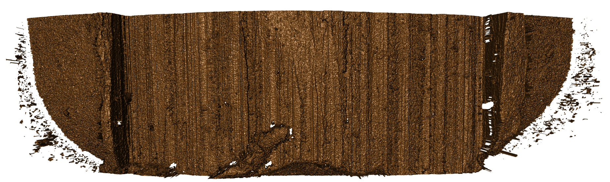


---
class: primary   
# Project Updates  

What's up next?  
- Priority is *publishing*!!  
- Standard bullet scans  
- Thinking about framework for R&R, quality metrics   
   - Package, shiny application, etc...  
- Working on the book

---
class: primary
# REU projects

- REU-Sprite: automatic assessment of scan quality

- REU-csafe: re-factoring of Random Forest model with updated features

---
class: primary
# Scan quality assessment

Lighting issue: 
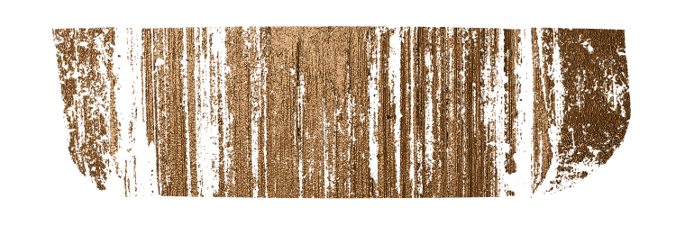

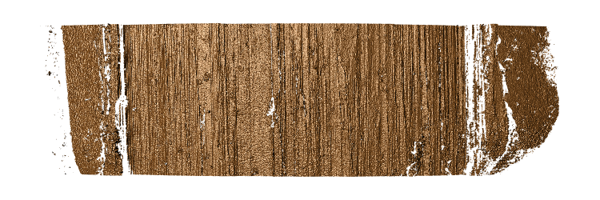

Better, but ...

---
class: primary
# Scan quality assessment

- extract features from scan to determine quality:

    - Number/percentage of missing values
    - location of missing values along horizontal axis

- find good cut-offs based on marginal distribution of features

- build warning system for immediate feedback


---
class: primary
# Random forest re-factoring

- exact feature definition/calculation changed in move from bulletr to bulletxtrctr

- re-run algorithms on Hamby 252 and 173 (NIST scans) 

- compare results from old run to new run

- re-fit Random forest to Hamby 252 and 173, compare scores

- re-fit Random forest on higher-resolution scans 

---
class: inverse
# Ganesh

---
class: primary
# Projects

- Two applications for the bullet matching pipeline  

  - *Interactive user interface for performing transformations, preliminary evaluations, extraction and scoring and batching the operations*  
  
  - *Diagnostics in the bullet matching pipeline using Interactive visualizations *  
  
- Chumbley Non-random Bullet-to-Bullet scoring (presenting at JSM)  


Other things:

- Revision of Book Chapter on Toolmarks  

- Written Prelim this summer  


---
class: primary
# User Interfaces

.center[
## Demo
]


---

class: inverse
# LateBreak


---
class: primary
# Late Break News
    
---
class: inverse
# Issues

---
class: secondary

- [Issues!!](https://github.com/CSAFE-ISU/slides/issues)
- One issue down, three to go.

```{r, eval=FALSE, echo=FALSE}
## Presenters
presenter <- 
  c("Soyoung", "Amy", "Ben", "Nick", 
    "Ganesh", "Nate", "Sam", 
    "James", "Kiegan", "Danica", "Susan", 
    "Miranda")

## Set seed as the date (mmdd)
set.seed(1105)

## Shuffle presenters
sample(presenter)
```

