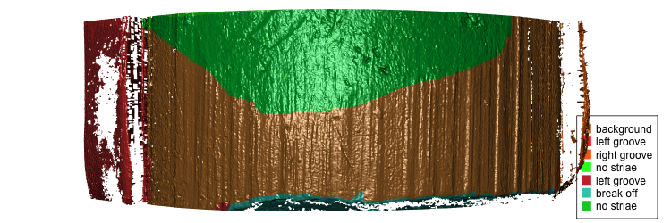
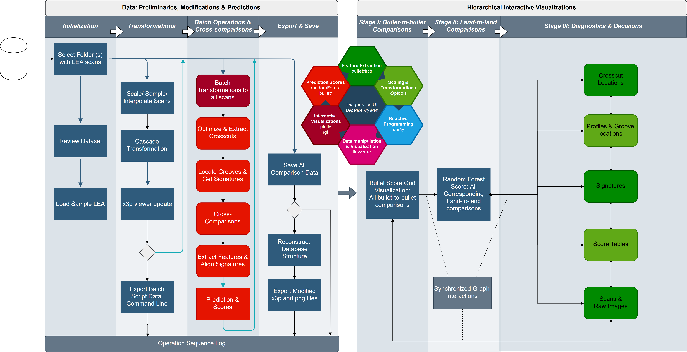

class: primary
# Overview
Faculty
- Heike Hofmann
- Susan VanderPlas

Graduate Students

- Ganesh Krishnan
- Kiegan Rice
- Charlotte Roigers
- Joe Zemmels


Undergraduates

- Talen Fisher (fix3p)
- Mya Fisher, Connor Hergenreter, Carley McConnell, Amy  (scanner)
- Syema, Tiger, Emmanuelle

---
class: primary
# News

- Talen was awarded with the **2019 Dean's High Impact Award for Undergraduate Research**

- Three summer REUs from HCI (Ganesh will supervise) [link to project description]

- AFTE is the week after All-Hands - proposals for abstracts are due April 15

---
class: primary
# Bullet projects - Big picture 

- **data collection**

- **computational tools**

- matching lands: 

    1. crosscut identification
    2. **groove location**
    3. curvature removal
    4. alignment of signatures
    5. feature extraction
    6. matching with trained Random Forest

- **analysis of results**

- **communication of results**

---
class: primary
# Update from the data collection

- **scans from bullet lands (about 20,000 total)**

    - LAPD: 4 bullets per barrel for 426 out of 626 firearms
    - Hamby Sets 10, 36, 44, 224, and a clone (35 bullets each)
    - Houston test sets (6 kits with 25 bullets each)
    - Houston persistence: 8 barrels with 40 fired bullets each
    - St Louis persistence: 2 barrels with 192 fired bullets each
    - most of the CSAFE persistence study 
    
- **and cartridge cases**

    - DFSC (about 2000)
    - getting ready to scan cartridges for CSAFE persistence
    
- **shooting range**
    
    - we are planning to go out to the range one more time to finish up the persistence study
---
class: primary
# Computational tools

- **fix3p**:  Chrome extension by Talen Fisher

    demo

- **x3ptools**

    - on CRAN in version 0.0.2 since Mar 27
    
    - working with masks: color images overlaid on top of the rendered scan surface
    


---
class: primary
# x3ptools

- change to the structure: x3p objects now have a slot called `mask` (raster image)

  
- **new functions**

  - `x3p_add_mask`: for a new mask (you shouldn't need that), but you can make changes to the mask with any image operation

  - `x3p_snapshot (file)`: save a snapshot of the active rgl device  in a (png) file

  - `x3p_darker`, `x3p_lighter`: darken/lighten the active rgl device
  
  - `x3p_show_xml`, `x3p_modify_xml()`: show and modify elements of the meta file

---
class: primary
# x3ptools

- **word of caution**:

  the addition of masks to `x3ptools` has impacts on a lot of other functionality. 

     - `sample_x3p` works fine (mask is being sub-sampled)
     
     - `y_flip_x3p` does NOT flip the mask. This is a bug and will be fixed.
  
  Please watch out for strange behavior and report.


- **immediate future changes**:

  all functions of the form `xxx_x3p` will be changed to `x3p_xxx` 

---
class: inverse
# Ganesh
---
class: primary
# Projects

- Two applications for the bullet matching pipeline  

  - *Interactive user interface for performing transformations, preliminary evaluations, extraction and scoring and batching the operations*  
  
  - *Diagnostics in the bullet matching pipeline using Interactive visualizations *  
  
- Chumbley Non-random Bullet-to-Bullet scoring (presenting at JSM)  


Other things:

- Revision of Book Chapter on Toolmarks  

- Written Prelim this summer  


---
class: primary
# User Interfaces



---
class: primary
# User Interfaces

.center[
## Demo
]

---
class: inverse
# Kiegan

---
class: primary   
# Project Background
 
My responsibilities on the bullet project: 

- Automated groove ID methods  
    - **Publishing work**  
- Scanning Variability Study  
    - Pilot study data analysis  
    - Study design and implementation  
    - **Model development**  
    - **Data analysis**  
    - **Publishing work**  

General update:  

- Worked booth and gave a talk at AFTE conference
- Lots of good feedback from people  
- Interest in training for FA/TM examiners  


---
class: primary   
# Project Updates: GROOVE ID 

Two papers in preparation:  

- Journal of Forensic Sciences paper on initial groove ID methods  
    - Getting into right format, submitting today or tomorrow!  
- FSI Paper on "final" groove ID methods
    - Joint work with Nate - just me for the summer
    - Two-Class Classification Method
    - Bayesian Changepoint Method (Nate)
    - Pairwise results comparison on 3 bullet test sets   
    - Cleaning up, getting ready for submission  

---
class: primary   
# Project Updates: VARIABILITY STUDY  

Goal of automated methods is to reduce human involvement in decision making.  

Some things need to be quantified about the automated bullet matching process:  
- Potential impact of different humans scanning LEAs 
- Potential impact of different machines 
- Whether differences impact raw data, processed data
- Whether differences impact matching scores


---
class: primary   
# Project Updates: VARIABILITY STUDY  

Data collection COMPLETE!!!!  
- 9 bullets 
    - 3 bullets each from 3 barrels
    - Hamby, Houston, CSAFE Persistence  
- 5 operators
- 2 machines
- 3-5 repetitions per operator/machine  
- ~ 2000 scans to work with. 


---
class: primary   
# Project Updates: VARIABILITY STUDY  


---
class: primary   
# Project Updates: VARIABILITY STUDY  


---
class: primary   
# Project Updates: VARIABILITY STUDY  


---
class: primary   
# Project Updates: VARIABILITY STUDY  


---
class: primary   
# Project Updates: VARIABILITY STUDY  


---
class: primary   
# Project Updates  

What's up next?  
- Priority is *publishing*!!  
- Standard bullet scans  
- Thinking about framework for R&R, quality metrics   
   - Package, shiny application, etc...  
- Working on the book


---
class: inverse
# Charlotte
---
class: primary
# Overview


- **Past Method**: Used magnitude thresholding and watershed segmentation to find LEAs

- **Current Method**: Use magnitude thresholding and Hough transform to get groove estimates

.center[

]

---
class: primary
# Hough Transforms

- A computer-vision algorithm that detects aligned points in an image
- Two points appear on the same line in an image will have intersecting lines in the feature space.
- Strong edges will have a lot of points along it, therefore a lot of intersections at that specific point.
  
.center[

]


---
class: primary
# Hough Transform
.center[

.caption[Hough Transform with Theta Filtering Hamby 252 Bullet 1 Land 3]
]

---
class: primary
# Hough Transform

.center[

.caption[Hough line closes to middle two-thirds of bullet]
]

---

class: inverse
# LateBreak


---
class: primary
# Late Break News
    
---
class: inverse
# Issues

---
class: secondary

- [Issues!!](https://github.com/CSAFE-ISU/slides/issues)
- One issue down, three to go.

```{r, eval=FALSE, echo=FALSE}
## Presenters
presenter <- 
  c("Soyoung", "Amy", "Ben", "Nick", 
    "Ganesh", "Nate", "Sam", 
    "James", "Kiegan", "Danica", "Susan", 
    "Miranda")

## Set seed as the date (mmdd)
set.seed(1105)

## Shuffle presenters
sample(presenter)
```

