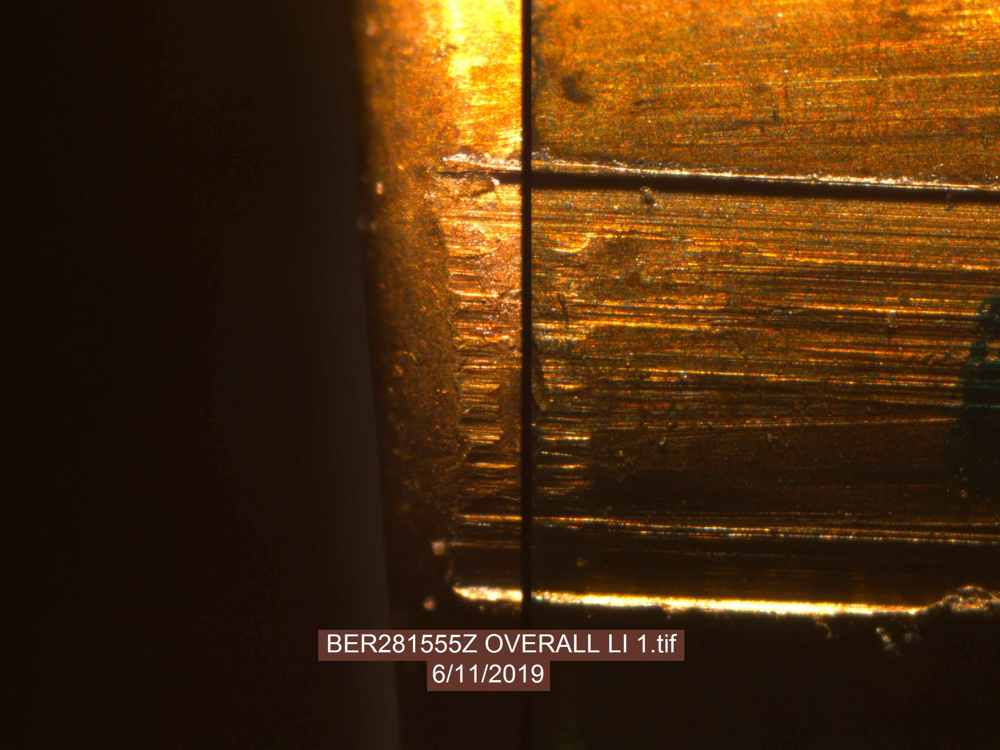
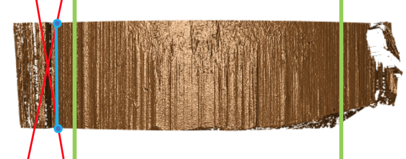
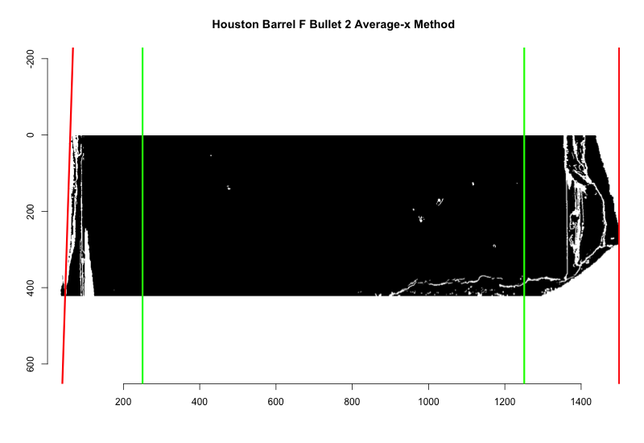
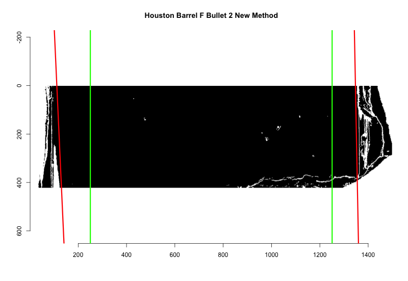
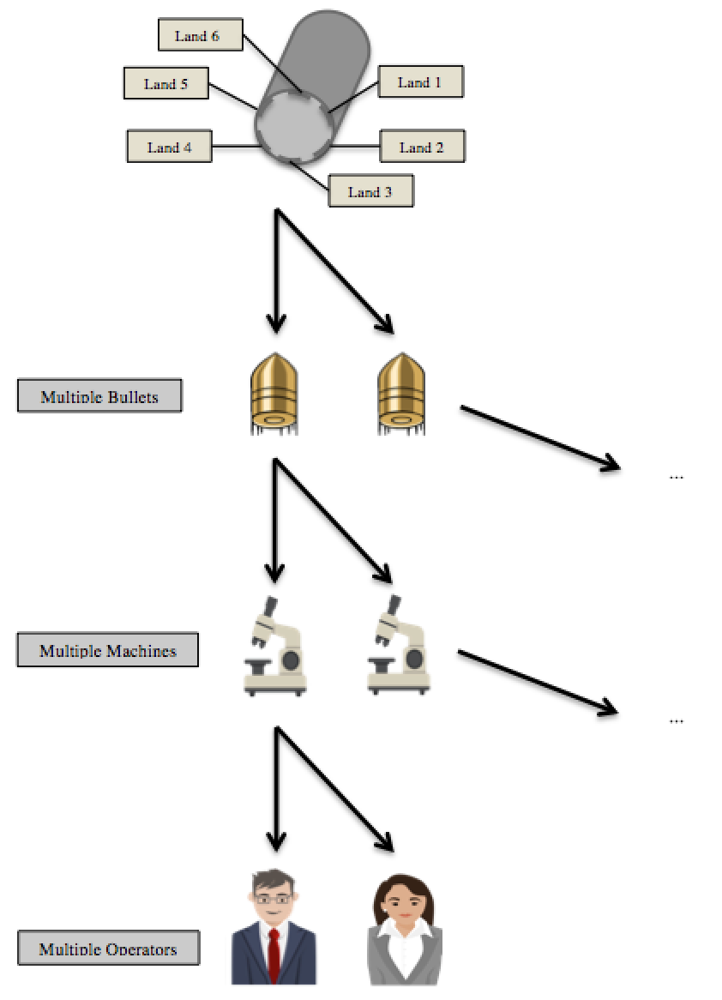
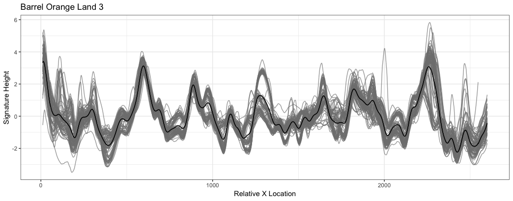
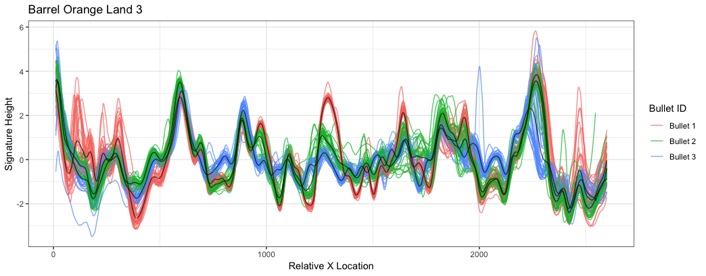

class: inverse
# Ballistics

---
class: primary
# Overview
Faculty
- Heike Hofmann
- Susan VanderPlas

Graduate Students

- Ganesh Krishnan
- Kiegan Rice (& Nate Garton)
- Charlotte Roigers
- (Joe Zemmels)


Undergraduates

- Talen Fisher (fix3p)
- Mya Fisher, Allison Mark, Connor Hergenreter, Carley McConnell, Anyesha Ray (scanner)
- Molly McDermott, Andrew Maloney (REU-CSAFE)
- Syema, Tiger, Emmanuelle (REU-SPRITE)

---
class: primary
# Bullet projects - Big picture 

- **data collection**

- **computational tools**

- matching lands: 

    1. crosscut identification
    2. **groove location**
    3. curvature removal
    4. alignment of signatures
    5. feature extraction
    6. matching with trained Random Forest

- **analysis of results**

- **communication of results**

---
class: primary
# Update from the data collection

- **scans from bullet lands (about 20,000 total)**

    - LAPD: 4 bullets per barrel for **all** of 626 firearms
    - Hamby Sets 10, 36, 44, 224, and a clone (35 bullets each)
    - Houston test sets (6 kits with 25 bullets each)
    - Houston persistence: 8 barrels with 40 fired bullets each
    - St Louis persistence: 2 barrels with 192 fired bullets each
    - most of the CSAFE persistence study 
    
- **and cartridge cases**

    - DFSC (about 2000)
    - getting ready to scan cartridges for CSAFE persistence
    
- **shooting range**
    
    - we are planning to go out to the range *one* more time to finish up the persistence study

---

class: primary
# NEWs

- visit to Vic Murillo from DCI Ankeny 



---

class: primary
# Charlotte: groove detection

- **Goal:** To automate the process of identifying groove engraved areas of bullet scans using computer vision algorithms.

- **Process:**
  - Prep images using gradient thesholding
  - Perform a Hough Transform on edges to identify groove edges
  - Find Hough lines closest to the middle 2/3rds of the bullet scan at the top and bottom of the bullet scan

.center[

]
  
---

class: primary
# Charlotte: groove detection

.center[



]

---

class: primary
# Ganesh: communication of results/diagnostics


---
class: primary
# Kiegan: variability study




---
class: primary
# Kiegan: variability study

Collected ~2000 scans: 
- 9 bullets, 3 each from 3 barrels  
- 6 LEAs per bullet  
- 5 operators  
- 2 machines  
- 3+ repetitions of each environmental condition  

---
class: primary
# Kiegan: variability study  
Example of all 90 repetitions for a single signature.



---
class: primary
# Kiegan: variability study  

Initial results show: 

- Differences between barrel types
     - Deeper striations = larger machine effect  
     - More tank rash/breakoff = larger bullet effect  
- Lots of structure due to bullet
     - Each bullet marks slightly differently
     - Measured "peaks and valleys" differ  

---
class: primary
# Kiegan: variability study  




---
class: primary
# Kiegan: variability study  

Currently working on modeling: 

- At the signature level  
    - Using all X locations, removing overall structure
    - Subsampling to each 100th X location 
         - In 5 different phases to check for consistency
         - model 1: (1, 101, 201,...)
         - model 2: (21, 121, 221,...), etc.

- Pairwise scores
    - Same-source pairwise scores 
    - Different-source pairwise scores 
         - For completeness

- Balanced with 3 repetitions   
- Hierarchically with 3-5 repetitions  
- With/without one operator  


---
class: primary
# Update on REU projects

REU-Sprite: assessment of scan quality

will add anonymized histogram of missing values in variability study

---
class: primary
# REU-CSAFE

**Goal:** Validate `bulletxtrctr` features in comparison to `bulletr` features used to fit the random forest model

**Process:**
- Get Hamby 173 and 252 scans from NIST
- Process scans to get new features using `bulletxtrctr`
- Match new features to old features - what changed?

Currently, trying to match features from Hare et al. (2016) to new features

---
class: inverse
# Next Project


---
class: inverse
# Sam

---
class: primary
# Project Updates

---
class: inverse
# Alicia

---
class: primary
# Project Updates

---
class: inverse
# Soyoung

---
class: primary
# Project Updates

---
class: inverse
# Miranda

---
class: primary
# Project Updates


---
class: inverse
# Danica

---
class: primary
# Project Updates

---
class: inverse
# James

---
class: primary
# Project Updates

---
class: inverse
# Eryn

---
class: primary
# Project Updates

---
class: inverse
# LateBreak


---
class: primary
# Late Break News
    
---
class: inverse
# Issues

---
class: secondary

- [Issues!!](https://github.com/CSAFE-ISU/slides/issues)
- One issue down, three to go.

```{r, eval=FALSE, echo=FALSE}
## Presenters
presenter <- 
  c("Soyoung", "Amy", "Ben", "Nick", 
    "Ganesh", "Nate", "Sam", 
    "James", "Kiegan", "Danica", "Susan", 
    "Miranda")

## Set seed as the date (mmdd)
set.seed(1105)

## Shuffle presenters
sample(presenter)
```

