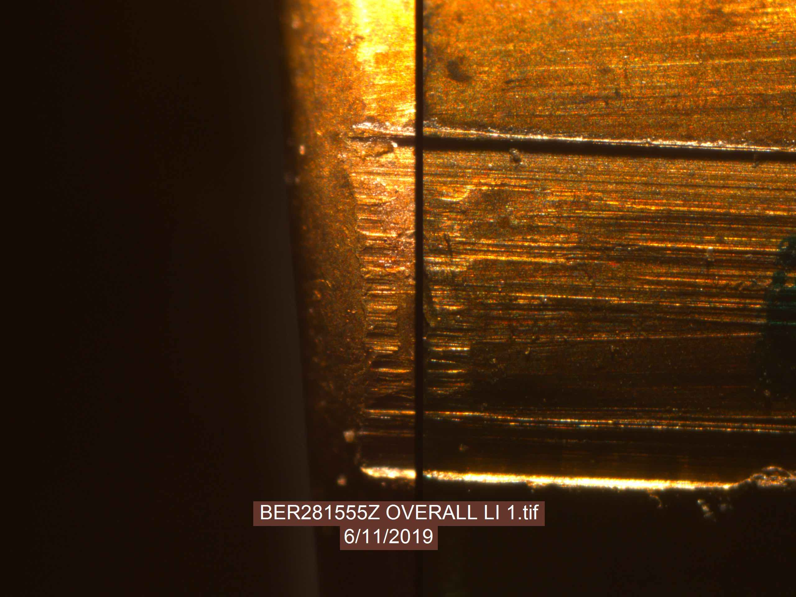
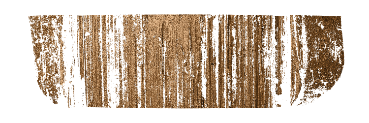

class: primary
# Update from the data collection

- **scans from bullet lands (about 25,000 total)**

    - LAPD: 4 bullets per barrel for **all** of 626 firearms
    - LAPD: 4 bullets per barrel for 96 firearms
    - Hamby Sets 10, 36, 44, 224, and a clone (35 bullets each)
    - Hamby Clone 224: three replicates (35 bullets each)
    - Houston test sets (9 kits with 25 bullets each)
    - Houston persistence: 8 barrels with 40 fired bullets each
    - St Louis persistence: 2 barrels with 192 fired bullets each
    - most of the CSAFE persistence study 
    
- **and cartridge cases**

    - DFSC (about 2000)
    - getting ready to scan cartridges for CSAFE persistence
    
- **shooting range**
    
    - we are planning to go out to the range *one* more time to finish up the persistence study

---

class: primary
# Comparison microscope in action

- visit to Vic Murillo from DCI Ankeny 




---
class: secondar
# Assessing scan quality

---
class: primary
# Analysis of missing values

Percentage of missing values


---
class: primary
# Example I

Overall percentage of missing values: 7.8%


Missing values in groove areas and in break off region

---
class: primary
# Example II

Overall percentage of missing values: 31.7%


Missing values everywhere, including striation areas. Probably a lighting problem.

---
class: primary
# Example III

Overall percentage of missing values: 33.2%



Missing values in the bottom of the striae. Lighting problem. Solution: add more light (+ 10% protocol)

---
class: primary
# Re-scan of Example III

Overall percentage of missing values: 19.9%


```{r, eval=FALSE, echo=FALSE}
## Presenters
presenter <- 
  c("Soyoung", "Amy", "Ben", "Nick", 
    "Ganesh", "Nate", "Sam", 
    "James", "Kiegan", "Danica", "Susan", 
    "Miranda")

## Set seed as the date (mmdd)
set.seed(1105)

## Shuffle presenters
sample(presenter)
```

