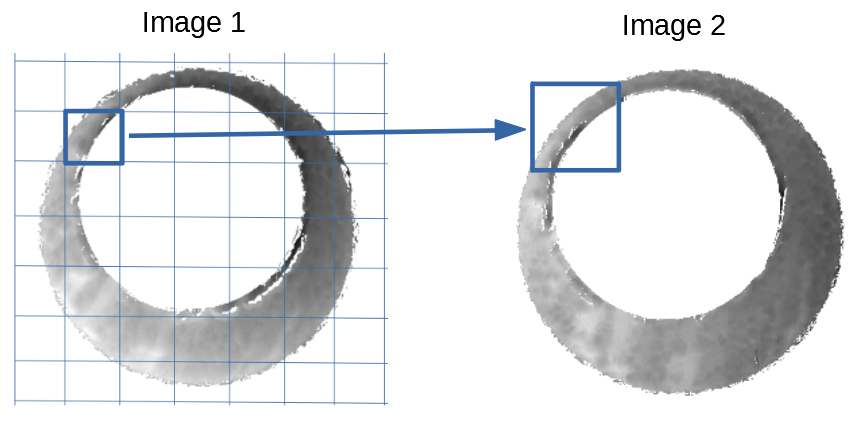

class: inverse
# Amy

---
class: primary
# Semester Goals & Updates

---
class: inverse
# Nate

---
class: primary
# Semester Goals & Updates
---
class: inverse
# Eryn

---
class: primary
# Semester Goals & Updates
---
class: inverse
# Miranda

---
class: primary
# Semester Goals & Updates

---
class: inverse
# Charlotte

---
class: primary
# Semester Goals & Updates
---
class: inverse
# Heike

---
class: primary
# Semester Goals & Updates
---
class: inverse
# Joe
---

class: top, primary
# Joe: John Deere Internship
.pull-left[
.center[
  
  
]
]

.pull-right[
.center[
  
  
]
]
---

class: primary
# Joe: Cartridge Cases Update
  - CMC algorithm "skeleton" complete

.center[


]
---

class: primary
# Joe: Semester Goals

 - STAT 641, 520, 551 and MATH 610
 
 - Instructing STAT 226

 - Algorithm improvements & generalizations
  - Congruent Matching...Donuts? Tori?
  - Method comparison on DFSC data
  - Implement/compare recently published CMC improvements
---
class: inverse
# Susan

---
class: primary
# Semester Goals & Updates
---
class: inverse
# Kiegan

---
class: primary   
# Semester Goals & Updates
---
class: inverse
# Soyoung

---
class: primary
# Semester Goals & Updates
---
class: inverse
# Ganesh

---
class: primary   
# Semester Goals & Updates

---
class: inverse
# Danica

---
class: primary   
# Semester Goals & Updates

---
class: inverse
# Yawei

---
class: primary
# Semester Goals & Updates

---
class: inverse
# LateBreak


---
class: primary
# Late Break News
    
---
class: inverse
# Issues

---
class: secondary

- [Issues!!](https://github.com/CSAFE-ISU/slides/issues)
- One issue down, three to go.

```{r, eval=FALSE, echo=FALSE}
## Presenters
presenter <- 
  c("Soyoung", "Amy", "Ben", "Nick", 
    "Ganesh", "Nate", "Sam", 
    "James", "Kiegan", "Danica", "Susan", 
    "Miranda","Joe")

## Set seed as the date (mmdd)
set.seed(1105)

## Shuffle presenters
sample(presenter)
```

