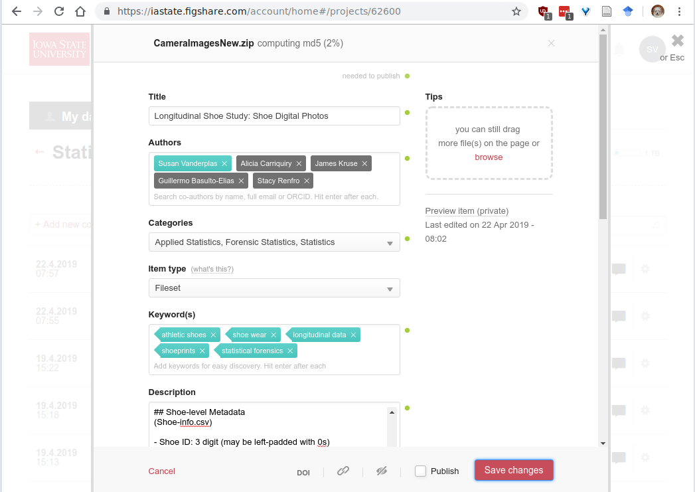

class: inverse
# About Slides

---
class: primary 
# New CSAFE slide template

We're now using [`xaringan`](https://github.com/yihui/xaringan)

What's changed: 

- New person slide: 

````
  ---
  class: inverse
  # Your Name
````

---
class: secondary

- New content slide with title: 

````
---
class: primary
# Title of slide 

Slide content
````

- New content slide without title: 

````
---
class: secondary

Slide content with no title on slide
````

---
class: inverse
# Sample User

---
class: primary
# Sample Slide

- Sample Table. Sam Tyner talked about the three must-haves of your summary:


| Must-have | It means |
| :------   | :------- |
| Context | Why are you doing what you're doing? "I'm working on X project in order to Y" |
| Content | What are you doing? "I wrote X function that does Y" or "I ran a simulation of Z" |
| Conclusion | What did you learn? "This will help me because it..." or "This important because it gets us to..." |

---
class: secondary

- If you are going to add an image, **create a directory** with your name within "images" folder. For example, "images/**guillermo**/sample_image.JPG"


 
 

---
class: inverse
# Soyoung

---
class: primary
# Project Updates


---
class: inverse
# Sam

---
class: primary
# Project Updates


---
class: inverse
# Susan

---
class: primary
# Longitudinal Shoe Study

- Working with CSSM and Library DataShare program to get permanent DOIs for all 7 collection methods

- Created a [collection](https://iastate.figshare.com/account/home#/collections/4477757) for the study
    - Collection manuals are a separate "dataset"
    - Already uploaded: Mat scan data, film + powder, vinyl (crime scene) photos, 2d scans
    - Upload in progress: paper + powder, camera photos
    - To upload later: 3d scans (not released for at least a year)

- Fight with DataShare: Can they host data from IRB-reviewed studies?
    
- To do: write paper describing the experiment and the database(s)

---
class: secondary


---
class: inverse
# Miranda

---
class:primary
# CoNNOR: Updates

- Defended Creative Component on April 9th!
- Now turning CC into paper for Forensic Science International (FSI)
    - Goal: Make CNNs seem useful and not scary for forensic practitioners

---
class:primary
# CoNNOR: Consistency

```{r, echo = F}
knitr::include_graphics("images/Miranda/text-line-1.png")
```

---
class:primary
# CoNNOR: Consistency

```{r, echo = F}
knitr::include_graphics("images/Miranda/uggs-1.png")
```

---
class:primary
# CoNNOR: Consistency

```{r, echo = F}

```

---
class:primary
# CoNNOR: Planned investigations (this summer)

- Optimal level to truncate VGG16 for transfer learning on shoes
    - Currently running Block2 truncated model on Bigfoot

- Fully convolutional neural networks - accommodate images of any size

- Region segmentation networks

- [`autokeras` R/python package](https://github.com/jcrodriguez1989/autokeras) that optimizes NN structure automatically


---
class: inverse
# LateBreak


---
class: primary
# Late Break News
    
---
class: inverse
# Issues

---
class: secondary

- [Issues!!](https://github.com/CSAFE-ISU/slides/issues)
- One issue down, three to go.

```{r, eval=FALSE, echo=FALSE}
## Presenters
presenter <- 
  c("Soyoung", "Amy", "Ben", "Nick", 
    "Ganesh", "Nate", "Sam", 
    "James", "Kiegan", "Danica", "Susan", 
    "Miranda")

## Set seed as the date (mmdd)
set.seed(1105)

## Shuffle presenters
sample(presenter)
```

