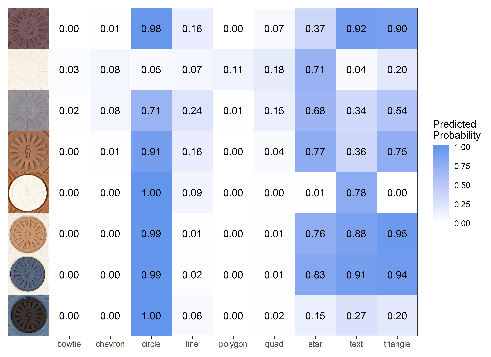

class: inverse
# Glass

---
class: inverse
# Soyoung

---
class: primary
# Project Updates

* Shoe project 
  + Method 1 : Maximum clique on edge detection (MC-COMP): Under the revision by JCGS!
  + Method 2 : Maximum clique on SURF detection : About to submit.

* Glass project with Sam
  + Evaluation of methods for forensic comparison of glass fragment: Almost ready to submit to FSI.
  

---
class: primary
# Projects plans

* Shoe project 
  + Address all questions by referees from JCGS 
  + Develop a random effects model on similarities using SURF detection by time, weight, person and so on. 

* Glass project
  + Work on covariance estimation 
  + Work on uncertainty pyramid 


---
class: inverse
# Sam

---
class: primary
# Project Updates

- [Paper](https://www.overleaf.com/project/5c9000fe051ee4050dc499ee) is just about ready to submit to Forensic Science International
    * (this week or next `r emo::ji("crossed_fingers")`)
- Meta-analyses of results: Under what conditions does a method make the wrong decision? 
    * Note: When panes are made by different companies, both methods always conclude different source. The following analyses are only for same company panes. 

```{r disagree, echo=FALSE, fig.align='center', out.width="95%"}

```

---
class: primary
# Meta-analysis

For each method, perform a logistic regression: 

$$\begin{align}
Y_{qk} & \sim Bern(\pi_{qk}) \\
logit(\pi_{qk}) & = \mu + \beta_1 \cdot d_{qk} + \beta_2 \cdot \mathbb{I}(\text{mfr} = B) + \beta_3 \cdot \mathbb{I}(\text{conclusion} = \text{same source}) \\
d_{qk} & = \text{days between manufacture of panes K and Q} \\
Y_{qk} & = \text{1 if the method made the correct decision and 0 o.w.}
\end{align}$$


```{r echo=FALSE, message = FALSE, warning = FALSE}
library(tidyverse)
library(parsnip)
data_for_log_reg <- read_csv("dat/dat-for-log-reg.csv")

data_for_log_reg2 <- filter(data_for_log_reg, same_mfr == 1) %>% 
  select( pane_q:score, method, diff_dates, conclude, correct) %>%
  mutate(mfr = str_sub(pane_q, 1, 1))

glm_form <- correct ~ diff_dates + mfr + conclude 
glm_model_spec <- logistic_reg() %>% set_engine("glm")
fitted_glms  <- data_for_log_reg2 %>% nest(-method) %>% 
  mutate(model_fit = map(data, fit, object = glm_model_spec, formula = glm_form))
fitted_glms <- fitted_glms %>% mutate(coefs = map(model_fit, function(x) coefficients(x$fit)))
fitted_glms <- fitted_glms %>% 
  mutate(predict_prob = map(model_fit, function(x) predict.glm(x$fit, type = "response")))
fitted_glms %>% select(method, coefs) %>% unnest() %>% 
  mutate(var = rep(c("Intercept", "# Days", "Mfr B", "Conclusion"), 2)) %>% spread(var, coefs) %>% 
  select(c(1,4,2,5,3)) %>% 
  knitr::kable(format = "html", digits = 3,caption = "Coefficients")

fitted_glms %>% select(method, coefs) %>% unnest() %>% 
  mutate(var = rep(c("Intercept", "# Days", "Mfr B", "Conclusion"), 2),
         oddsrat = exp(coefs)) %>% select(-coefs) %>% spread(var, oddsrat) %>% 
  select(c(1,4,2,5,3)) %>% 
  knitr::kable(format = "html", digits = 3,caption = "Odds Ratios")
```

---
class: primary
# Meta-analysis 2

For each method, perform a logistic regression: 

$$\begin{align}
Y_{qk} & \sim Bern(\pi_{qk}) \\
logit(\pi_{qk}) & = \mu + \beta_1 \cdot d_{qk} + \beta_2 \cdot \mathbb{I}(\text{mfr} = B) + \beta_3 \cdot s_{qk}\\
d_{qk} & = \text{days between manufacture of panes K and Q} \\
s_{qk} & = \text{resulting score} \\
Y_{qk} & = \text{1 if the method made the correct decision and 0 o.w.}
\end{align}$$


```{r echo=FALSE, message = FALSE, warning = FALSE}
glm_form <- correct ~ diff_dates + mfr + score 
glm_model_spec <- logistic_reg() %>% set_engine("glm")
fitted_glms  <- data_for_log_reg2 %>% nest(-method) %>% 
  mutate(model_fit = map(data, fit, object = glm_model_spec, formula = glm_form))
fitted_glms <- fitted_glms %>% mutate(coefs = map(model_fit, function(x) coefficients(x$fit)))
fitted_glms <- fitted_glms %>% 
  mutate(predict_prob = map(model_fit, function(x) predict.glm(x$fit, type = "response")))
fitted_glms %>% select(method, coefs) %>% unnest() %>% 
  mutate(var = rep(c("Intercept", "# Days", "Mfr B", "Score"), 2)) %>% spread(var, coefs) %>% 
  select(c(1,3,2,4,5)) %>% 
  knitr::kable(format = "html", digits = 3,caption = "Coefficients")

fitted_glms %>% select(method, coefs) %>% unnest() %>% 
  mutate(var = rep(c("Intercept", "# Days", "Mfr B", "Score"), 2),
         oddsrat = exp(coefs)) %>% select(-coefs) %>% spread(var, oddsrat) %>% 
  select(c(1,3,2,4,5)) %>% 
  knitr::kable(format = "html", digits = 3,caption = "Odds Ratios")
```

---
class: primary 
# What's going on? 

```{r, echo = FALSE, out.width='65%'}
knitr::include_graphics(c("images/astm-data.png", "images/rf-data.png"))
```

---
class: primary
# Message of the paper

1. Much more data collection is required: types of glass (other than float), other companies, more time between manufacture, etc.
2. The current methods are really only adequate for discrimination. If the samples are indistinguishable, that is not sufficient evidence that they have the same source. 
3. Random forest is a good candidate for a score-based method, but more data is needed. 
4. Interval-based methods are inadequate because they are not well-calibrated: no "difficult cases" in the literature. 

---
class: inverse
# Shoes 

---
class: inverse
# Susan

---
class: primary
# Longitudinal Shoe Study

- Working with CSSM and Library DataShare program to get permanent DOIs for all 7 collection methods

- Created a [collection](https://iastate.figshare.com/account/home#/collections/4477757) for the study
    - Collection manuals are a separate "dataset"
    - Already uploaded: ~~Mat scan data, film + powder, vinyl (crime scene) photos, 2d scans~~ The library deleted everything during a fight with IRB... have to start over with the upload...
    - Upload in progress: paper + powder, camera photos
    - To upload later: 3d scans (not released for at least a year)

- Fight with DataShare: Can they host data from IRB-reviewed studies? Yes, as of last Thursday
    
- To do: write paper describing the experiment and the database(s)

---
class: secondary


---
class: inverse
# Miranda

---
class:primary
# CoNNOR: Updates

- Defended Creative Component on April 9th!
- Now turning CC into paper for Forensic Science International (FSI)
    - Goal: Make CNNs seem useful and not scary for forensic practitioners

---
class:primary
# CoNNOR: Consistency

```{r, echo = F}

```

---
class:primary, smallheader
# CoNNOR: Consistency 

```{r, echo = F}

```

---
class:primary, smallheader
# CoNNOR: Consistency

```{r, echo = F}
knitr::include_graphics("../../images/shoes/CoNNOR/2019-04/fix-contrast-1.png")
```

---
class:primary, smallheader
# CoNNOR: Planned investigations (this summer)

- Optimal level to truncate VGG16 for transfer learning on shoes
    - Currently running Block4 truncated model on Bigfoot (Block2 killed Bigfoot)
    - Move computations to GPU server for Block 3 and Block2

- Fully convolutional neural networks - accommodate images of any size

- Region segmentation networks

- [`autokeras` R/python package](https://github.com/jcrodriguez1989/autokeras) that optimizes NN structure automatically


---
class: inverse
# Soyoung


---
class: inverse
# Late  Breaking


---
class: primary
# Late Breaking News
    
---
class: inverse
# Issues

---
class: secondary

- [Issues!!](https://github.com/CSAFE-ISU/slides/issues)
- One issue down, three to go.

```{r, eval=FALSE, echo=FALSE}
## Presenters
presenter <- 
  c("Soyoung", "Amy", "Ben", "Nick", 
    "Ganesh", "Nate", "Sam", 
    "James", "Kiegan", "Danica", "Susan", 
    "Miranda")

## Set seed as the date (mmdd)
set.seed(1105)

## Shuffle presenters
sample(presenter)
```

