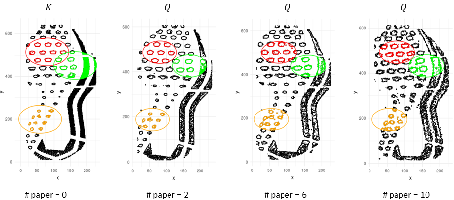
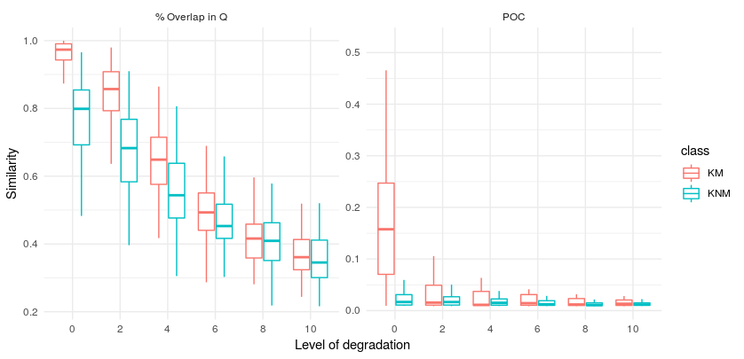
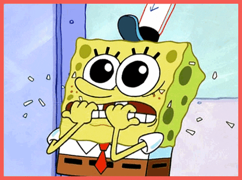
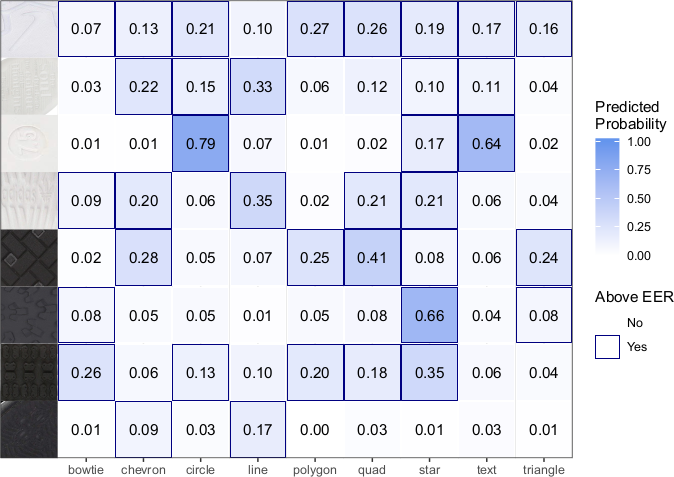
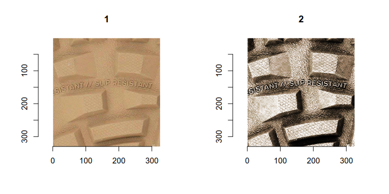

class: inverse
# About Slides

---
class: primary 
# New CSAFE slide template

We're now using [`xaringan`](https://github.com/yihui/xaringan)

What's changed: 

- New person slide: 

````
  ---
  class: inverse
  # Your Name
````

---
class: secondary

- New content slide with title: 

````
---
class: primary
# Title of slide 

Slide content
````

- New content slide without title: 

````
---
class: secondary

Slide content with no title on slide
````

---
class: inverse
# Sample User

---
class: primary
# Sample Slide

- Sample Table. Sam Tyner talked about the three must-haves of your summary:


| Must-have | It means |
| :------   | :------- |
| Context | Why are you doing what you're doing? "I'm working on X project in order to Y" |
| Content | What are you doing? "I wrote X function that does Y" or "I ran a simulation of Z" |
| Conclusion | What did you learn? "This will help me because it..." or "This important because it gets us to..." |

---
class: secondary

- If you are going to add an image, **create a directory** with your name within "images" folder. For example, "images/**guillermo**/sample_image.JPG"


 
 

---
class: inverse
# Soyoung

---
class: primary
# Project Updates

- **Submit JCGS paper**  
    - Working on revisions  
    - Performance test on degraded shoe impressions  
- **Submit shoe paper with SURF detection**  
    - Almost done
    - Decide which journal we want to submit
- **BF vs. LR simulation**  
    - Help Danica for simulating glass data  
- *Write the weight effect to SURF score in the shoe comparisons*  
- Write and do more analyses for more publications  


# Degraded and smudged impressions   

  
 

# Mates and non-mates    

  
 

# Result   

  
 


---
class: inverse
# Sam

---
class: primary
# Project Updates

Greetings from NIST! 

- *Open Forensic Science in R* book now up on my website
    * [sctyner.github.io/OpenForSciR](https://sctyner.github.io/OpenForSciR/)
    * Hopefully link to it on CSAFE website soon! 
- Work done at NIST: 
    * Draw your own CDFs & bounds (à la Lund & Iyer (2017)) with a Shiny app: [sctyner.shinyapps.io/drawing-cdfs](https://sctyner.shinyapps.io/drawing-cdfs)
    * R package `dprocsim`: [github.com/sctyner/dprocsim](https://github.com/sctyner/dprocsim)
        + Simulate CDFs from Dirichlet Process Priors 
        + Has closures that output functions of those CDFs to evaluate on a grid
        + Check that they fall in your bounds (Shiny App available in package with `run_shiny()`)
        + For the priors that fit your criteria, simulate from the posteriors
        + Evaluate the posterior CDFs on a grid to get uncertainty intervals
    * Giving a talk on the *down packages and the `tidyverse` on Thursday

---
class: primary
# RI2I Symposium

Attended the [Forensic Science Research Innovation to Implementation](https://www.nist.gov/news-events/events/2019/06/forensic-science-research-innovation-implementation-symposium-ri2i) on June 19-20. 

Major takeaways: 

- Different incentives prevent implementation of new research 
    * **Researchers**: in academia; motivated by need to publish, get grant funding; little to no incentive to expand outside of academia (very comfortable)
    * **Practitioners**: casework is top priority; no time to read research papers (even if they had perfect access to them); no incentive to learn new tools/other professional development
    * **Private sector**: don't want to invest in research unless the financial benefits are clear; lots of inherent risk in new technology
    * **Courts/Legal**: Daubert/Frye; judges cannot do their own research; who is validating the new methods; need to consider old cases decided with old tech
    
---
class: secondary 

- Need for an independent, federal institution for forensic science that will
    * Validate new methodology
    * Translate research in academia and work to implement in forensic labs 
    * Create standard methodology/SOP for new techniques, validation, etc. 
    * Help labs with their validation (tiger team)
    * Centralized accreditation 
    * Host one central place for labs to share data
    * Legal education 
    
---
class: primary
# The End

##See you in July! 

```{r, echo = FALSE, fig.align='center', out.width="55%"}
knitr::include_graphics("https://media.giphy.com/media/3o6gE5nhk4pNuMSwOk/giphy.gif")
```

---
class: inverse
# Miranda

---
class: primary
# Project Updates

- Finishing up paper to submit to Forensic Science International
- Studying for written prelim
  - 3 weeks from Tuesday...
  
```{r nervous, echo=FALSE, fig.align='center', out.width="65%"}

```

---
class: inverse
# Eryn

---
class: primary
# Project Updates

**Goal of project:** To measure the wear of a shoe overtime

- start with an stl file from the longituidinal shoe study then turn it into a mesh object 

- The problem: Alignment 
    - Align by the widest and narrowest parts of the outline
    - Specify landmarks to look for
    
- Packages I found that should help:
  - `shapes`
  - `geomorph`
  - `Morpho`
  - `Arothron`
  
- Currently: Writting functions to align shoes 

---
class: secondary 


```{r plot-stl, rgl = TRUE, dev = 'png', fig.width = 8, fig.height = 4, out.width = "100%", echo = F}
rgl::setupKnitr()
shoe_flip_angle <- structure(
  c(-0.999475359916687, -0.0319919027388096, -0.0030277690384537, 
     0, -0.0320942476391792, 0.99845552444458, 0.0450587198138237, 
     0, 0.0015826690942049, 0.0451280698180199, -0.998970746994019, 
     0, 0, 0, 0, 1), .Dim = c(4L, 4L)) 


stl <- rgl::readSTL(con = "images/Eryn/centered_shoe.stl", ascii = F, plot = F)
rgl::open3d()
rgl::triangles3d(stl, aspect = "iso", col = "blue")
rgl::view3d(userMatrix = shoe_flip_angle, zoom = .5)

```


---
class: inverse
# Susan

---
class: primary
# Project Updates: `ShoeScrapeR`

Goal: a database of shoe details

- Original `ShoeScrapeR` downloads the shoe tread image (no metadata or other images)

- Rewriting/Refactoring to get metadata for shoes:
  - brand logos
  - available sizes (at least on Zappos)
  - available colors
  - description information
  - top, side, back, front, and bottom pictures

- Current Status: Functions are written, trying to make them work reliably. 
  


---
class: primary
# Project Updates: `CoNNOR`

- CoNNOR: Convolutional Neural Network for Outsole Recognition

- Automatic pipeline:    .small[
1. Determine if any data files have changed since last model run
2. Get images and labels from LabelMe
3. Find minimum bounding rectangle for each labeled region
4. Crop and rotate MBR
5. Save resulting files with names that match the labels:    
`circle_quad_triangle-1-brand-model-product_productid-color_colorid.png`
6. Divide all images into training, test, validation sets
7. Augment the training data once
8. Read in the training, test, and validation data
9. Fit the model
10. Save all model files to a directory labeled with the date/time the script started.
]


---
class: primary
# Project Updates: `CoNNOR`

###### Low Contrast Problems



---
class: primary
# Project Updates: `CoNNOR`

Goal: Automatically correct contrast before saving images

- Methods: "Histogram equalization"    
Basically, map the quantiles of the values that exist onto the full range of values:

```{r, echo = F, fig.width = 8, fig.height = 4, out.width = "100%"}
suppressPackageStartupMessages(library(imager))
par(mfrow = c(1, 2))
initial <- matrix(rep(seq(.25, .75, length.out = 10000), 3), nrow = 100, ncol = 100) %>% as.cimg(dim = c(100, 100, 1, 3))
plot(initial, rescale  = F)
rescaled <-  matrix(rep(seq(0, 1, length.out = 10000), 3), nrow = 100, ncol = 100) %>% as.cimg(dim = c(100, 100, 1, 3))
plot(rescaled, rescale  = F)
```

---
class: primary
# Project Updates: `CoNNOR`

- Using Histogram equalization in RGB space can result in odd color changes

- Better solution?
    - Convert to HSL (hue, saturation, lightness) and only equalize the lightness channel. Then convert back.    



---
class: primary
# Project Updates: `CoNNOR`

- Code is working for *most* images 
  - still need to handle prlblem images 
  - images with very low variation in lightness
  - conversion effects, ...

- Still need to re-fit the model with the contrast-adjusted images.

```{r, out.width = "24%", echo = F}
knitr::include_graphics(c("images/Susan//bowtie_circle_other-1-alegria-debra-professional-all-spice_product_7814575_color_7062.jpg", 
"images/Susan//chevron-2-adidas-kids-nemeziz-18-4-in-soccer-little-kid-big-kid-solar-yellow-blue-active-red_product_9124318_color_777986.jpg", 
"images/Susan//line_quad-1-adidas-originals-nmd-r1-grey-five-grey-five-black_product_8808124_color_758542.jpg", 
"images/Susan//text-1-adidas-outdoor-terrex-cc-boat-parley-trace-blue-raw-grey-chalk-white_product_8866618_color_727486.jpg"
))
```
---
class: inverse
# LateBreak


---
class: primary
# Late Break News
    
---
class: inverse
# Issues

---
class: secondary

- [Issues!!](https://github.com/CSAFE-ISU/slides/issues)
- One issue down, three to go.

```{r, eval=FALSE, echo=FALSE}
## Presenters
presenter <- 
  c("Soyoung", "Amy", "Ben", "Nick", 
    "Ganesh", "Nate", "Sam", 
    "James", "Kiegan", "Danica", "Susan", 
    "Miranda")

## Set seed as the date (mmdd)
set.seed(1105)

## Shuffle presenters
sample(presenter)
```

