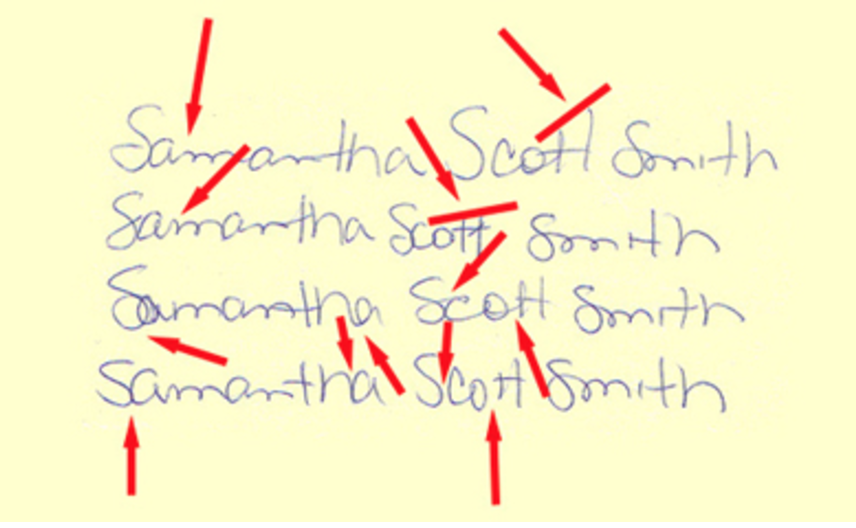

# Show and Tell   May 22

## AFTE conference

- Alicia, Heike, Haley
- slides for the talk: [Matching Bullet Lands: Full and Degraded](../../talks/AFTE\ 2017/AFTE-slides.html)

## Handwriting Examination

- Focus shifts from letters to content
- Subconscious, habitual formations are repeated
- Size, slope, pressure, lifts, spacing, position to baseline, height relationships, beginning and ending strokes, direction of strokes, etc...
- Principle of Individuality: no two writers share the same combination of handwriting characteristics given sufficient quantity and quality of writing to compare.
    - Twin studies
    - Peter Wienberger
- Variation

## Handwriting Examination

## Handwriting Examination

- Writing skill
- Document examiner training 
    - Two years
    - Form-perception testing
- Current proccess
    - Independent examination of the questioned document
    - Side by side comparison
    - Evaluate the sginificance of the combination of characteristics observed during comparison
    - Peer review
    
## Handwriting Examination

- ASTM standard guide
- The FBI has no established number of "points" required to establish a match
- Software tools
    - CEDAR-FOX

