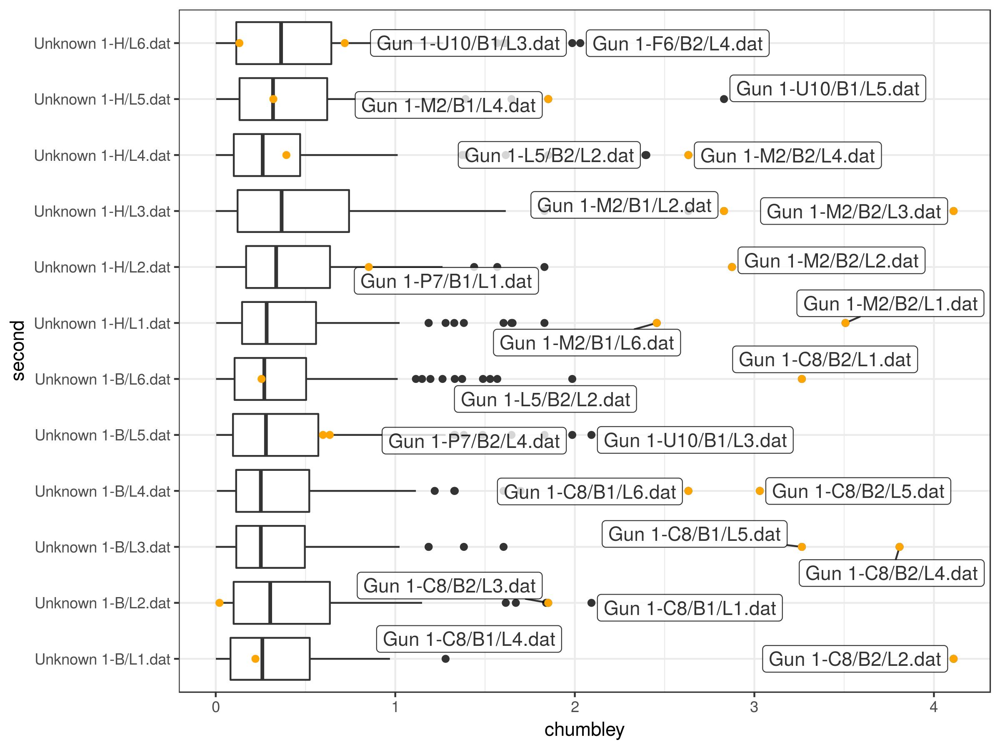

# Show and Tell <br> May 29

## Bullet matching (Heike)

- scans from Sensofar (Bill Henderson) of bullets by Phoenix PD: 8 barrels (2 shots), 2 unknown bullets
- total of 108 lands (each file ~133 MB)
- available from `/myfiles/las/research/csafe/bullet-scans/Phoenix Test/` 

## Changes to bulletr

- changes to parameter settings in `bulletr` (`groove_cutoff`, `smooth_factor` in `get_groove` both depend on resolution)
- `get_groove` has now parameter `method` - just hook any alternative method in here. 
- currently available methods are `rollapply` (Eric's) and `middle` (takes middle 75 percent of a land)

## Results

- feature set for Phoenix PD bullet lands are a bit strange
- next week: investigate feature set

## Chumbley Score

- Chumbley score is non-parametric test based on multiple correlation values extracted from striation marks of two lands (Chumbley et al 2010)

```{r, echo = FALSE, message=FALSE}
library(tidyverse)
library(bulletr)
data(br411)
b1 <- get_crosscut(x = 250, bullet=br411)
b2 <- get_crosscut(x = 150, bullet = br411)
b1.gr <- b1 %>% get_grooves(smoothfactor=30)
b2.gr <- b2 %>% get_grooves()
b1 <- fit_loess(b1, b1.gr)$data
b2 <- fit_loess(b2, b2.gr)$data
ctest <- chumbley(b1, b2, window=150, reps=5)
ctest$alignment$plot
```

## Chumbley score

```{r}
# aligned correlation scores
ctest[[3]]
# random correlation scores
ctest[[4]]
# results from Mann-Whitney U test
ctest$test
```

## Chumbley on Phoenix PD (orange is known match)


## Chumbley on Phoenix PD, again



## Chumbley score

- impact of parameters (window width, number of replicates) on test result?
- variability of results?

## More on Grooves (Kiegan and Ulrike)  
- working with development version of `bulletr`, looking at `get_grooves`
- making sure we understand what the current code is doing
- now with updates for parameter `method`, we will start looking at new methods to add
- also adding a `get_grooves_test` that includes plot of smoothed crosscut 
- alternatively, an option in the function to output the smoothed plot

## Optional smoothed grooves output
- thinking this could be added as an option depending on the method
- allows us to check to make sure the image is "smooth enough"
- if it is misidentifying, this gives a check for whether its because there is a bump before the true peak
- works in my clone of the dev version of bulletr

## Original plot from get_grooves  


## New smoothed option for get_grooves 


## Handwriting Analysis (Amy) 
Two objectives
- Begin with human QD examiners specifying characteristics
- Automated determination of characteristics

## Begin with human QD examiners specifying characteristics
- Sargur N. Srihari, University of Buffalo
- CEDAR-FOX software
- CEDAR dataset
  - CEDAR letter
  - over 1,500 individuals wrote the letter three times each
  - representative of the United States population

## CEDAR letter


## CEDAR-FOX


## CEDAR-FOX


## Statistical Models and Inference
- Problem complexity
- Bayesian Networks
- Markov Networks
- Probability of Evidence

## Automated determination of characteristics
- Christopher Saunders, PhD
- FLASH ID software (proprietary)
- "... the careful reader should be able to implement a similar system based on the information in this article."
- Data: modified London Letter (FBI)
- Skeleton
- Topology and Geometry


