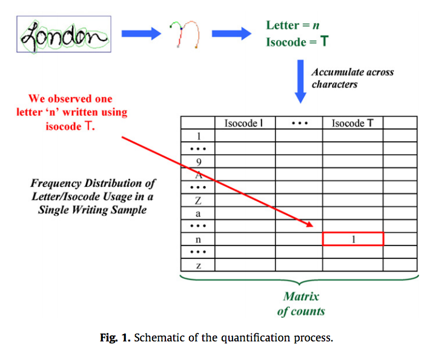
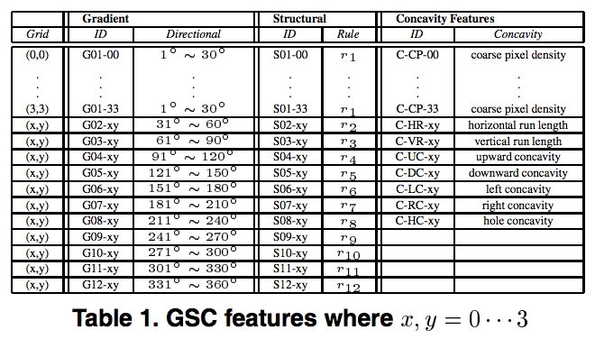
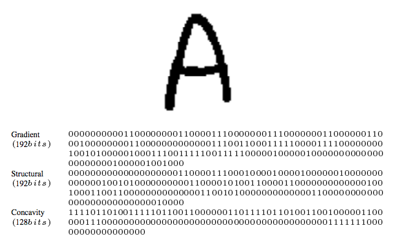
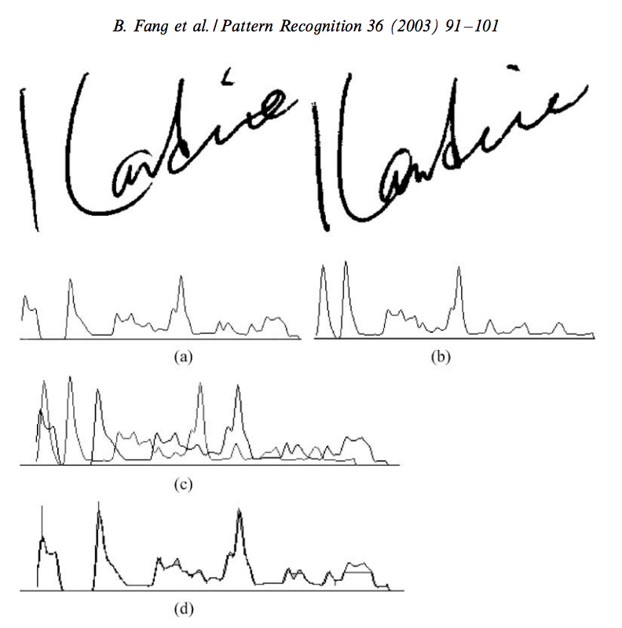

\newcommand\ddfrac[2]{\frac{\displaystyle #1}{\displaystyle #2}

# Show and Tell   June 5

## Bullet project 

- Heike: lots of bug fixing in `bulletr` package and new/simpler functions. Working on a vignette.
- shout-out to Ganesh: we can now writ to x3p!!! - function will be in bulletr package 

## Random forest

## Bullet project 

- James Hamby sent us a new set of bullets!

## Bullet project - identifying grooves  

- Looking at a single crosscut from each land of Hamby 44, Hamby 252, Cary studies
- Using get_grooves (with "rollapply" method) to see how groove identification is going
- Plotting both the original data points and the twice-smoothed line on top

## Identifying grooves  

## Identifying grooves  

- A lot are being misidentified, especially when there isn't actually a groove present in the crosscut
- Many of the single crosscuts available have some missing data 
- They may be too close to the edge of the bullet, and we need to go further up in "x" values for groove identification
- It may still be the best crosscut to use for matching, but not for identifying grooves

## Identifying grooves - next steps  

- Instead of looking at single crosscuts ("signatures"), we will look at "data" file in database and look for multiple x values
- Check what locations get_grooves is finding
- Thinking about fitting a line to account for the angle in the grooves  

## Handwriting 

## Handwriting  

- Score based likelihood ratios (SLRs)
- $x$ = measurement obtained from the source (sample with known source)
- $y$ = measurement obtained from the trace (sample with unkown source) 
- $LR = \frac{f(x,y|H_p, I)}{f(x,y|H_d, I)} = \frac{f(y|x,H_p,I)}{f(y|H_d,I)} \approx \frac{g(\Delta(x,y|H_p, I))}{g(\Delta(x,y|H_d, I))} = SLR$  
- $\Delta$ assesses the dissimilarity between $x$ and $y$
- $g$ is the probability distribution associated with the random variable $\Delta(x,y)$
- Interpretation of SLR numerator
    - "the likelihood of observing this score if the known source measurement is paired with measurements taken from traces randomly drawn from the known source population"

## SLRs  
Three methods   

- $SLR_1$ is trace-anchored   
    - Denominator interpretation: "the likelihood of observing this score if _the_ trace measurement is paired with measurements taken from random sources in some relevant population"
- $SLR_2$ is source-anchored   
    - Denominator interpretation: "the likelihood of observing this score if trace measurements taken from randomly selected sources from some relevant population are paired with _the_ measurement taken from a known source"
    
## SLRs  
Three methods (continued..)  

- $SLR_3$ is general match ("no anchor")
    - Denominator interpretation: "the likelihood of observing this score if trace measurement taken from a randomly selected source from a relevant population is paired with a measurement taken from a different source selected source from a relevant population"
    
## Binary Feature Vector
- High accuracy for off-line character recognition
- Gradient, Structural, and Concavity features (GSC)
    - __Gradient__ features use stroke shapes on a small scale
    - __Structural__ features use stroke trajectories on an intermediate scale
    - __Concavity__ features use stroke relationships at longer distances
- Image is binarized and slant normalized
- Bounding box is placed around the edges
- Grid (4x4) is placed in the bounding box

## Binary Feature Vector

## Binary Feature Vector

## Binary Feature Vector

