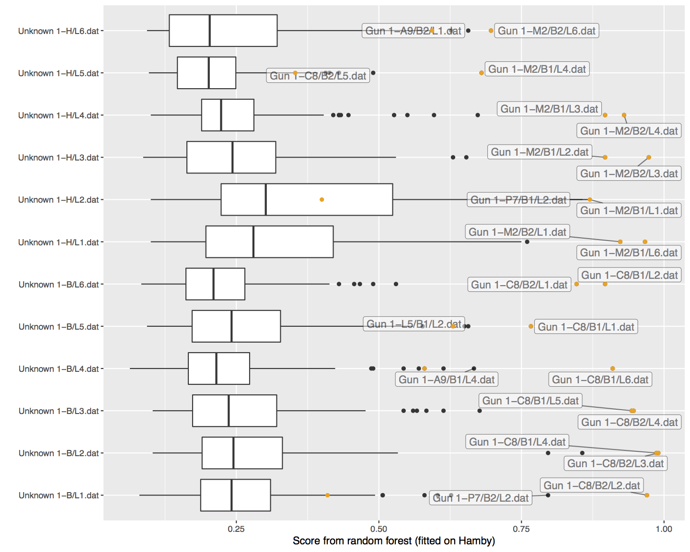
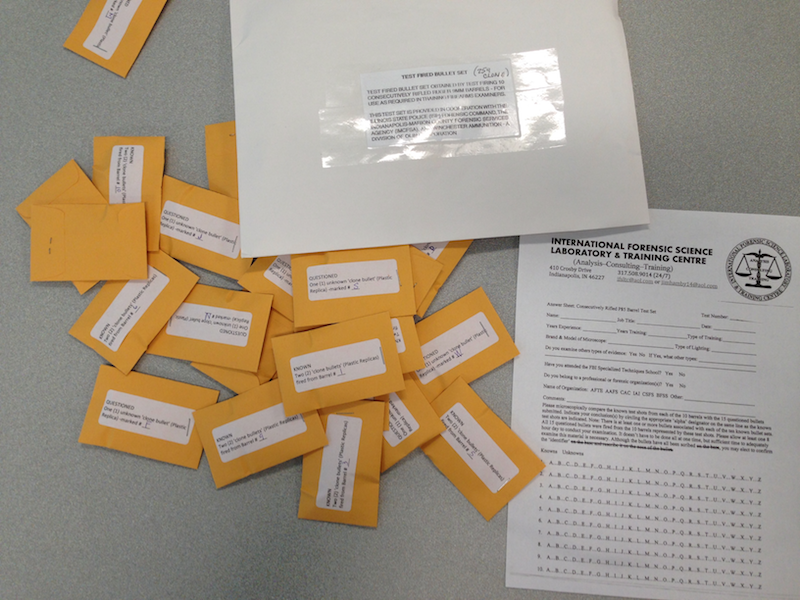
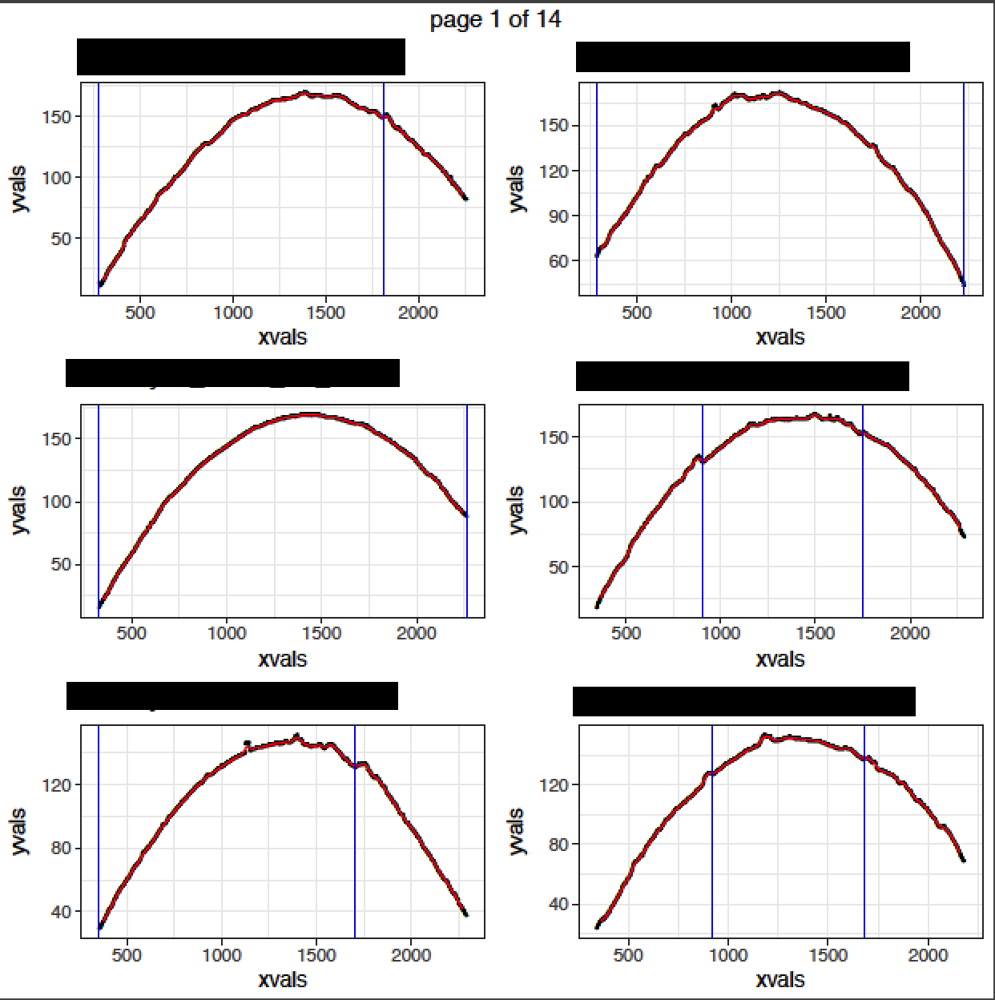

# Show and Tell   June 5

## Bullet project 

- Heike: lots of bug fixing in `bulletr` package and new/simpler functions. Working on a vignette.
- shout-out to Ganesh: we can now writ to x3p!!! - function will be in bulletr package 

## Random forest

## Bullet project 

- James Hamby sent us a new set of bullets!

## Bullet project - identifying grooves  

- Looking at a single crosscut from each land of Hamby 44, Hamby 252, Cary studies
- Using get_grooves (with "rollapply" method) to see how groove identification is going
- Plotting both the original data points and the twice-smoothed line on top

## Identifying grooves  

## Identifying grooves  

- A lot are being misidentified, especially when there isn't actually a groove present in the crosscut
- Many of the single crosscuts available have some missing data 
- They may be too close to the edge of the bullet, and we need to go further up in "x" values for groove identification
- It may still be the best crosscut to use for matching, but not for identifying grooves

## Identifying grooves - next steps  

- Instead of looking at single crosscuts ("signatures"), we will look at "data" file in database and look for multiple x values
- Check what locations get_grooves is finding
- Thinking about fitting a line to account for the angle in the grooves  

## Handwriting  

- Score based likelihood ratios (SLRs)
- Three methods
    - SLR_1 is trace-anchored $\quad\quad SLR_1 = g(\Delta(x,y)|H_p, I)$
    - SLR_2 is source-anchored
    - SLR_3 is general match ("no anchor")
