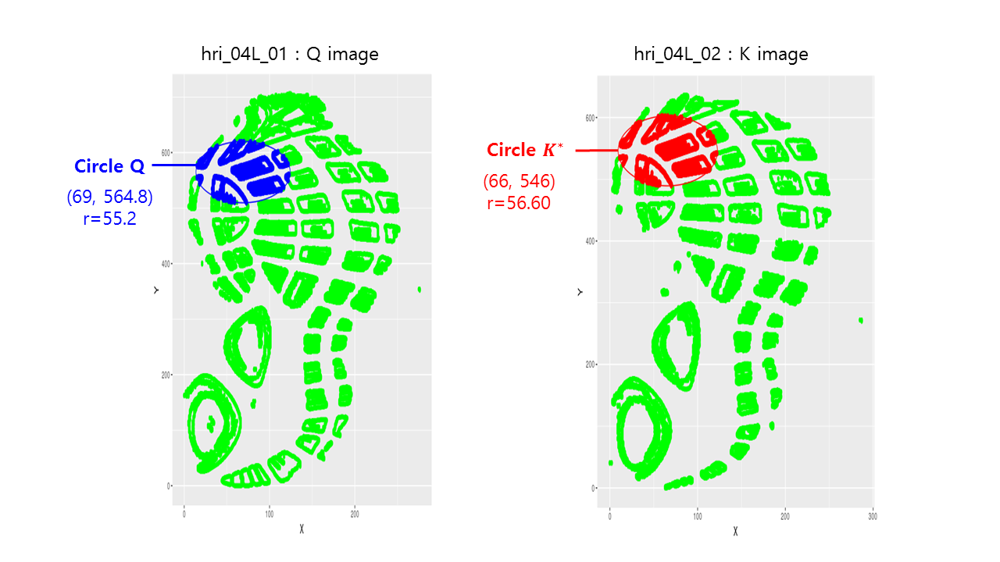

# Show and Tell   September 11

## Upload your progress (using RStudio) 1/2

- Make sure that you connect RStudio and Github. Click [here](http://happygitwithr.com/rstudio-git-github.html).
- Go to File -> New Project -> Version Control -> Git.
- Fill out:
    
| Field          | Address | 
| :--            | :-- | 
| Repository URL | https://csafe-isu.github.io/slides |
| Project directory name | slides |
| Create project as subdirectory of | Select with 'browse' |

- Go to File -> Open file... -> 02_weekly-updates/update-2017-09-11.Rmd

## Upload your progress (using RStudio) 2/2

- Add a few slides and save. You can copy the format of other slides or make something [more sophisticated](http://rmarkdown.rstudio.com/ioslides_presentation_format.html).

- Click 'Knit' button.

- Commit and push your changes on 'update-2017-09-11.Rmd' and 'update-2017-09-11.html' in the Git section.

## sinyapps repo

The shinyapps repo on github is a sandbox for our different shiny applications:

bulletr, [x3p-viewer](https://x3p-viewer.shinyapps.io/x3p-viewer/), and groove-finder are on there at the moment.

## shoeprint 1 by Soyoung

## shoeprint 2 by Soyoung

