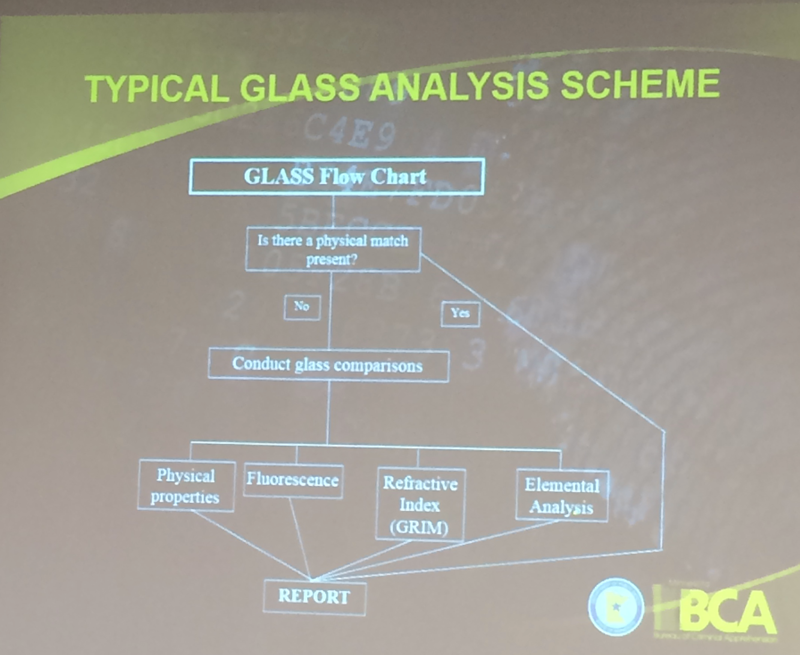
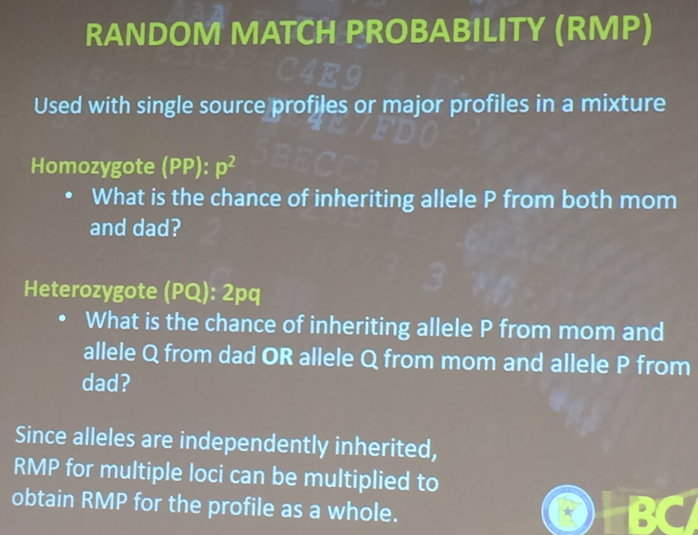
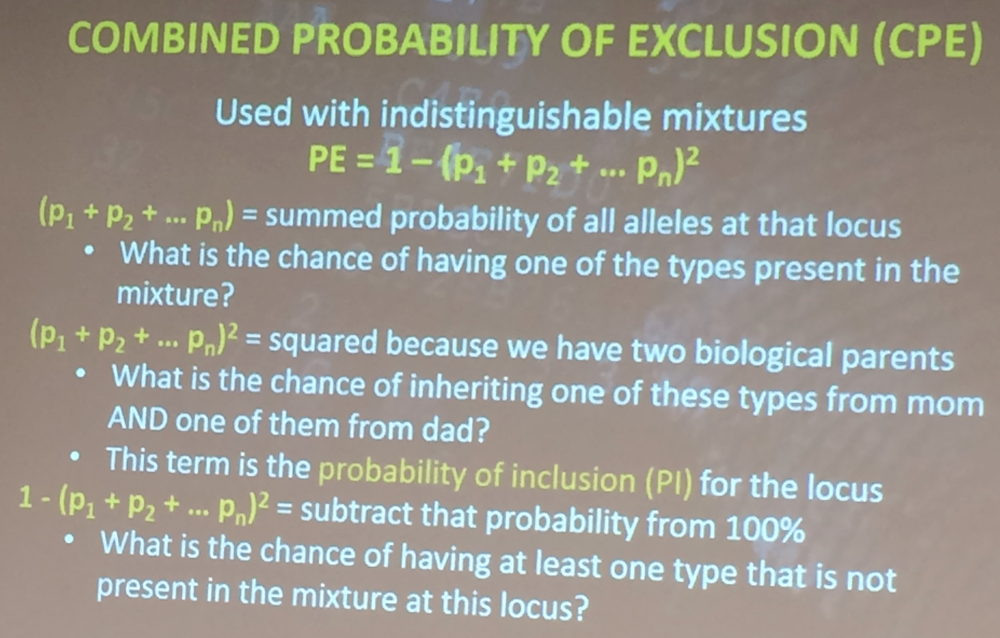
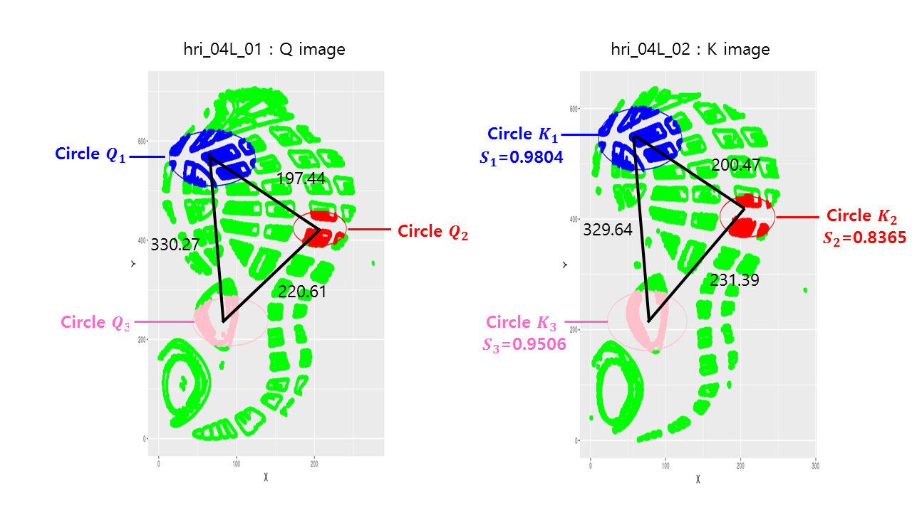
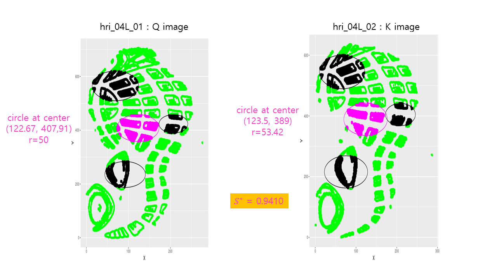
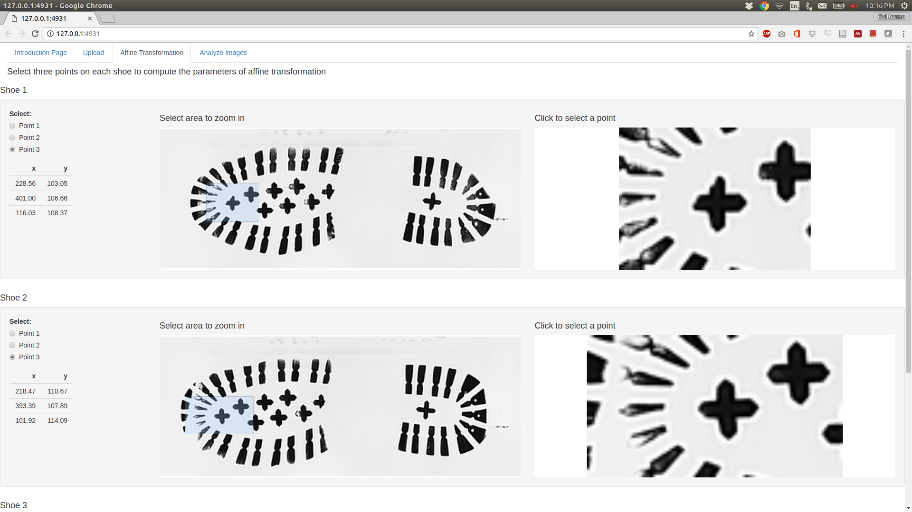
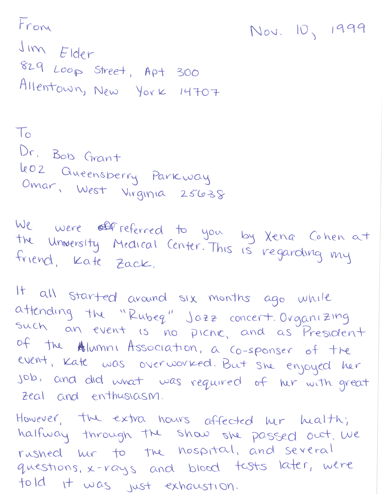

# Show and Tell <br> September 11

## Upload your progress (using RStudio) 1/2

- Make sure that you connect RStudio and Github. Click [here](http://happygitwithr.com/rstudio-git-github.html).
- Go to File -> New Project -> Version Control -> Git.
- Fill out:
    
| Field          | Address | 
| :--            | :-- | 
| Repository URL | https://csafe-isu.github.io/slides |
| Project directory name | slides |
| Create project as subdirectory of | Select with 'browse' |

- Go to File -> Open file... -> 02_weekly-updates/update-2017-09-11.Rmd

## Upload your progress (using RStudio) 2/2


- Add a few slides and save. You can copy the format of other slides or make something [more sophisticated](http://rmarkdown.rstudio.com/ioslides_presentation_format.html).

- Click 'Knit' button.

- Commit and push your changes on 'update-2017-09-11.Rmd' and 'update-2017-09-11.html' in the Git section.

## shinyapps repo

The shinyapps repo on github is a sandbox for our different shiny applications:

bulletr, [x3p-viewer](https://x3p-viewer.shinyapps.io/x3p-viewer/), and groove-finder are on there at the moment.


# Sam's Slides

## ICFIS Workshop 

Title: "Elements of Forensic Science for Forensic Practitioners"

Lessons learned:

- Siloization - different disciplines have own language and terms 
- "Hierarchy of Propositions"
    * Source level - is a person the source of the evidence? (CSAFE can help most here, imho)
    * Activity level - how did that evidence get there (investigators)
    * Offense level - did a criminal act occur? (judicial system)

## ICFIS Workshop (cont'd) {.smaller}

More lessons learned: 

- Generic Model for forensic evidence analysis
    1. Feature selection (relevant & useful features)
    2. Distortion assessment (intra-source variability; which differences matter?)
    3. "Matching" step (correspondence; how strong of a match?)
    4. "Significance" of the "match" (discriminability; how discriminating is the "match"?)
    5. Decision (reporting; LR, frequency, categorical scale?)
    6. Quality control (verification, technical review)
    
## ICFIS Workshop, Fingerprints
    
- Fingerprint evidence protocol ACE-V
    * Analysis - information gathering step (1 + 2 above)
    * Comparison - side-by-side of latent v. known (3 + 4 above)
    * Evaluation - decision making (5 above)
    * Verification - 2nd analyst repeats ACE (6 above)
- GYRO marking of features - subjective qualitative assessment of uncertainty
    * Green = High confidence
    * Yellow = Medium confidence
    * Red = Low confidence
    * Orange = Annotations *after* viewing known print
    
## ICFIS Workshop, Trace Evidence

Q: What is trace evidence? 

A: Microscopic debris easily transferred from one location to another

- "We will attempt to physically match anything"
- Paint, tape, glass, fiber, etc. 
- Flowchart of analysis: 



## ICFIS Workshop, DNA

- PCR-STR: polymerase chain reaction short tandem repeats
- Replicate a DNA sample, count occurrences of STR alleles at 23 loci
- One mismatched loci is enough to eliminate (in single-source sample)
- Markers for sex are DYS391, Chromosomes (X,Y), one other location
- SE33 is a very discriminating location. [more info here](http://strbase.nist.gov/)
- At most 2 values per location - one from mom, one from dad. 
  

## MTurk Preliminary Results 1


## MTurk Preliminary Results 2


## MTurk Preliminary Results 3


## Shoeprint 1 by Soyoung
- Created database of 150 pairs of shoe print images with 5 reps on each foot. 
- The algorithm speeds up and is packed as the package 'shoeprintr'.
- Toward a final score for similarity between shoe prints. 



## Shoeprint 2 by Soyoung
- Find more evidence of KM and KNM.



## Jason Saporta

I spent the summer at Credit Suisse making models for predicting loan defaults, prepayments, etc. Not much connection with CSAFE unless you believe everybody on Wall St. is a criminal.

During the past week I implemented a neural network for matching bullet signatures. Everything's running well, but no serious results yet.

Plans for this week:
- Maybe actually getting results for the aforementioned model
- Replicating studies on CNN effectiveness for stego problems
- Reading more about recent developments in Bayesian ML and determining if that could help with my research

## Shoeprints App and Package (Guillermo and Martin)

- Upload your images
- Pre-process image (negate values, rotate, crop, etc)
- Algorithm to find affine transformation parameters

## On Shoeprints Profile (Guillermo and Martin)




## Regarding Shoeprints Database (Guillermo and Martin)

- A lot of this is going on. Among them
   - Matscan (feet pressure heatmap)
   - 3D scanner (fixed)
   - 3D scanner (handheld)
   - High resolution camera
   - Shoeprints on sand
   - Stand on paper (detailed, walking, stomping, twisting and more than one print)

## Amy - Outreach

STEMversity in Milledgeville, GA
- 25 high school students  
- One day program  
- Intro, shoe print activity, handwriting activity  

OPPTAG Explorations  
- 15 high school students  
- One week program  
- ``From the Crime Scene to the Court Room''  
- Alicia, Officer Natasha Greene, DCI Crime Lab, Brandon Garrett J.D.


## Amy - Outreach

Coming soon  
- National Organization for the professional advancement of Black Chemists and Chemical Engineers (NOBChCE)  
- Science Bound (September 23)  
- Hands on Activity Modules (Handwriting \& Shoeprint)  

## Amy - Handwriting

REU Handwriting Samples
- 10 students  
- 2 days  
- CEDAR Letter \& London Letter repeated 3 times each
- Signature page

Flash ID

## Amy - Handwriting



## Automatic Handwriting Matching
- Thinning Image  
- Vertex Detection

## Automatic Handwriting Matching -- Code
```{r, message=FALSE, warning=FALSE}
devtools::install_github("CSAFE-ISU/handwriter")
library(handwriter)
data(london)
london_thin = thinImage(london)
london_nodes = getNodes(london_thin)
```

## Automatic Handwriting Matching -- Thinning
```{r}
plotImageThinned(london, london_thin)
```

## Automatic Handwriting Matching -- Vertex Detection
```{r}
plotNodes(london, london_thin, london_nodes)
```

## Ganesh  

Summer:
Development of x3p write capability in the bulletr package for different profiles
Shiny app (wrApp) for reading dat/x3p files and writing in x3p format
- Single file mode
- Batch Mode
 and a bunch of other things
 
 Here's the link
 https://github.com/ganeshkiastate/wrApp
 
 Plan for the coming days:
 
 Adaptation of the Chumbley score method from toolmark comparisons to bullets.
  Key challenge:  Understanding the drawbacks of the current algorithm when applied to curved surfaces.
>>>>>>> 5e29d4c220fc2f618c788fc3f695894f610c80d2
>>>>>>> b5e2c343ef5bd94af0a53c6388bf088cf51421bb
