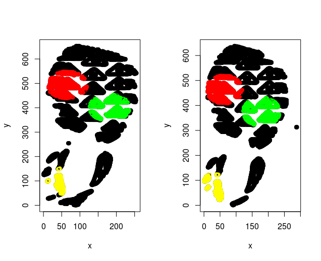
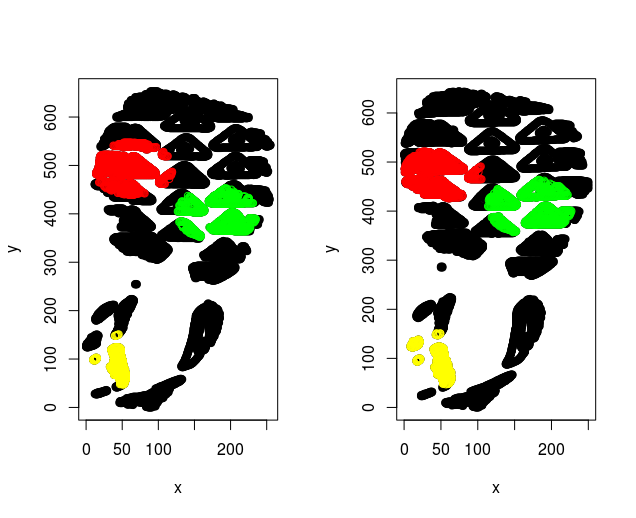
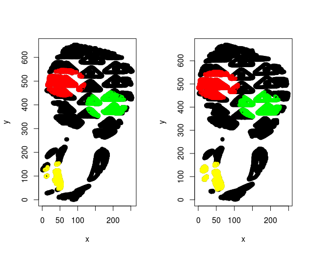

# Show and Tell   September 18

# Unnamed's Slides

## Sample List

- This
- Is 
- Sparta!!
- (And *Sparta* in Italics)
- (And **Sparta** in bold)
- (And ***Sparta*** in bold Italics)
- (And [Sparta](https://en.wikipedia.org/wiki/Sparta) with a link)

## Sample Image

## Sample Table with Equations

For me (Guillermo), it's been a nightmare to type equations and tables in RMarkdowns. But you can try...

| Column A  | Column B  |
| :- | :- |
| 1 | 2 |
| $\pi^e$ | $e^\pi$ |
| $1/2$ | $\sum_{j=1} a_j$ |
| $1/2$ | $\frac{1}{2^2} + \frac{1}{2^3} + \frac{1}{2^4} + \cdots$ |

# Sam's Slides

## Judge education and outreach

- Phone call with Alicia and some other awesome people:
    + Judge Barbara Hervey 
    + Judge Stephanie Domitrovich 
    + Felice Schur, Assoc. Dir., Judicial Div., ABA
- Devise a course to teach statistics to judges  
    + Use cases where statistical testimony has been / could be used
    + Focus on concepts, not equations
    + Ballistics, fraud, paternity, discrimination, mixture DNA
    + e.g. U.S v. Glynn (2008) (ballistics)
- Work with Hal Stern at UCI

## Developing more human factors studies

- Using ULTR language in the evidence conditions
- Describing the ULTR language as approved by the FBI or not
- Telling participants the known error rates or not (where applicable)
- More evidence conditions: mixture DNA, ballistics, fingerprints
- Including the statement below as a condition:

> Even though these two items are indistinguishable, we do not know how many other items would have also been indistinguishable from the crime scene evidence."

- Work with Bill Thompson at UCI. 

# Soyoung's slides

- Working on many comparisons between known matches (replicates)
- There are 10 possible pairwise comparisons for 5 replicated images
- Example. Comparison between rep2 and rep3

# Soyoung's slides

- Working on many comparisons between known matches (replicates)
- There are 10 possible pairwise comparisons for 5 replicated images
- Example. Comparison between rep2 and rep4

# Soyoung's slides

- Working on many comparisons between known matches (replicates)
- There are 10 possible pairwise comparisons for 5 replicated images
- Example. Comparison between rep2 and rep4

# Soyoung's slides
- Get the results of 20 comparisons (2 pairs)
- The goal is to find similarity attributes as many as possible
- Euclidean distance of centers from 3 circles,
- Average of Overlap features,
- Standard deviation of rotation angle estimations.

|Summary |Mean_overpt| Diff_ecd | sd_rot |
|--------|-----------|----------|--------|
| MIN    |0.8481     |0.9532    |0.1432  |
|1st. Qu.|0.8938     |5.0380    |0.3872  |
|Median  |0.9450     |6.1066    |0.5684  |
|3rd. Qu.|0.9670     |10.5957   |0.9506  |
|Max.    |0.9788     |20.5656   |2.2501  |

