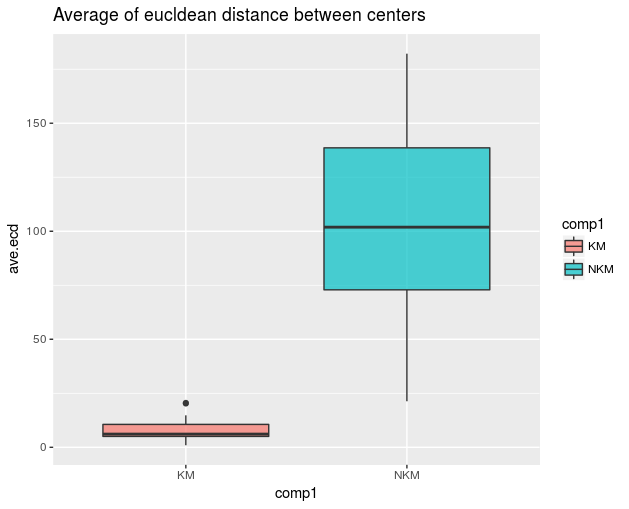
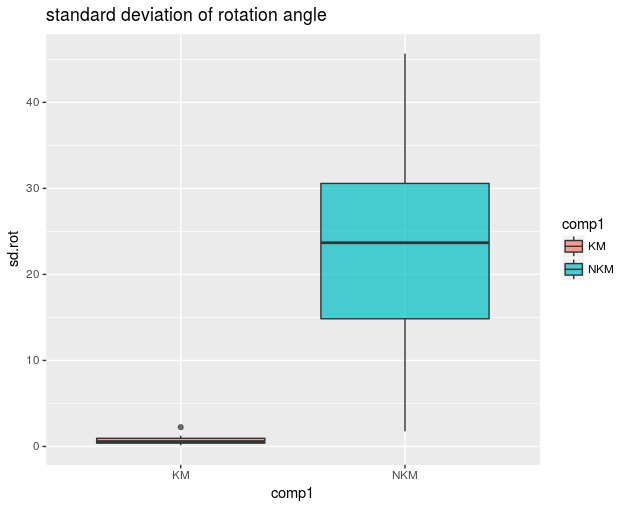
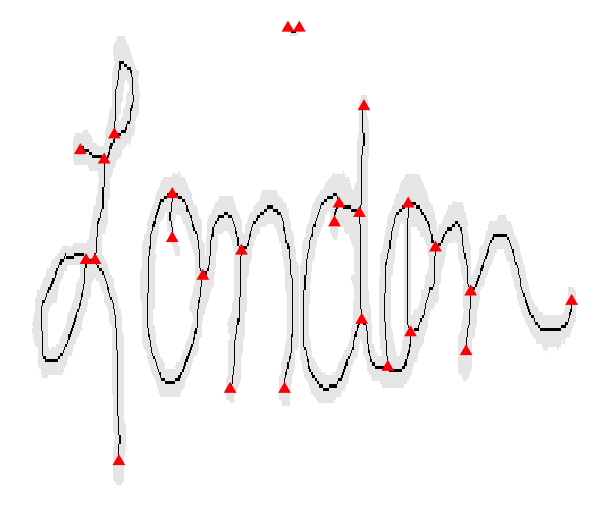
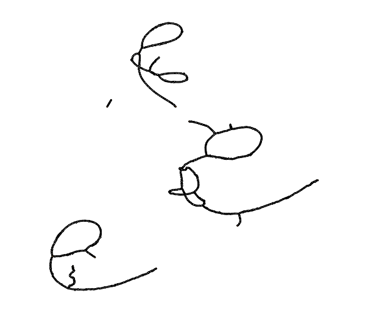
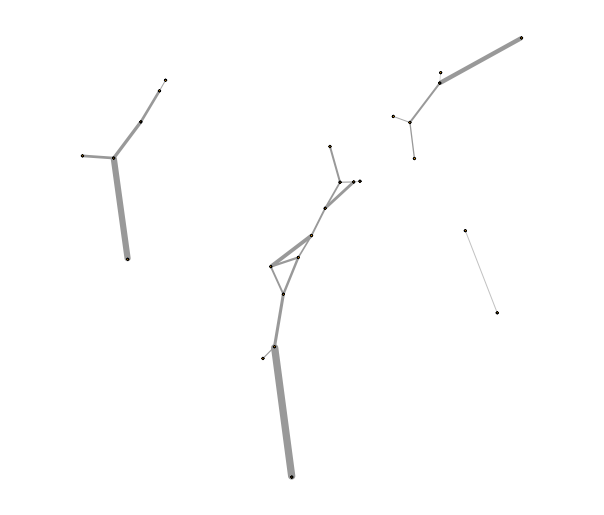

# Show and Tell   September 25

## Soyoung's slides 1
- Working on experiments for possible attributes for similarity score
- Known Match (KM) : 20 comparisons
- Known Non-Match (KNM) : 25 comparisons
- Average of overlap features from KM and KNM

## Soyoung's slides 2
- Average of euclidean distances btw centers from KM and KNM

## Soyoung's slides 3
- Standard deviation of rotation angle estimation from KM and KNM

## Nick's Slides
 - Create writing path isomorphism
 - Having trouble with loops
 - Can get paths for all other connection and limit the isomorphic graph to a simpler graph of just nodes
 
## Path Graph

## Path Graph

## Isomorphism

=======
## Amy's Slide
- Outreach on Saturday went well!
    + 20 Science Bound students grades 9 - 11
    + 3 hands-on activities and an online quiz (NIST - Fingerprint Examiner)
- Tring to get a feel for the data that FlashID dumps out. Having trouble moving files.
- Talking with IT about handling installation issues with the FlashID VM.
- Does anyone have a shoe print case study to include with the middle school teacher resource package?

# Guillermo

## MAFS

- Soyoung and I attended last Wednesday (2017-09-20) to the Midwestern Association of Forensic Scientists ([MAFS](http://www.mafs.net/mafs-2017-fall-meeting-homepage)) conference in Cincinnati, OH

- Specifically, these two workshops by Lesley Hammer:
    + _Ensuring Thorough and Fair Evaluation of Limitations during the Footwear Examination Process_ and 
    + _Testifying about the Methods and Foundations of Footwear Evidence_.

- Audience: mostly footwear practitioners

## MAFS

+ __Ensuring Thorough and Fair Evaluation of Limitations during the Footwear Examination Process__: 
    - Analysis of impressions (substrate, matrix, deposition, photography, collection): Clarity and reliability, limitations in conclusion

+ __Testifying about the Methods and Foundations of Footwear Evidence__:
    - Discussion on error rates, PCAST report, standards (SWTREAD & OSAC)

## Robustness of Hu moments

- Go there (Update to his slide later)

>>>>>>> 769b89a7da0156515b6c11396fe89e4cde84c796
