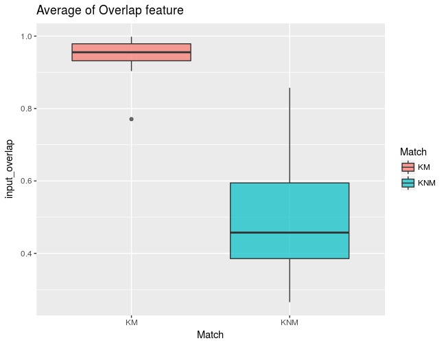

# Show and Tell   September 25

## Soyoung's slides 1
- Working on experiments for possible attributes for similarity score
- Known Match (KM) : 20 comparisons
- Known Non-Match (KNM) : 25 comparisons
- Average of overlap features from KM and KNM

## Soyoung's slides 2
- Average of euclidean distances btw centers from KM and KNM

## Soyoung's slides 3
- Standard deviation of rotation angle estimation from KM and KNM

## Amy's Slide
- Outreach on Saturday went well!
    + 20 Science Bound students grades 9 - 11
    + 3 hands-on activities and an online quiz (NIST - Fingerprint Examiner)
- Tring to get a feel for the data that FlashID dumps out. Having trouble moving files.
- Talking with IT about handling installation issues with the FlashID VM.
- Does anyone have a shoe print case study to include with the middle school teacher resource package?

