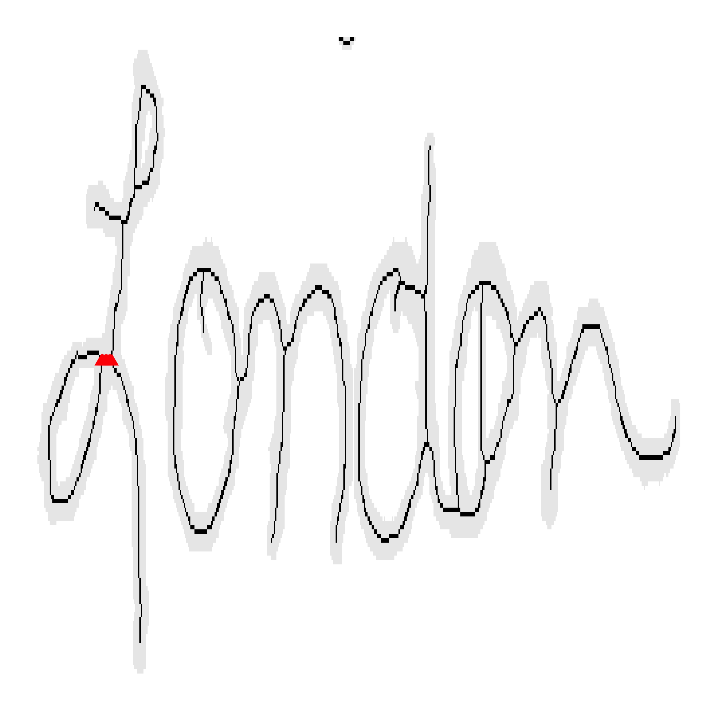
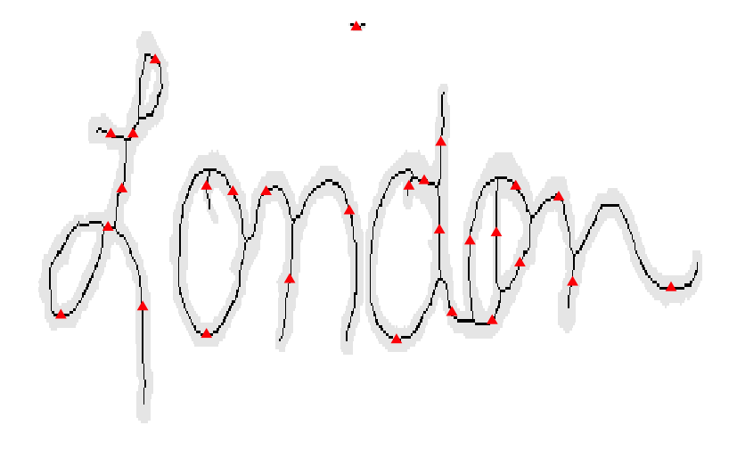
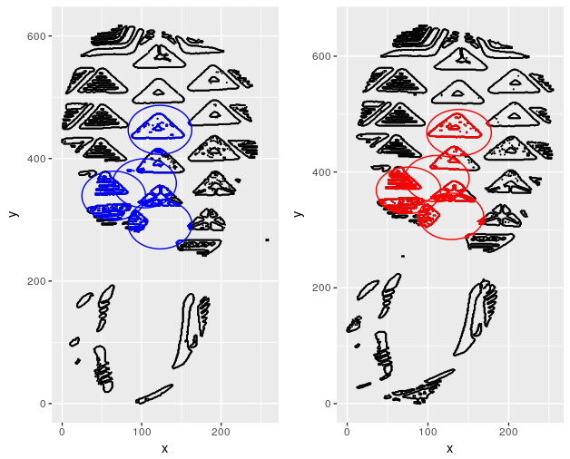
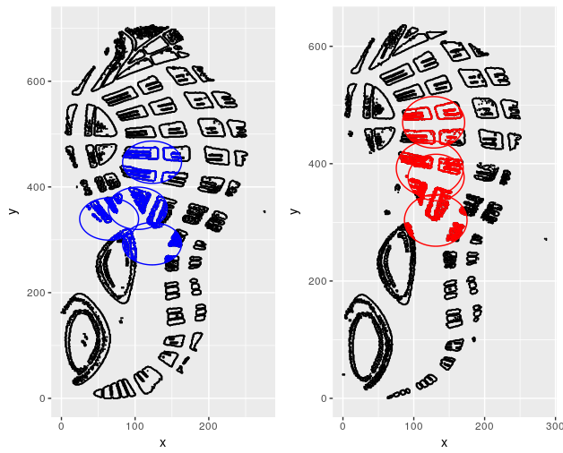

# Show and Tell   October 02

# Presenter 1

## Presenter 1 - Slide 1

- Cherophobia is the fear of fun
- "Facebook Addiction Disorder" is a mental disorder identified by Psychologists
- Bananas grow curved because they start growing towards the sun

## Presenter 1 - Slide 2

- The border between Mexico and the USA is the second largest border in the world (US-Canada is longer)
- Mexico???s size is 756,066 square miles, which is almost three times larger than Texas
- Mexico is second only to Brazil in the number of Catholic citizens

# Nick Berry

## Nick Berry - Path Finding

## Nick Berry - Break Point Proposals

# Soyoung

## Soyoung's slides 1

## Soyoung's slides 2

## Soyoung's slides 3

