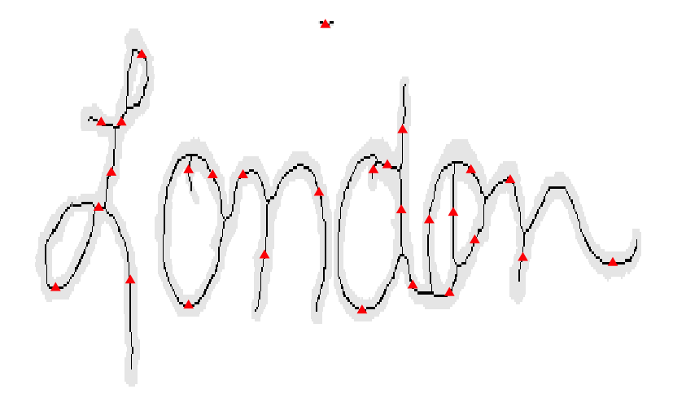

# Show and Tell   October 09

# Heike & Alicia

## Firing Range

- visit of shooting range on Oct 3 2017

## Officer Lennie and our Mylar tube

## Nailpolish for marking bullets

- nail polish works, but stains the mylar

## Sharpie marks also work

- they do not stain the mylar,
- and they even survive when the bullet is deformed

## Armored vest 

# Sam

## Nothing major to report

- Still moving forward on collecting cases to use for judge outreach courses
- Any input w.r.t what to teach, how to teach it, cases to use, etc is welcome

# Martin

## Axis for a Shoeprint found with Linear Regression

<tr>
<td>  </td>
<td>  </td>
</tr>

## To try this Week

- There is a lot of variability on the area scanned of a shoe, even within the same shoe and subject
- The alignment based on linear regression could be useful to get the initial values of a iterative method
- I will look for an algorithm that can be applied to registry binary images

# Nick

## Proposal Breakpoints

## Final Breakpoints

# Amy (\& Kiegan)

## Data

## One data frame
Need to find all unique writers

## Counting writer grapheme pairs

# Ganesh

## Algorithm: Optimization and Validation 

## Percentage of Failed Test

## Type I Error Rate

## Type II Error Rate

## Optimized window

more information: https://github.com/CSAFE-ISU/toolmark-method-assessment

