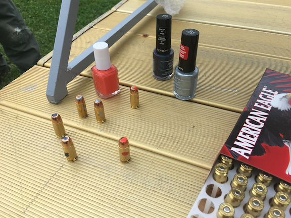
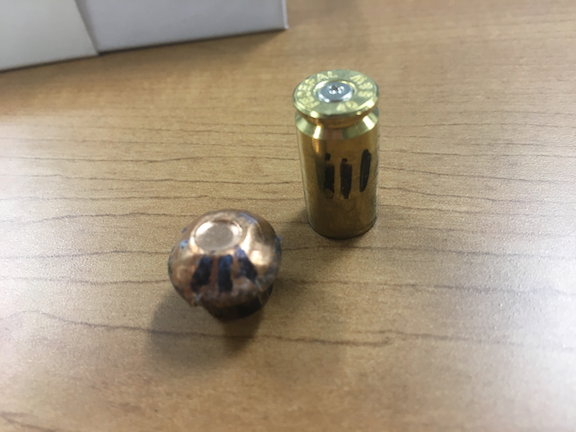

# Show and Tell   October 09

# Presenter 1

## Presenter 1 - Slide 1

- Cherophobia is the fear of fun
- "Facebook Addiction Disorder" is a mental disorder identified by Psychologists
- Bananas grow curved because they start growing towards the sun

## Presenter 1 - Slide 2

- The border between Mexico and the USA is the second largest border in the world (US-Canada is longer)
- Mexico???s size is 756,066 square miles, which is almost three times larger than Texas
- Mexico is second only to Brazil in the number of Catholic citizens

# Heike & Alicia

## Firing Range

- visit of shooting range on Oct 3 2017

## Officer Lennie and our Mylar tube

## Nailpolish for marking bullets

- nail polish works, but stains the mylar

## Sharpie marks also work

- they do not stain the mylar,
- and they even survive when the bullet is deformed

## Armored vest 

