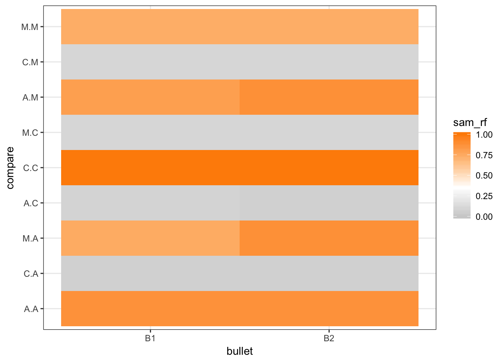
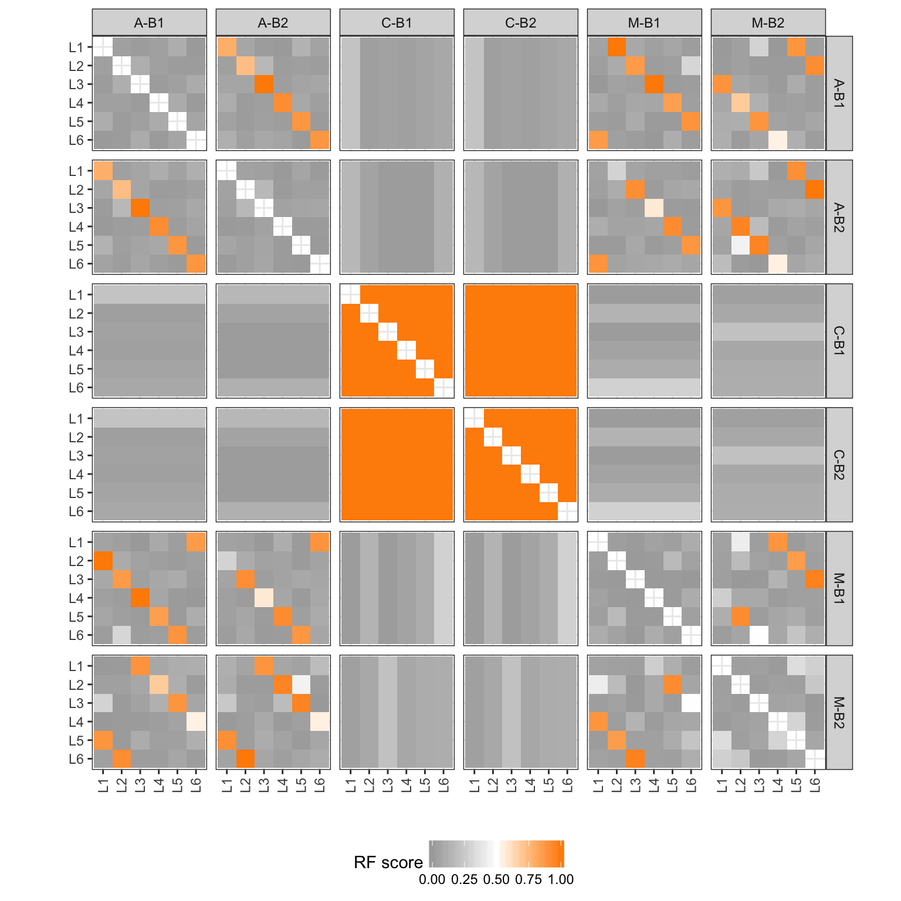
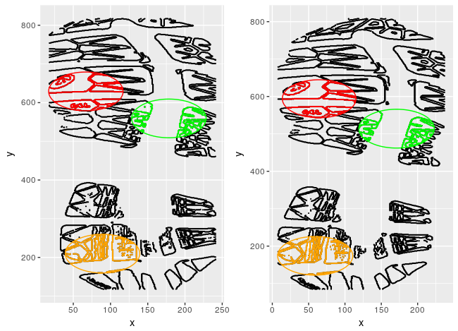
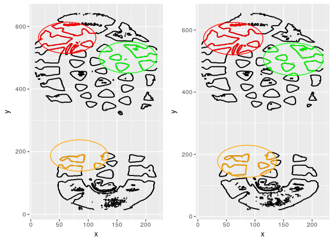
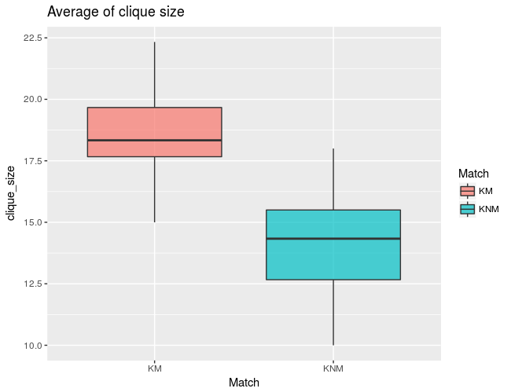
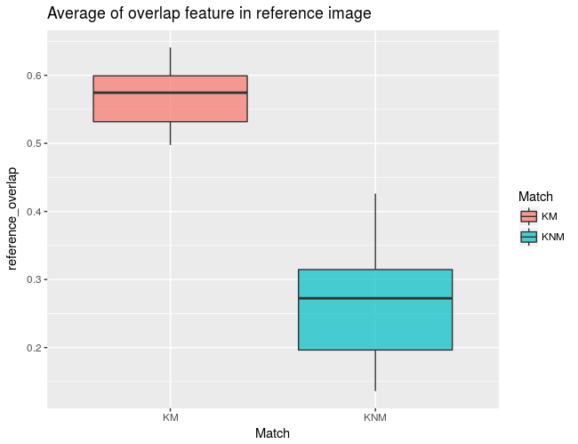
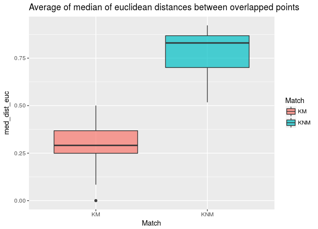
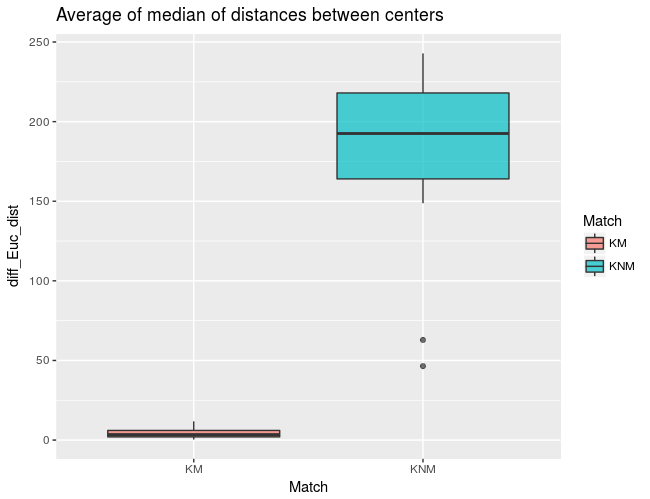
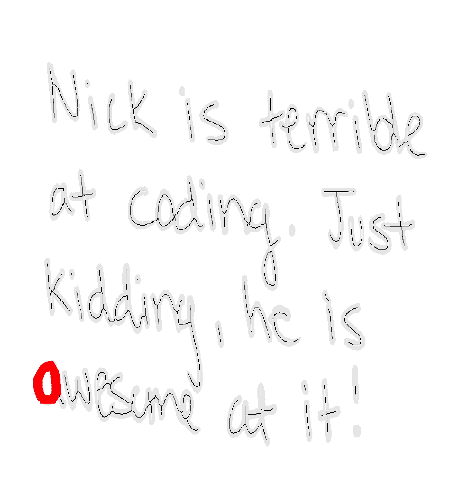

# Show and Tell   October 16

# Sample Speaker

## About Iowa

- Iowa is the only state name that starts with two vowels
- Strawberry Point is a city in Clayton County home to the world's largest strawberry
- German is the third most common language
- Iowa is the only state whose east and west borders are 100% formed by water
- Iowa ranks number one in producing corn, soybeans, hogs, eggs and ethanol

# Heike - news from the microscope

## User test

Three operators A, C, M were asked to scan two bullets each (from the same barrel) - i.e. the two bullets match each other

... look at the results ...

## What happened?

- bullet-to-bullet scores 
- high rf score is indicative of a match

## What happened - more details

- land-to-land scores 

## Soyoung

## Experiments
- Goal : 100 KM & 100 KNM

## Experiments
- Goal : 100 KM & 100 KNM

## 6 similarity attributes
- 20 KM & 15 KNM

## 6 similarity attributes
- 20 KM & 15 KNM

## 6 similarity attributes
- 20 KM & 15 KNM

## 6 similarity attributes
- 20 KM & 15 KNM

## 6 similarity attributes
- 20 KM & 15 KNM

## 6 similarity attributes
- 20 KM & 15 KNM

# Nick

## Pathfinding actually works on a full document.

## And just the loops

