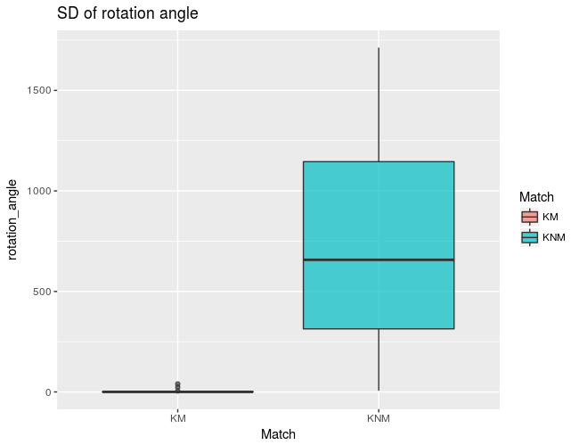
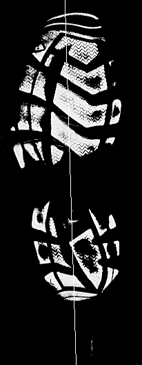

# Show and Tell   October 16

# Sample Speaker

## About Iowa

- Iowa is the only state name that starts with two vowels
- Strawberry Point is a city in Clayton County home to the world's largest strawberry
- German is the third most common language
- Iowa is the only state whose east and west borders are 100% formed by water
- Iowa ranks number one in producing corn, soybeans, hogs, eggs and ethanol

# Heike - news from the microscope

## User test

Three operators A, C, M were asked to scan two bullets each (from the same barrel) - i.e. the two bullets match each other

... look at the results ...

## What happened?

- bullet-to-bullet scores 
- high rf score is indicative of a match

## What happened - more details

- land-to-land scores 

## Soyoung

## Experiments
- Goal : 100 KM & 100 KNM

## Experiments
- Goal : 100 KM & 100 KNM

## 6 similarity attributes
- 20 KM & 15 KNM

## 6 similarity attributes
- 20 KM & 15 KNM

## 6 similarity attributes
- 20 KM & 15 KNM

## 6 similarity attributes
- 20 KM & 15 KNM

## 6 similarity attributes
- 20 KM & 15 KNM

## 6 similarity attributes
- 20 KM & 15 KNM

# Nick

## Pathfinding actually works on a full document.

## And just the loops

# Martin

## Axis for a Shoeprint found with Linear Regression

<tr>
<td>  </td>
<td>  </td>
</tr>

## Update on the Shoeprints Alignment

- Using linear regression to find the axis of a shoeprint does a good job, but far from what wee need
- After searching for methods to align binary images, it seems there is not that much done for this as special case
- A bunch of people claim that the "imregister" function from MATLAB does a very good job even for binary images
- The more important thing for "imregister" is that the objects on both images are not very far apart

# Sam and Miranda

## Judge training (Sam)

New books purchased for the CSAFE Library! 

- *Statistical Science in the Courtroom*, Joseph L. Gastwirth, Ed. 
- *Applying Statistics in the Courtroom: A New Approach for Attorneys and Expert Witnesses*, Phillip I. Good
- *Statistics for Lawyers*, Michael O. Finkelstein & Bruce Levin

## ~~Hazing~~ Introducing Miranda

- Literature review: 
    + How do people make decisions using psychological heuristics?
    + How are jurors influenced by expert testimony?
    + How are jurors influenced by the presence of statistics?
- Annotated bibliography of literature review
    + Work in progress
- Ideas from lit review for future application to human factors experiments
- Modifying Qualtrics survey to include conditions using ULTR (Uniform Language for Testimony and Reports)
    + How are the ULTR conditions perceived as compared to the RMP or LR?
