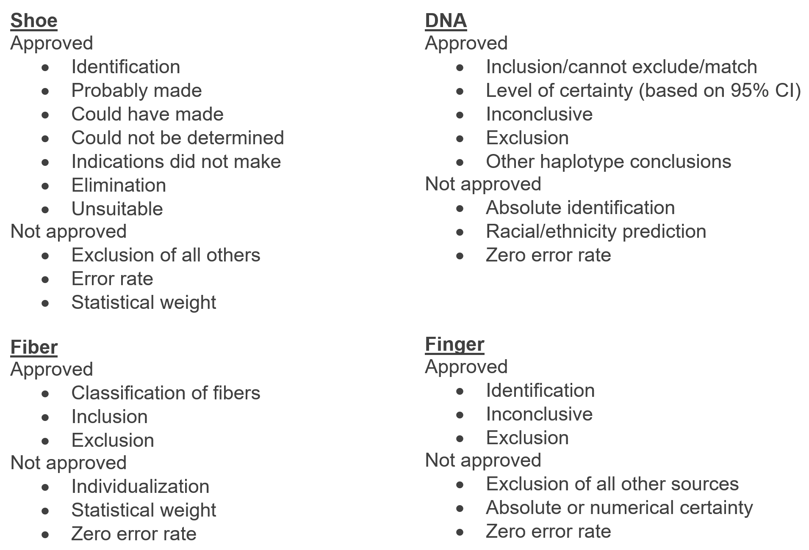

# Show and Tell   October 23

# Sample Speaker

## Uruguay

- is the least corrupt country in Latin America, it is ranked first in the region for democracy, peace, lack of corruption, quality of living, e-Government, freedom of press, size of the middle class, prosperity and security;
- is the only country in Latin America which is entirely outside the tropics;
- became the world's first country to legalize marijuana trade;
- won gold for football at both the 1924 and 1928 Olympics (they are the only Olympic gold medals the country has ever won;
- has the lowest poverty and population-growth rates in South America, and
- produced almost 95% of its electricity from renewable sources in 2015

# Miranda 

## ULTR Updates 

*Goal:* - Update Sam's Mechanical Turk study conditions to comply with Uniform Language for Testimony and Reports (ULTR) guidelines

*Previously:* - Sam's original eight conditions had the examiner assigning either a 1 in 100 (moderate evidence) or 1 in 1,000,000 (very strong evidence) random match probability to each of the four evidence types (i.e., shoeprint, fiber, fingerprint, and DNA).

*Obstacles to ULTR:* - Each evidence type has different guidelines for indicating a match, and most categories explicitly forbid the use of probability or likelihood

## ULTR Overview

## Fingerprint - ULTR 

Fingerprint evidence - only one ULTR statement provided for indicating a match: 

*Identification* - "The examiner may state or imply that an identification is the determination that two friction ridge prints originated from the same source because there is sufficient quality and quantity of corresponding information such that the examiner would not expect to see that same arrangement of features repeated in another source. While an identification to the absolute exclusion of all others is not supported by research, studies have shown that as more reliable features are found in agreement, it becomes less likely to find that same arrangement of features in a print from another source." 

## Fingerprint - Original condition

Providing a numeric level of certainty is not allowed for fingerprint evidence: difficult to manipulate this guideline into two conditions equivalent to 1/100 and 1/1,000,000 RMP

*Original condition* (moderate fingerprint): "Brian Kelly’s fingerprint is consistent with the latent print found on the bathroom faucet handle.  Based on scientific data on the characteristics of fingerprints, I estimate that approximately one in one hundred (very strong: one million) people has a fingerprint that is consistent with the partial print found on the faucet.  That means that there is one chance in one hundred (one million) of finding a consistent fingerprint from a randomly chosen person."