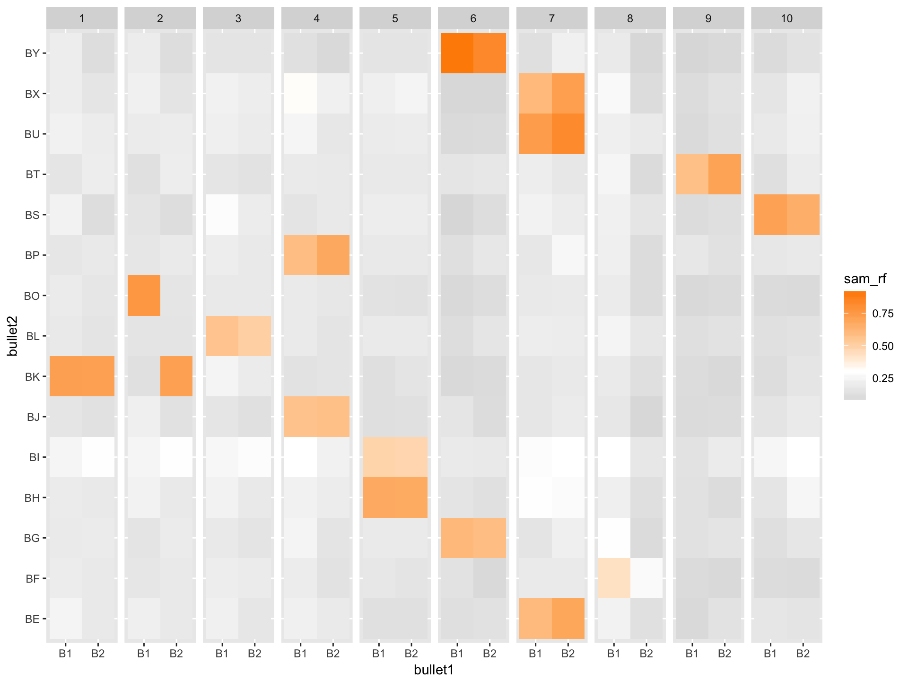
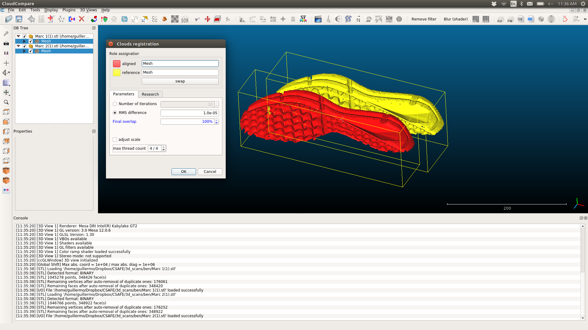
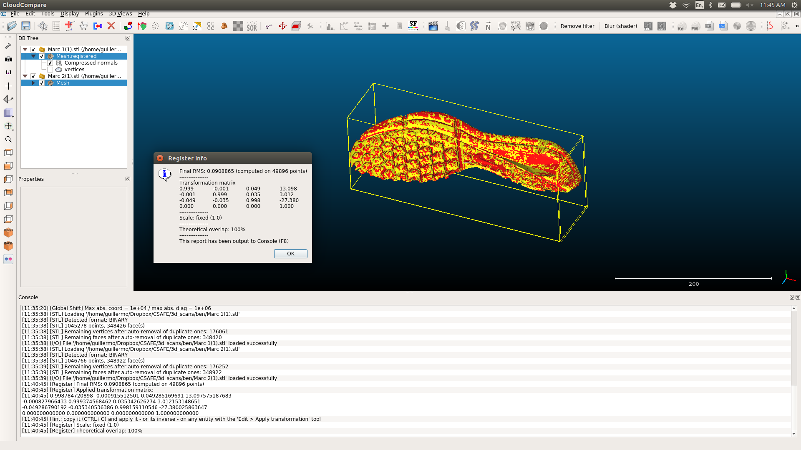

# Show and Tell   October 30

# Sample Speaker

## South Dakota

- Clark, South Dakota is home to the world famous Mashed Potato Wrestling Contest.
- Mitchell is the home of the world's only Corn Palace, which is made of 3500 bushels of corn.
- Pierre, South Dakota is the only combination of state and capital in the U.S. that doesn't share any letters.
- Mount Rushmore took 14 years and only 1 million dollars to build.
- In Deadwood a permit is required to mix one alcoholic beverage with another. But you can mix all the beer you want.
- It is also illegal there for casinos to hang a sign saying "Casino".

# Heike

## Hamby-44 Re-scan

- Hamby set 44: two test fires  each from ten consecutive barrels, 15 questioned bullets
- Hamby set 44 is part of NIST ballistics dataset
- all 35 bullets are now re-scanned with higher resolution CLM

## Hamby-44: Questioned versus known bullets

- for which bullets would you request re-scans?

# Jason

## Intervals for Random Forest Predictions

- Intervals constructed from predicted probabilities from many random forest classifiers.
- Widths increase as probabilities approach 0.5.
- Similar results to modeling individual tree classifications as binomial and making intervals for each $p$.

# Ganesh
## Previous
- Adjusted Chumbley Algorithm proposed by Hadler et al. applied to bullet signatures on all pairwise land-to-land comparisons of the Hamby scans ( a total of 85491 comparisons)
- Identified the window of optimization and window of validation for the chumbley algorithm for Bullet Signatures
for the Hamby-44 and Hamby-252.

## Profiles
- Trying to see how the chumbley algo works when profiles are used instead of signatures
- Chumbley algo uses a LOwEss smoothing with a default coarseness as 0.25, the idea is to first identify what coarseness would
give us best results in terms of type I and type II errors.
- Window of optimization and validation used is the same as identified for signatures.

# Guillermo

## 3D Scans

- Computed: Root Mean Squared
- Software: Cloud Compare
- Algorithm: [Iterative Closest Point](https://en.wikipedia.org/wiki/Iterative_closest_point) 
- URL: [Cloud Compare Wiki](http://www.cloudcompare.org/doc/wiki/index.php?title=ICP)

## Cloud Compare

## Cloud Compare

## Adidas

|combination                       |       RMS|comparison         |
|:---------------------------------|:--------|:------------------|
|Black Adidas 3 vs. Black Adidas 4 | 0.0527943|same position      |
|Gray Adidas 1 vs. Gray Adidas 2   | 0.0579312|same position      |
|Gray Adidas 3 vs. Gray Adidas 4   | 0.0739594|same position      |
|Black Adidas 2 vs. Black Adidas 4 | 0.0942008|different position |
|Gray Adidas 1 vs. Gray Adidas 3   | 0.0948706|different position |
|Gray Adidas 2 vs. Gray Adidas 4   | 0.1141320|different position |
|Black Adidas 1 vs. Black Adidas 3 | 0.1217560|different position |
|Black Adidas 1 vs. Black Adidas 2 | 0.1281420|same position      |
|Black Adidas 1 vs. Gray Adidas 1  | 0.5169180|different shoe     |
|Black Adidas 3 vs. Gray Adidas 3  | 0.5662830|different shoe     |

## Nike

|combination                   |       RMS|comparison         |
|:-----------------------------|:---------|:------------------|
|Blue Nike 1 vs. Blue Nike 3   | 0.0997982|different position |
|Black Nike 1 vs. Black Nike 3 | 0.1033800|different position |
|Blue Nike 1 vs. Blue Nike 2   | 0.1080130|same position      |
|Black Nike 2 vs. Black Nike 4 | 0.1199030|different position |
|Blue Nike 2 vs. Blue Nike 4   | 0.1201910|different position |
|Black Nike 3 vs. Black Nike 4 | 0.1257290|same position      |
|Blue Nike 3 vs. Blue Nike 4   | 0.1789350|same position      |
|Black Nike 1 vs. Black Nike 2 | 0.3249440|same position      |
|Black Nike 3 vs. Blue Nike 3  | 0.4119280|different shoe     |
|Black Nike 1 vs. Blue Nike 1  | 0.4219350|different shoe     |

## Worn Nike 10

|combination              |       RMS|comparison         |
|:------------------------|:---------|:------------------|
|Guillermo3 v. Guillermo4 | 0.0700580|same position      |
|Jimmy3 v.Jimmy4          | 0.0954348|same position      |
|Guillermo1 v. Guillermo2 | 0.1228840|same position      |
|Jimmy1 v.Jimmy2          | 0.1426450|same position      |
|Jimmy2 v. Jimmy4         | 0.1750110|different position |
|Jimmy1 v.Jimmy3          | 0.2243080|different position |
|Guillermo1 v. Guillermo3 | 0.3102520|different position |
|Guillermo2 v. Guillermo4 | 0.3232360|different position |
|Guillermo1 v. Jimmy1     | 0.7514990|different shoe     |
|Guillermo3 v. Jimmy3     | 0.8378400|different shoe     |

## Worn Nike 10.5

|combination        |       RMS|comparison         |
|:------------------|:---------|:------------------|
|Martin3 v. Martin4 | 0.0475458|same position      |
|Martin1 v. Martin2 | 0.0556824|same position      |
|Marc1 v. Marc2     | 0.0753957|same position      |
|Marc1 v. Marc3     | 0.1114660|different position |
|Marc3 v. Marc4     | 0.1293860|same position      |
|Marc2 v. Marc4     | 0.1335840|different position |
|Martin1 v. Martin3 | 0.2188400|different position |
|Martin2 v. Martin4 | 0.2361030|different position |
|Marc1 v. Martin1   | 0.9889590|different shoe     |
|Marc3 v. Martin3   | 1.0699400|different shoe     |
