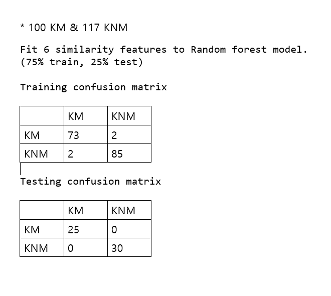
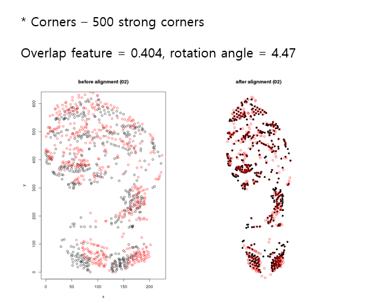
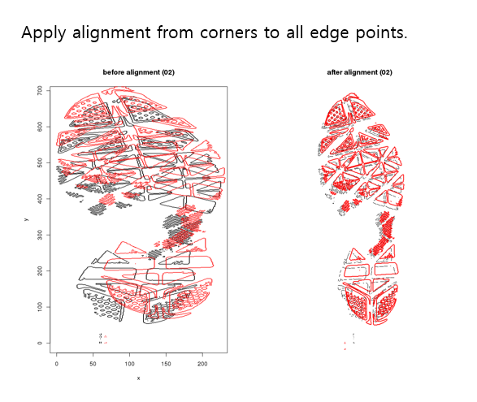
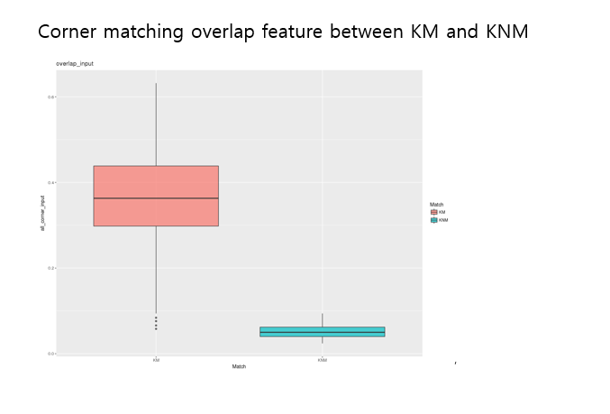
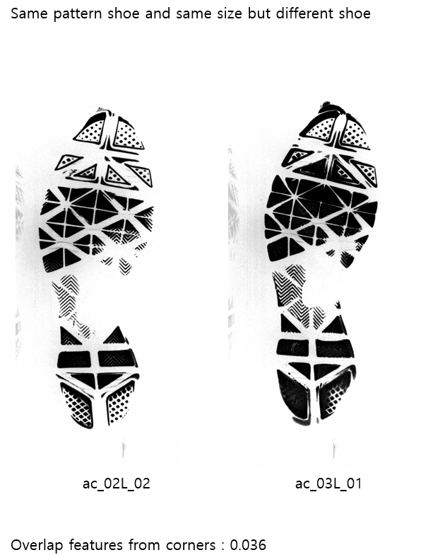
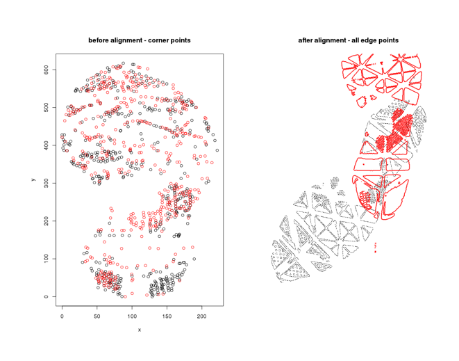

# Show and Tell   November 6

# Sample Speaker

## South Dakota

- Clark, South Dakota is home to the world famous Mashed Potato Wrestling Contest.
- Mitchell is the home of the world's only Corn Palace, which is made of 3500 bushels of corn.
- Pierre, South Dakota is the only combination of state and capital in the U.S. that doesn't share any letters.
- Mount Rushmore took 14 years and only 1 million dollars to build.
- In Deadwood a permit is required to mix one alcoholic beverage with another. But you can mix all the beer you want.
- It is also illegal there for casinos to hang a sign saying "Casino".

## Soyoung

## 3 circle matching - all edge points
- 100 KM & 117 KNM

## Rough alignment from corner points 
- 500 of strong corners are detected by Harris-Stephens algorithm

## Apply the alignment to all of edge points

## corner matching results

## Same outsole pattern but different shoes

## Same outsole pattern but different shoes

