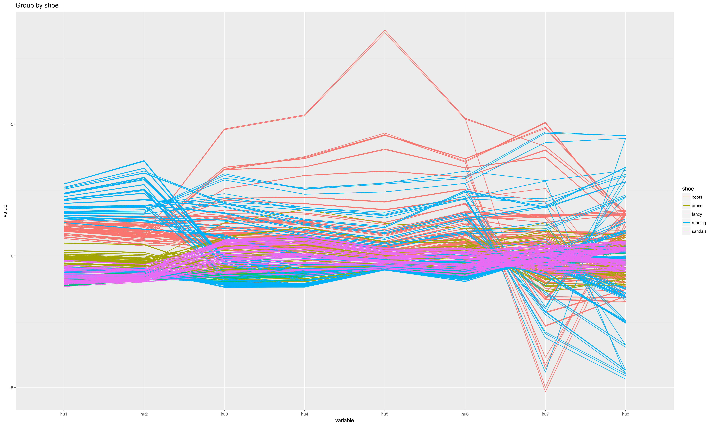
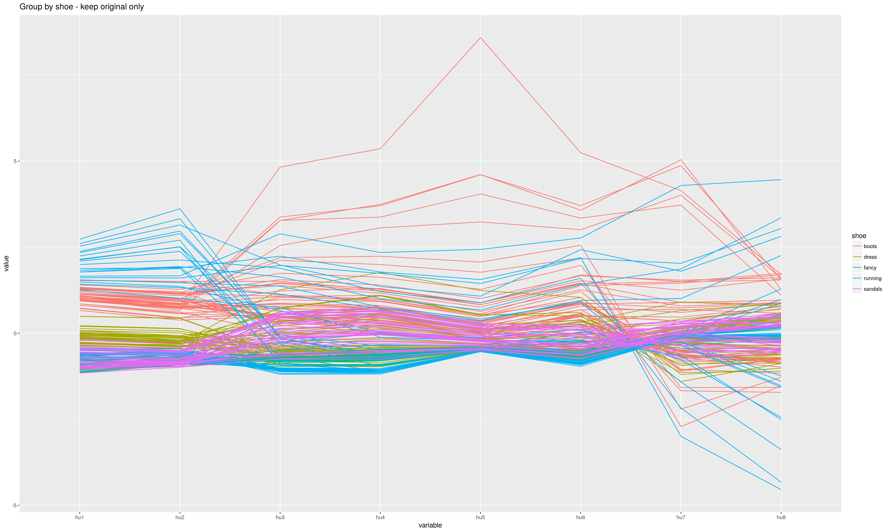
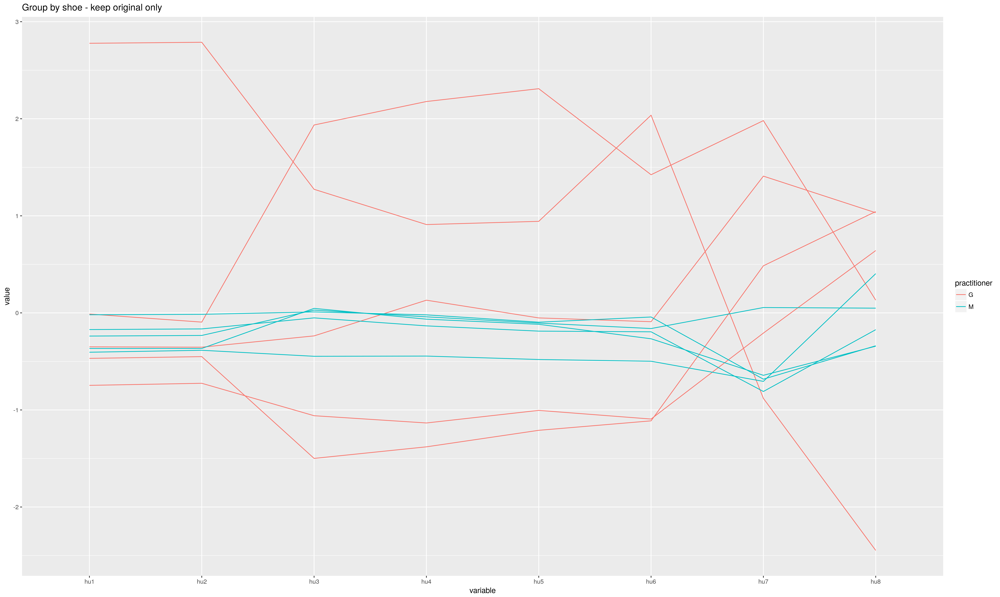
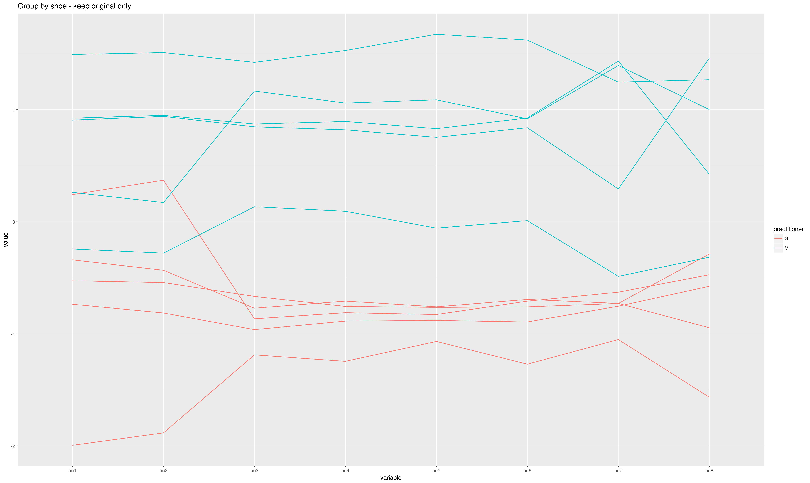
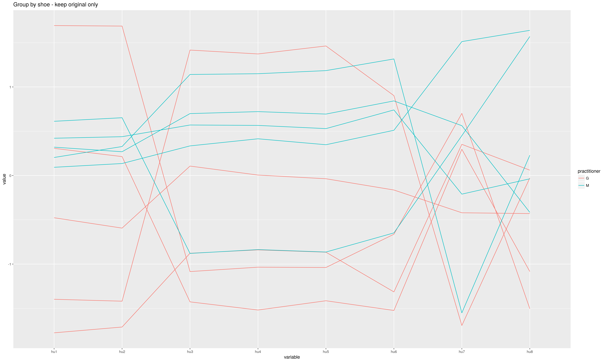
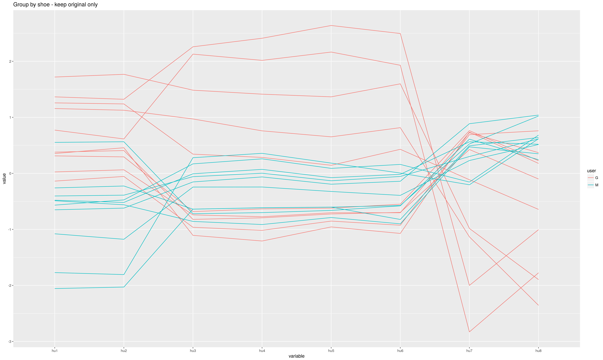

# Show and Tell   November 13

# Guillermo

## Hu Moments Robustness

|shoe  |side |user |pract |rep |image      |      hu1|
|:-----|:----|:----|:------------|:----------|:----------|--------:|
|boots |L    |G    |G            |1          |original   | 1.395490|
|boots |L    |G    |G            |1          |translated | 1.419463|
|boots |L    |G    |G            |1          |rotated30  | 1.395492|
|boots |L    |G    |G            |1          |rotated60  | 1.395492|
|boots |L    |G    |G            |1          |resized    | 1.393610|
|boots |L    |G    |G            |2          |original   | 1.366388|
|boots |L    |G    |G            |2          |translated | 1.384042|
|boots |L    |G    |G            |2          |rotated30  | 1.366386|
|boots |L    |G    |G            |2          |rotated60  | 1.366390|
|boots |L    |G    |G            |2          |resized    | 1.365857|

## Hu Moments Robustness

## Hu Moments Robustness

## Hu Moments Robustness

## Hu Moments Robustness

## Hu Moments Robustness

## Hu Moments Robustness

# Sample Speaker

## Some facts

- The Aztecs sacrificed about 250,000 people, or about 1% of their population, each year.
- As of 2015, indigenous people make up 21.5% of Mexico's population (25 million people).
- 8 out of the 52 U.S. states exist on the land that used to belong to Mexico.
- Each year, residents of Naco, Mexico, join those of Naco, Arizona, for a volleyball match over the fence separating the two countries.

# Jason

## Bullet Matching Models

- Changing the classification score cutoff drastically changes confusion matrices and model performance.
- Ideal cutoff for current random forest model seems to be somewhere around 0.85.
- Arguably better results with a simple neural network model (MLP with 5 hidden layers, no regularization).

## Bullet Matching Models

