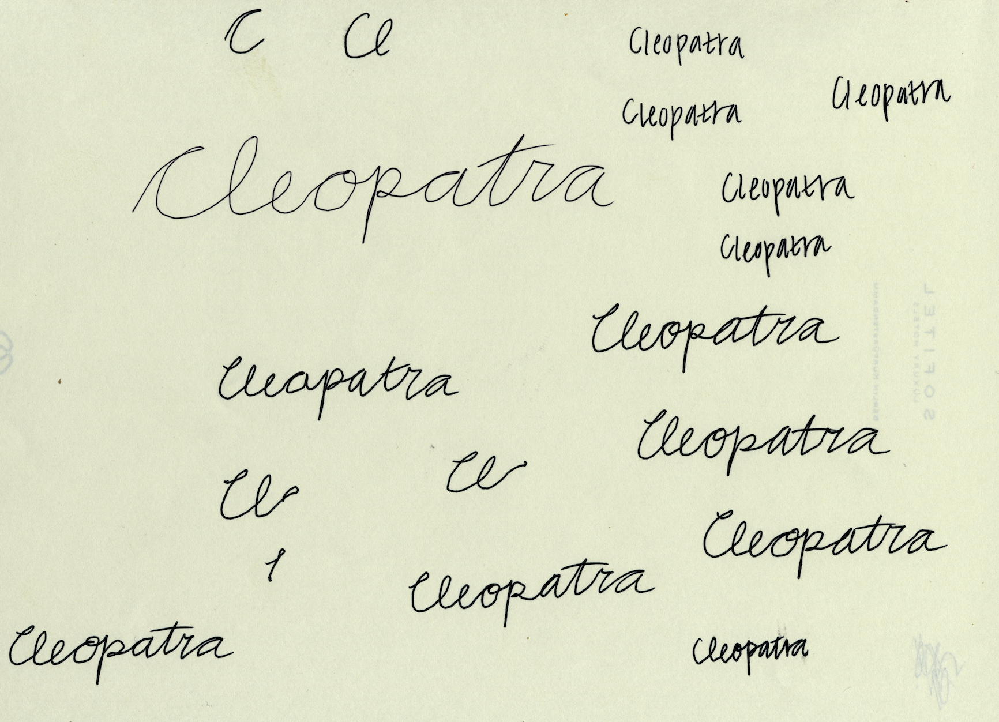

# Show and Tell   November 27

# Sample Speaker

## Sample Slide

- An image from [this article](https://www.nytimes.com/2016/10/04/well/eat/low-point-weight-wireless-scales.html) in the NYT (from 2016).

## Update on Houston FSI

- three kits (groups G1, G2, G3) with fifteen test fires each (from five barrels) amd eight questioned bullets
- all three groups are open sets, i.e. not all questioned bullets match one of the known test fires

## Known bullets

## Questioned bullets

## Scores other than Sequence Average Matching

- Algorithmically: 36 Land-to-land comparisons for each pair of bullets
- Sequence Average Matching uses maximum of consecutive land matches
- Other scores?

## Scores other than Sequence Average Matching

## Scores to Decision

- random forest based on knowns, applied to questioned

# Amy

## 9 writers, 4 documents each (exept writer 4)

- Scaled by count of 1 vertex graphemes

# Soyoung

## Shoe matching - all edge points
- 100 KM & 117 KNM

## Shoe matching - corner matching
- 444 KM & 438 KNM

## Shoe matching - corner matching
- 444 KM & 438 KNM

# Nick

## Image Cleaning (Base Image)

## Image Cleaning (Base Image)

## Image Cleaning (Base Image)

## Image Cleaning (Base Image)

## Image Cleaning (Base Image)

## Image Cleaning (Base Image)

