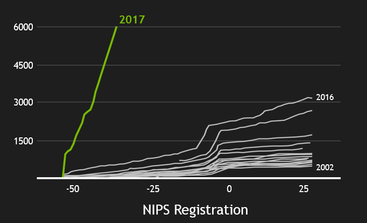

# Show and Tell   December 11

# Sample Speaker

## Sample Slide

- a
- b

# Jason

## NIPS 2017

- Arguably the most important conference in AI.
- Over 6000 people, including all the big tech companies.
- Videos for many of the sessions at https://www.facebook.com/NIPSlive/
- This was a conference devoted to *applications of statistics*. We are a large *applied statistics department*. Why was I the only one there?

## NIPS 2017

# Amy

## Graph Type Importance and Frequencies

## Consider the 10 Most Frequent Graph Types
- 2_192
- 3_224
- **4_112**
- 4_120
- 4_98
- 5_120
- 5_225
- **6_112**
- 7_120
- 8_112

## A Fully Bayesian Approach
- 9 writers
- 6 documents per writer
- Data:

## Hierarchical Model

## Estimates of Posterior Distn. for $\pi_w$ vectors

## Writing Samples
- Writing samples from writer #4 (top) and writer #8 (bottom).

## Questioned Writer #1

## Questioned Writer #2

## Analysis of two new questioned writings

## Results of *Authorship* Analysis

## Results of *Authorship* Analysis

