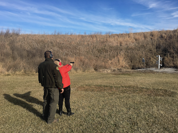
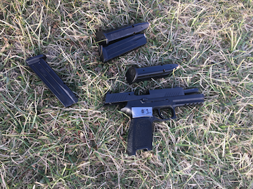
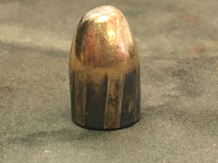
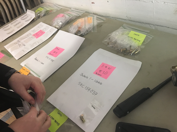
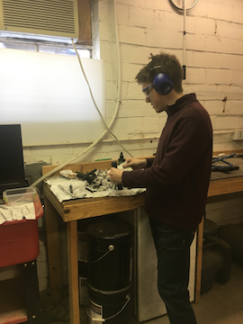
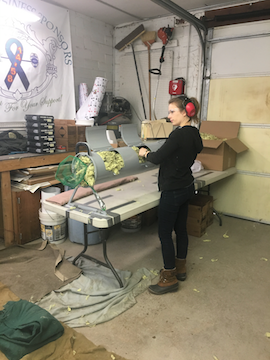

# Show and Tell <br> January 22

# Sample Speaker

## Sample Slide

- Very 
- Stable
- Genius

# Bullet project

## Lot's of news!

- FTE workshop Dec 7/8 was great, thanks everybody for their help
- **CSAFE-Persistence**: Over the break we went out to the Story County shooting range and collected bullets from ten new Sig Sauer handguns.

## CSAFE persistence






## CSAFE persistence




Next outing: tomorrow 12-4pm, please send email if you want to help

## bulletr

- x3p IS0 standard was updated in late 2017. 
- `read_x3p` and `write_x3p` are adjusted in bulletr.
- we've made a test image ... it's supposed to be wildly distributed:


## csafe logo as x3p

```{r, message=FALSE}
devtools::install_github("csafe-isu/bulletr")
library(bulletr)
test <- read_x3p(path=system.file("", "csafe-logo.x3p", package = "bulletr"))
plot_3d_land(bullet=test)
```


#Soyoung

## Shoe matching - Method 1 (Edges)
- Fix circles in Q and find best matching circles in K
- Confine area for candidate circles in K
- KM ; Compare Li1 vs. Li2, KNM ; Li1 vs. Lj1 
- Same pattern but different shoe ; Li1 vs. Ri1
- Partial vs. full ; partial Li1 vs. Li2


## Shoe matching - Method 2 (Corners & Edges)
- Fast alignment using 500 of strong corners
- After the alignment, fix circles in Q and find corresponding area in K to find best matching circles
- KM, KNM, same pattern diff shoe (L vs. R)
- Most challenging : partial vs. full comparison

## Shoe matching - Method 2 (Corners & Edges)


