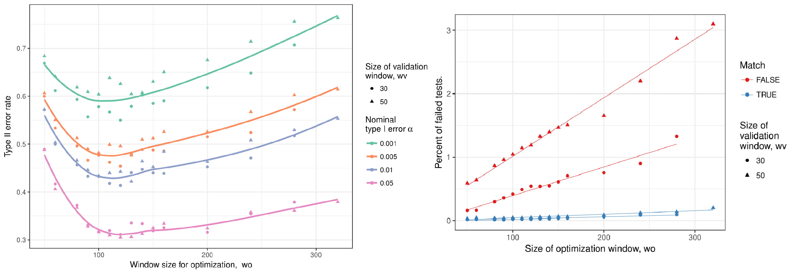

# Show and Tell   January 29

# Soyoung

## Shoe matching - Method 1 (Edges)
- Fix circles in Q and find best matching circles in K
- Problem : Takes long time!! 
- Confine area for candidate circles in K (1 hour -> 10 mins)

## Shoe print matching - Method 1 (Edges)
- KM ; Compare Li1 vs. Li2, KNM ; Li1 vs. Lj1, Partial vs. full ; partial Li1 vs. Li2
- Same pattern but different shoe ; Li1 vs. Ri1

## Shoe print matching - Method 2 (Corners & Edges)
- Fast alignment using 500 of strong corners
- After the alignment, fix circles in Q and find corresponding area in K to find best matching circles
- KM, KNM, same pattern diff shoe (L vs. R)
- Most challenging : partial vs. full comparison

## Shoe print matching - Method 2 (Corners & Edges)

## Shoe print matching - Method 2 (Corners & Edges)

# Ganesh

## Adapting the chumbley score to bullets

## Optimization Window (Signatures)

## Validation Window (Signatures + Profiles)

## Coarseness (Profiles)

## Modification of Algorithm

1.Instead of using static same distance windows in the validation step, allowing for wiggle room.
Pick out the window which gives the best correlation between the two markings.

2.Current modification keeps the Validation window size the same, but moves it a bit to the left and right on the second (of the two markings)

3.Results are slightly better than the original hadler-morris-chumbley algorithm. A 1 pixel (0.645 micron) movement of WV, reduces both the number of False Positives and False Negatives

4.Needs to be tested for different "delta parameter values" (how much window movement is good enough?)

<!-- ## Alternative modificiations to be tested  -->
<!-- -Move windows on both markings -->
<!-- -Extend the window for wiggle room on both markings -->

<!-- 
 -->

<!--  -->

# Sam 

## Bullet project

- File tracking for large files $\Rightarrow$ [Git LFS](https://git-lfs.github.com/)
- Works with private repos
- Really fast with Git version 2.11.0

## Training for Judges

- 3 case studies, 3 statistical concepts

1. Sampling - US v. Shonubi (1997) (drug smuggling)
2. Independence - Sally Clark case in UK (1999) (2 SIDS deaths in 1 family)
3. Conditional Probability - People v. Collins (1968) (supposed rarity of interracial couple)

## Training (cont.)

General idea: 

- judges only have time to care about what's relevant to them
- present literal case studies where a statistical concept was relevant
- explain how the statistics played a role
- generally explain some statistics concepts
- glossary and formula definition appendices 

Still TBD: 

- Likelihood ratio
- Quantifying and understanding variability
- Relevant populations (?) (can be pushed into LR)
- Others? Maybe something about assumptions when modeling? 

## Writing

- Aim to submit paper on the mock juror study to *Law, Probability, and Risk* by end of February 

- ROpenSci Fellowship...waiting to hear more

# Kiegan  

## Different methods for finding 'cutoff' values  
- Using robust linear models to fit the curve of the bullet 
- Get residuals 
- How do we decide where to cut off the residuals? (i.e., where are the grooves?)
- 4 times median value of the residuals 
- Divide residuals by relative height and take range of wherever the non-positive residuals are

## Comparing difference in grooves to residuals  

## Comparing difference in grooves to residuals

