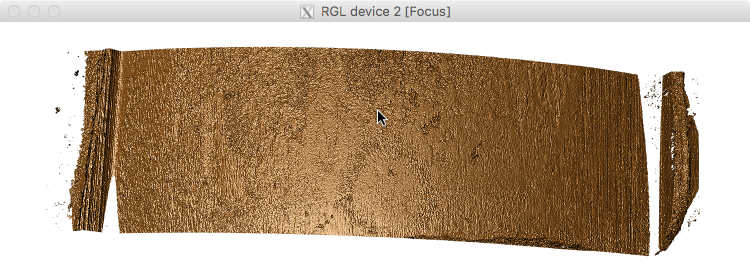
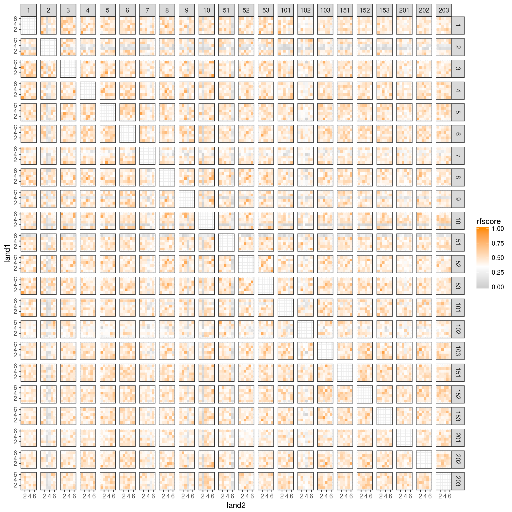
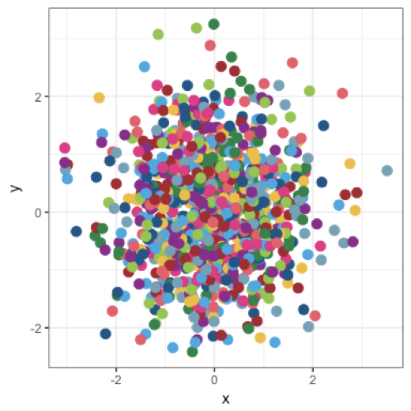
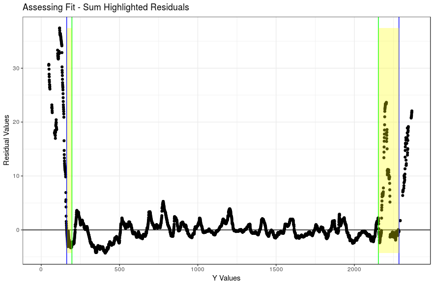
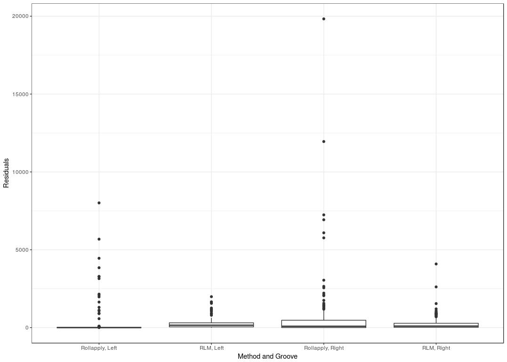
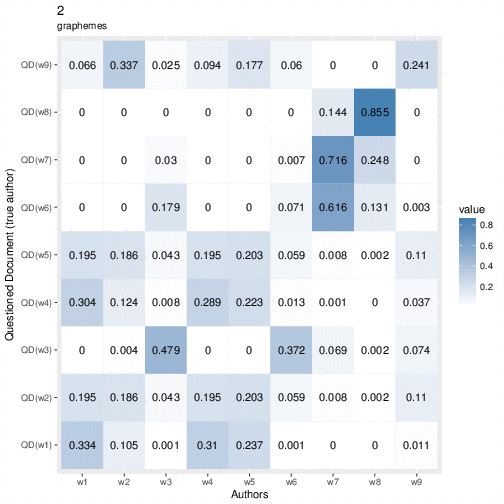
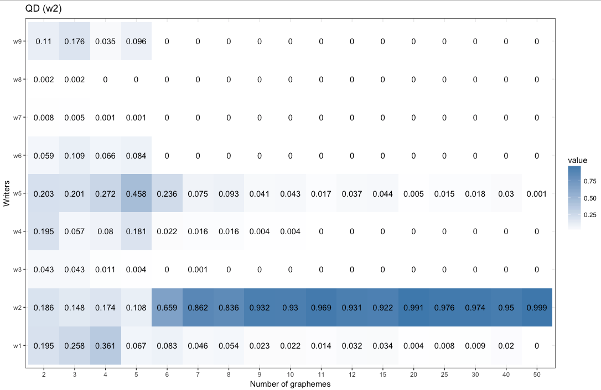
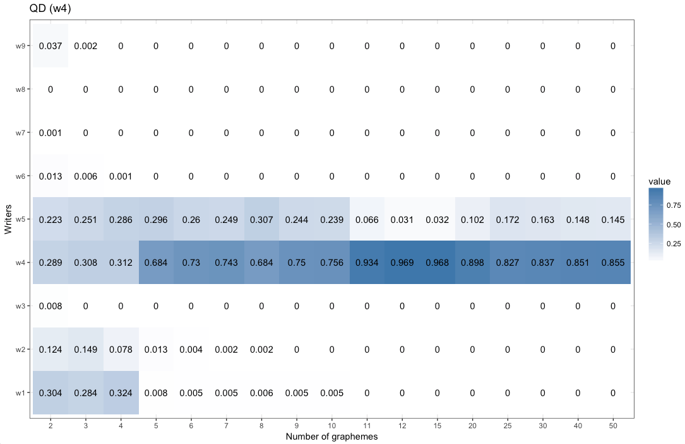
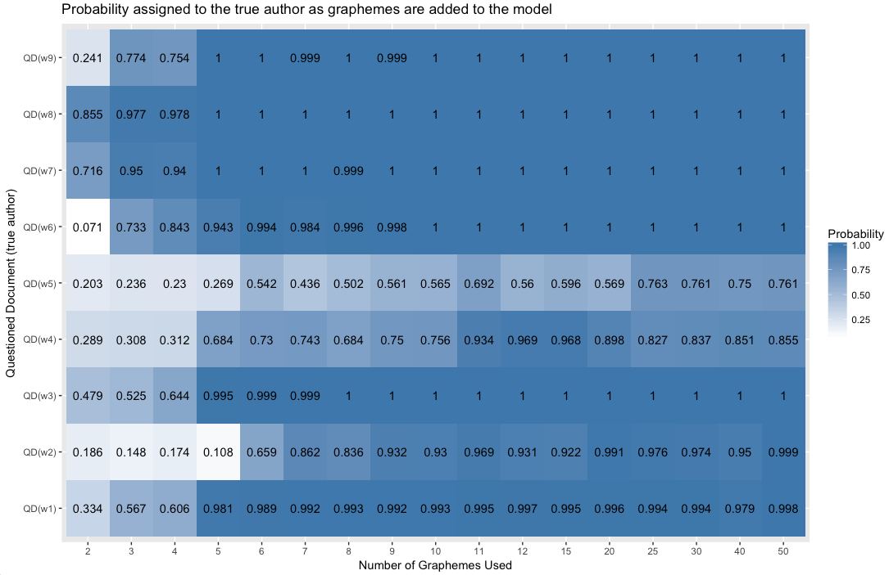
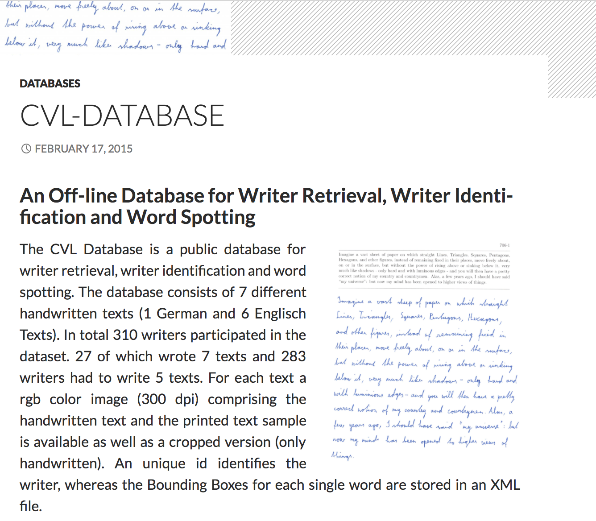

# Show and Tell   February 5

# Sample Speaker

## Sample Slide

- Do
- not
- trust
- the
- groundhog

# Heike

##  {.white}

!! We are done !!

## Bullet collection

- On Friday we finished collecting bullets from the ten new Sig Sauer hand guns.
- 1,270 bullets and cartridge cases from ten different barrels
- start collecting for ten Smith & Wessons (confiscated by DCI Ankeny)
- scanning

## Results from first couple of scans

Bullet lands don't have very deep marks, but scans look OK

## Matching? - not so much

Barrel 1:

## On a different note ...

Color schemes: CSAFE has it's own color scheme!

# Guillermo

## On shoes...

- Study is going well for the most part (looking at you, 3D scanner)
- Planning on extending the period participants will be using the shoes
- Thinking of a follow-up study for the Summer (maybe NIST too)
- Extracting matrices from pressure sensing mat
- Testing ICP algorithm

# Kiegan

## Groove ID  

- RLM method is performing better than `rollapply` method  
- Reduces extremity of really bad `rollapply` examples  

  

## Groove ID  

- RLM method is performing better than `rollapply` method  
- Reduces extremity of really bad `rollapply` examples  

  

## Groove ID  
- Also going to try iteratively fitting `loess` model  
- Main problem is always 'how far is too far' - the cutoff problem  

## Statistics and Society Book  

- Meeting w/Hal via Zoom, then leadership team (outline)  
- Re-framing Sam's judge training
- Searching for real-world case studies  

# Amy

## REU Results - Hierarchical Model

 

## REU Results - Hierarchical Model

 

## REU Results - Hierarchical Model

 

## REU Results - Hierarchical Model

 

## Data

- Re-install an updated version of Flash ID
- Re-construct and re-export all reference sets (**old**: REU data, **new**: CVL database)

 

