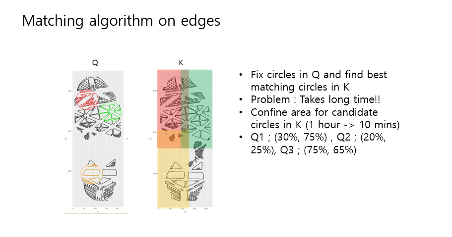
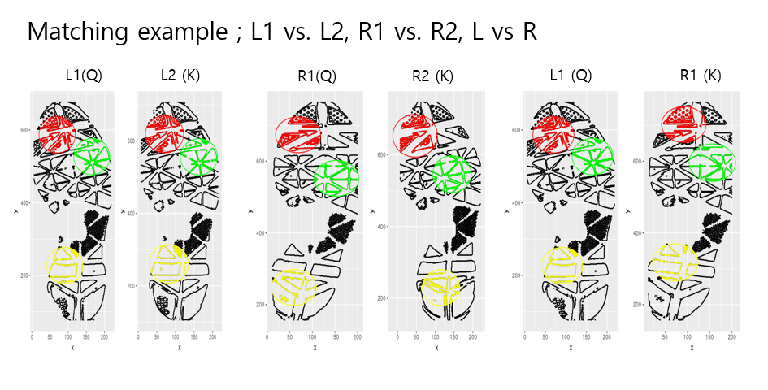
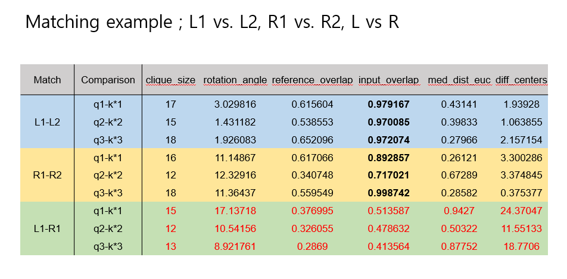
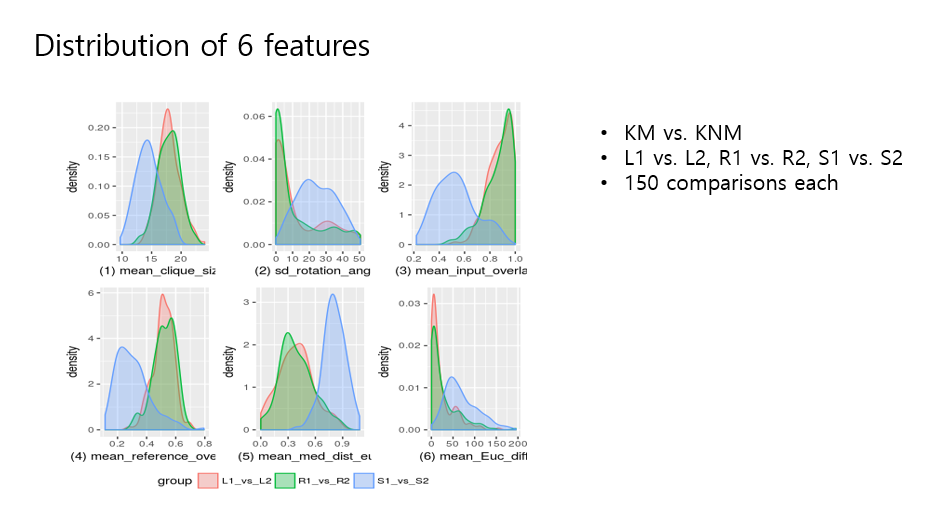
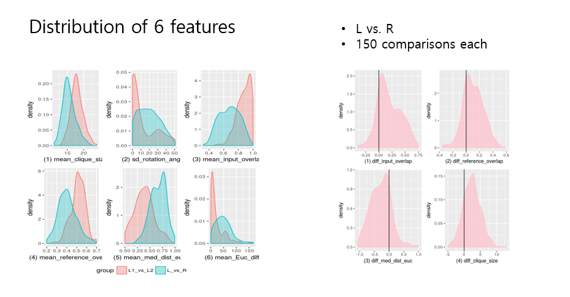
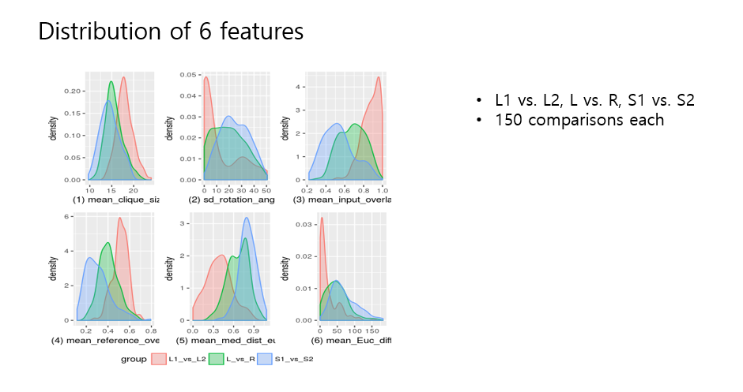
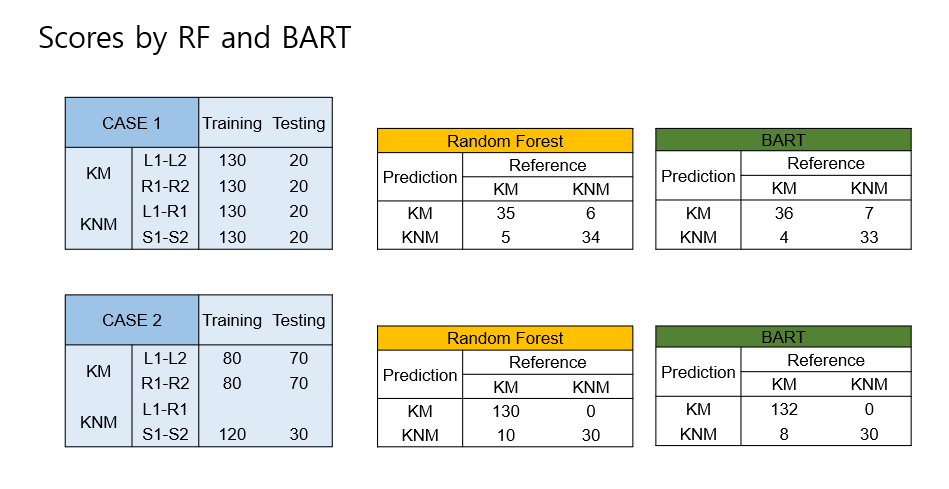
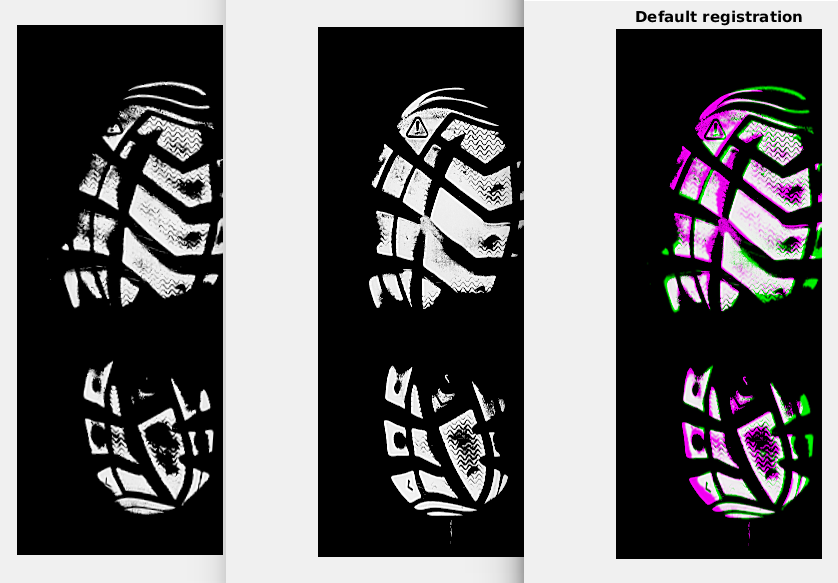
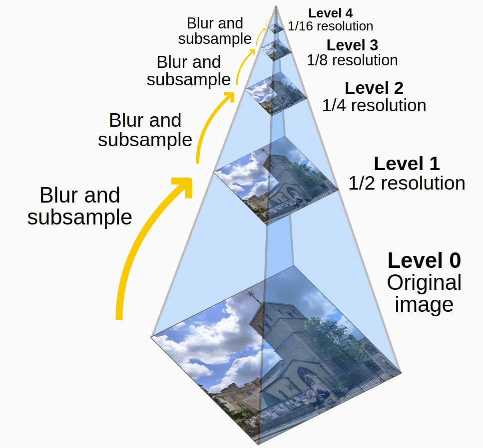

# Show and Tell   February 12

# Sample Speaker

## Sample Slide

- The 
- groundhog
- was 
- right
- :'(

# Soyoung

## Shoe matching on edges

## Shoe matching on edges

## Shoe matching on edges

## Shoe matching on edges

## Shoe matching on edges

## Shoe matching on edges

## Shoe matching on edges

# Martin

## Shoeprint registration update

* What is working?
     + Given two shoeprint images, we can do a initial rough alignment using an axis found with SLR
     + After this is done, we apply the MATLAB function 'imregister' to get a better alignment

## Currently working on...

* Writing my version of 'imregister' in Rcpp
     + The algorithm is based on minimizing the difference of the pixel intensities after a given affine transformation is applied
     + The optimization algorithm is based on gradient descent
     + The more interesting part is the use of the pyramid representation
     

=======
# Nick

## Coding things up
 - Just coding things up. Thinning algorithm can take up to a minute for full documents
 - When we start processing documents, this adds up. Would like to decrease this time
 - Converting R code to Rcpp
