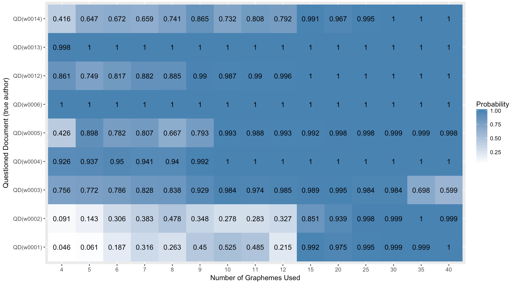
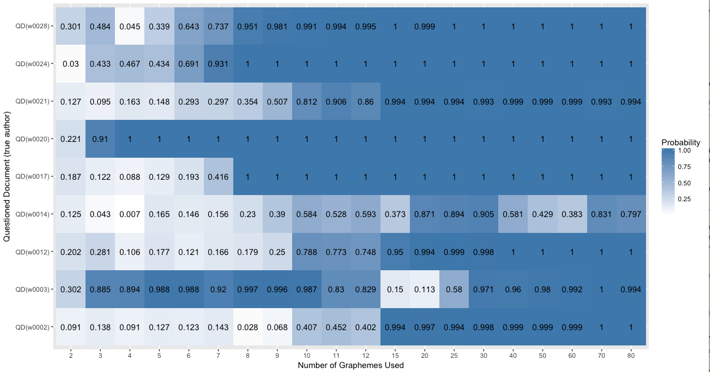
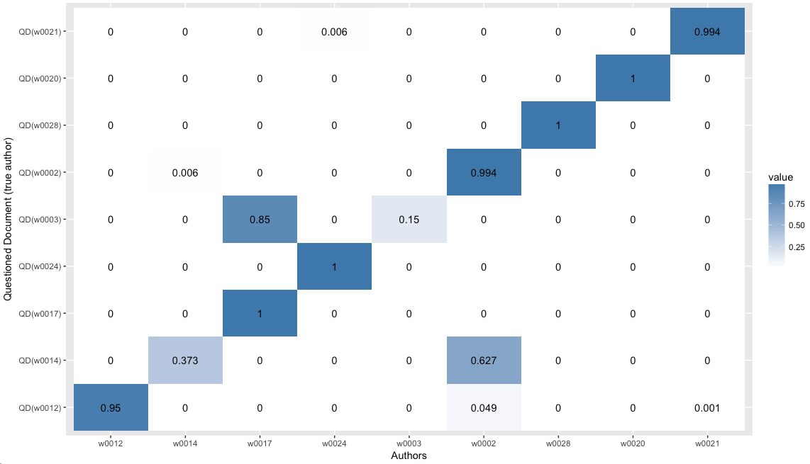
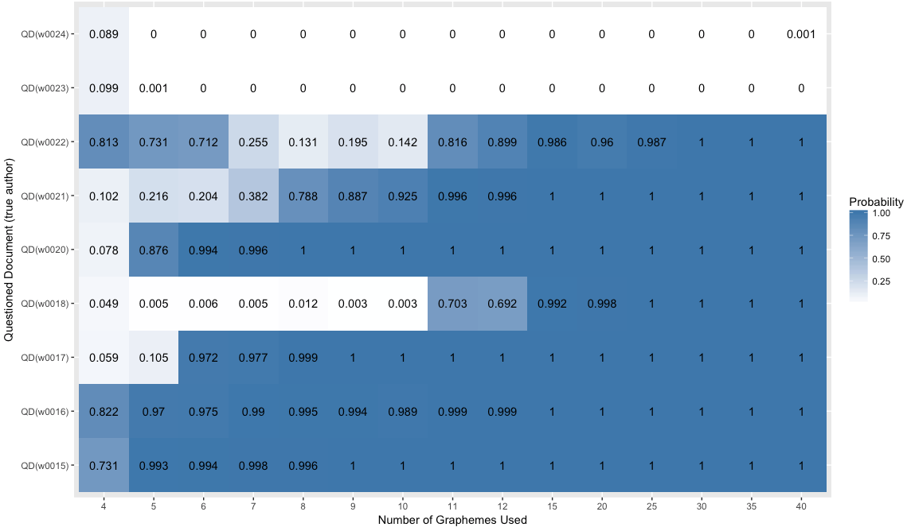
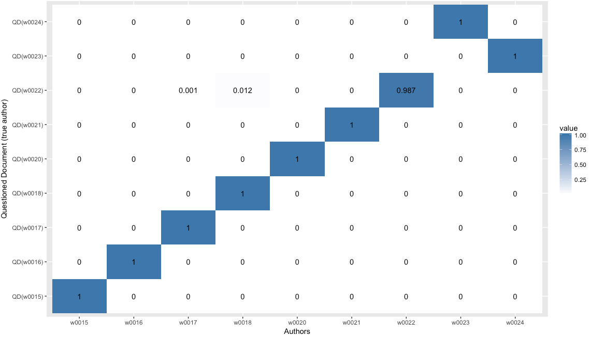
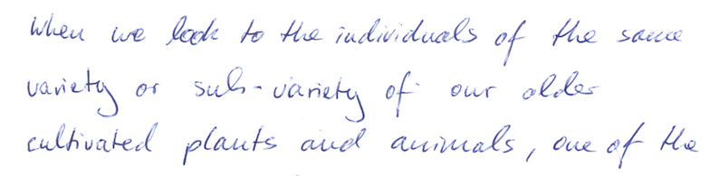
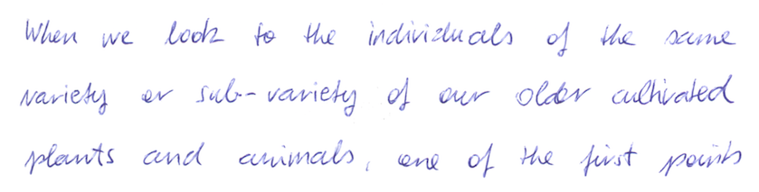

# Show and Tell   February 26

# Sample Speaker

## Sample Slide

- a
- b
- c

# Jason

## Feature Distributions on Hamby and Phonix Sets

## Feature Distributions on Hamby and Phonix Sets

## Interval Lengths on Phoenix Set

## Interval Lengths by `rtrees` Predicted Scores

# Kiegan

## AAFS in Seattle  
- Gave talk on automated groove ID in 3D bullet land scans
- Worked the booth!  

## Statistics and Forensics book

- Sending section on pattern evidence/fingerprints to editor  
- Sending to John Kimmel by end of the week  

# Ganesh

## Writing
- Working on the writeup for the Chumbley score adaptation
## Shiny
- In the process of updating shiny app for reading writing to be in sync with x3ptools
## Chumbley score
- Comparing bullets by combining lands
- Running for the in-house Hamby data
- Window wiggle adaptation fix

# Amy

## AAFS Conference in Seattle

## Example #1 - Poster

## Example #2

## Example #2 - 15 graphemes

## Example #3

## Example #3 - 25 graphemes

## Example #3 - Writing samples 
### (w0023 top, w0024 bottom)

