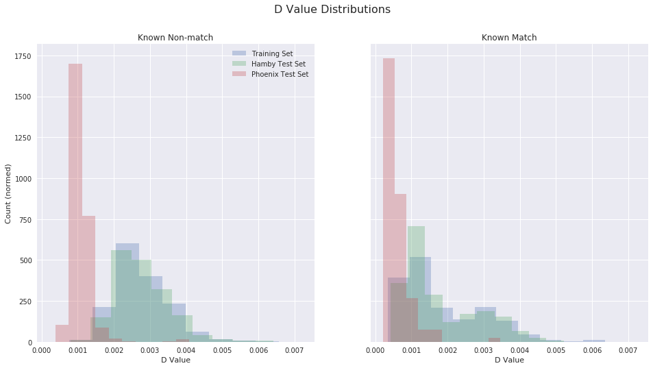
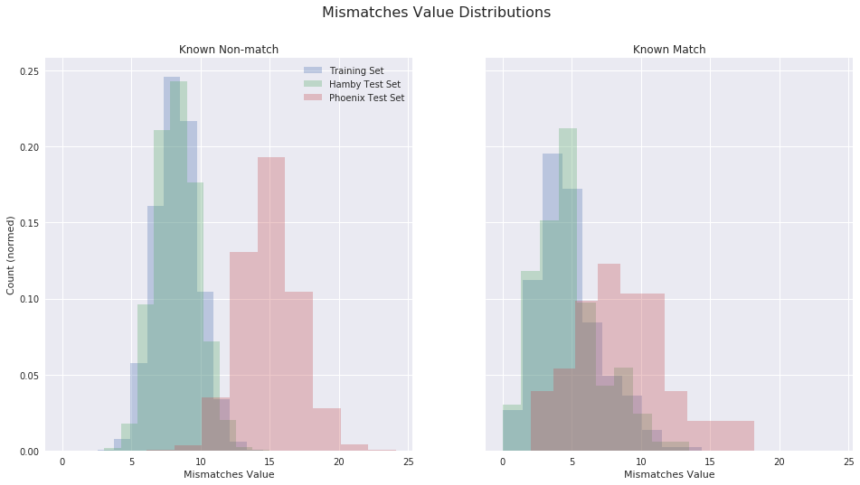
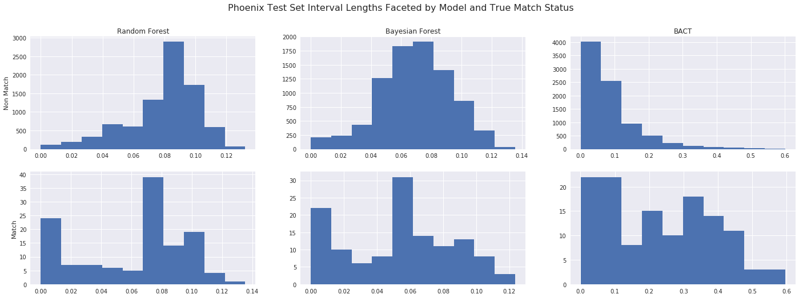
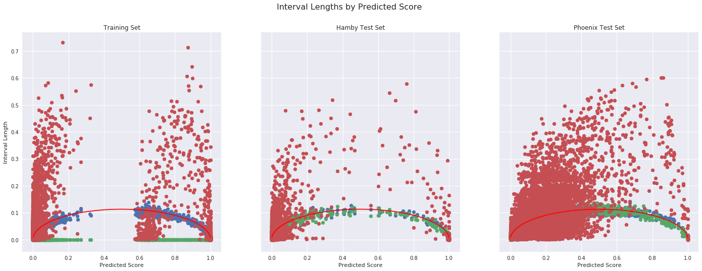
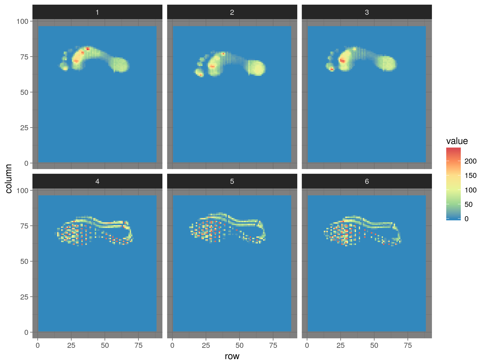
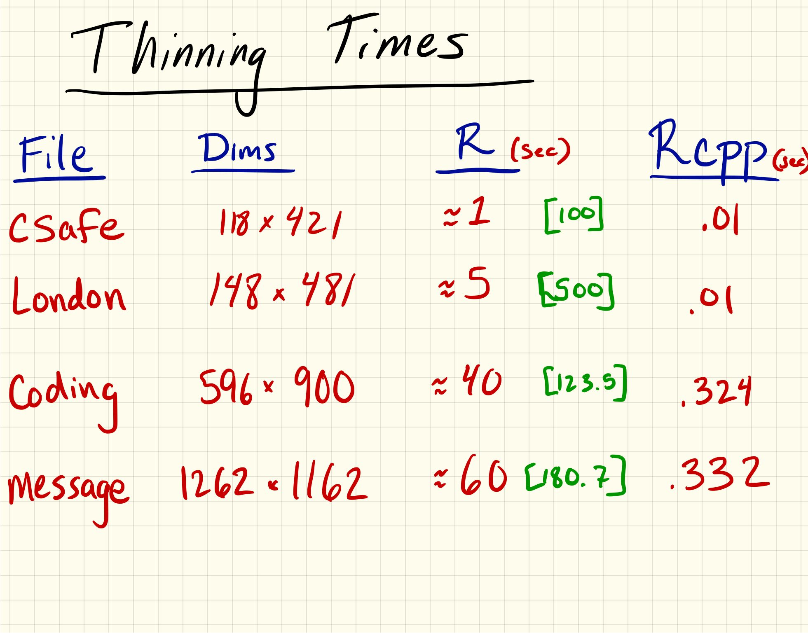

# Show and Tell <br> February 26

# Jason

## Feature Distributions on Hamby and Phonix Sets


## Feature Distributions on Hamby and Phonix Sets


## Interval Lengths on Phoenix Set


## Interval Lengths by `rtrees` Predicted Scores



# Kiegan

## AAFS in Seattle  
- Gave talk on automated groove ID in 3D bullet land scans
- Worked the booth!  


## Statistics and Forensics book

- Sending section on pattern evidence/fingerprints to editor  
- Sending to John Kimmel by end of the week  

# Guillermo

## Pressure Sensing Mat

- Two CSV files
    + Single frame
    + 300 frames (that create a video)
- Text in CSV: text and matrix or matrices
- Rows of text are variable

## Raw Low Resolution



## Interpolated


# Ganesh

## Writing
- Working on the writeup for the Chumbley score adaptation
## Shiny
- In the process of updating shiny app for reading writing to be in sync with x3ptools
## Chumbley score
- Comparing bullets by combining lands
- Running for the in-house Hamby data
- Window wiggle adaptation fix

# Nick

## Re-writing Thinning Algorithm
 - I'm now on the lookout for other things that I can do faster


## Shiny App
 - Speedups in thinning allowed us to make the shiny app better. All processing now done in app, so an image can be uploaded rather than an RDS object that was pre-processed.
  - <https://berryni.shinyapps.io/ViewHW>
  
# Martin

## AAFS (Seattle)
- Presented a poster talking about the CSAFE shoeprint project, including the shoeprints study, database in construction and current progress to analyze the 2d scanner images
- Ran the booth at the exhibition  
- Attended some talkes and poster presentations from 'Engineering Sciences' and 'Digital & Multimedia Sciences' sections

## Shoeprint images alignment

- Still working on my version of 'imregister' (mostly debugging)
- Currently working on obtaining the distribution of the differences between the first reading (baseline) and second reading for the nike shoes (male size 10.5)

# Heike

## Current

- We have a new set of barrels to test!
- Sign up for this Friday 8-12 or 12-4, if you are available (email from Stacy)

## x3ptools

- new package to work with x3p files
- gain for us: 120 MB files go down to 20 MB
- available from https://github.com/heike/x3ptools
- Functionality
  - Reading/Writing: `read_x3p`, `write_x3p`
  - Basic transformations: rotate, transpose, sample
  - Basic visualization
- ready to go on CRAN, waiting for OK from NIST

## GIT LFS

- works fine, once the file names are less than a mile long:
- file identifier: study-type-barrel-shotnumber, e.g. `DCI-B-01-0001` and `DCI-C-01-0001`
- git lfs does come at a price ... 50 GB/month for $5

## Finally, color schemes

```{r, fig.width=4, fig.height=4, message=FALSE, warning=FALSE, eval = FALSE}
# devtools::install_github("heike/gretchenalbrecht")
library(gretchenalbrecht)
csafe <- make_palette("https://forensicstats.org/wp-content/uploads/2017/01/csafe-logo-90.png")
cols10 <- get_pal(11, csafe) 

dframe <- data.frame(x = rnorm(1000), y = rnorm(1000), col=sample(1:10, 1000, replace=TRUE))
dframe %>% ggplot(aes(x = x, y=y, colour=factor(col))) + geom_point(size=3) + 
  theme_bw() +
  theme(legend.position="none") +
  scale_colour_manual(values=cols10$col[-1])
```
