# Show and Tell   March 19

# Sam

## Projects

- **Judge training:** draft waiting for feedback from Hal & Alicia, then will be sent to judges for feedback
- **REU:** phone interviews nearly complete! Project planning - data science focus, glass data & mock jury study data. Lecture/event/activity ideas welcome! 
- **ROpenSci Fellowship:** [CRAN task view](https://github.com/sctyner/ctv-forsci) draft complete. Feedback welcome! Going to be "rotating" on projects for 4-6 weeks, starting with glass. 

# Ganesh

## Nist Scans: Observed Type I error rate

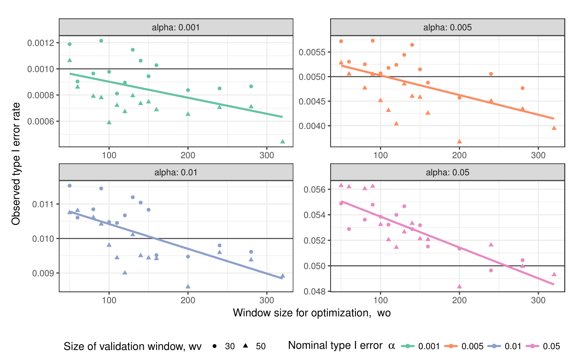

## Nist Scans: Type II Error rate and Failed Tests

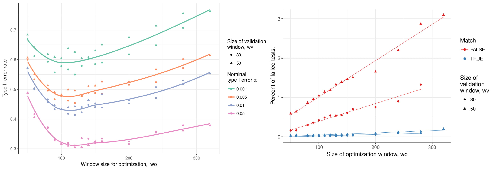

## Updates
- **CSAFE scans:** Testing setup ready
- Results are not much better at the moment than NIST scans, in terms of FP and FN error rates. 
- Investigating, possible problems of missing values in signature, smoothing and excessive failing of different shift comparisons

# Kiegan  

## Updates  

- **Chapman and Hall book:**  'Officially' happening! Positive reviews.  
    - Finishing chapter on analysis of evidence by end of March
    - Trace evidence case studies  
    - DNA case studies (non-mixture)  
- **NIJ Graduate Fellowship:** Submitted over break. :) 
- **Groove Identification:** Looking into median absolute devation, iterative robust linear model fits  

# Nick

## Updates

 - Removed dependency on "imager"
 - Cleaned up image to fill holes that shouldn't be there
 - Redid plotting to make it a little faster and changed little red circles.

## Cleaning Effects
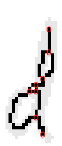
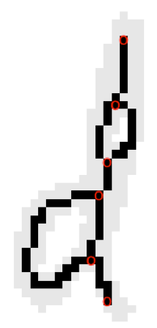

## Cleaning Effects
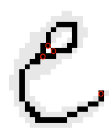
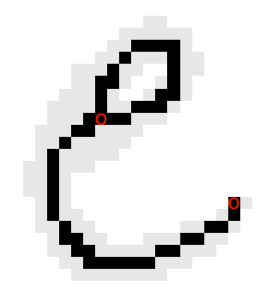

## Cleaning Effects

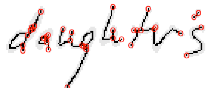
 
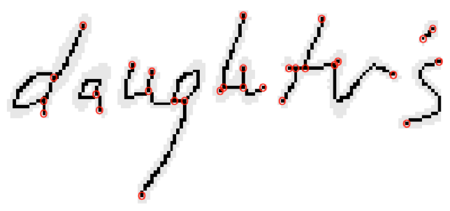

## New Plots

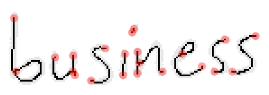

# Guillermo

## Renaming files

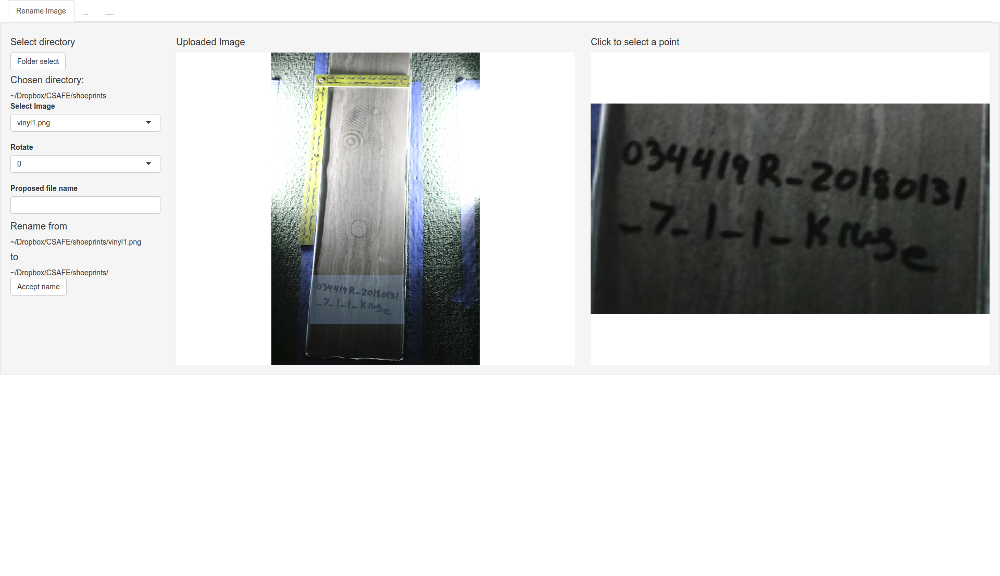

# Soyoung

## Shoe matching score
- Mated score and Non-mated score

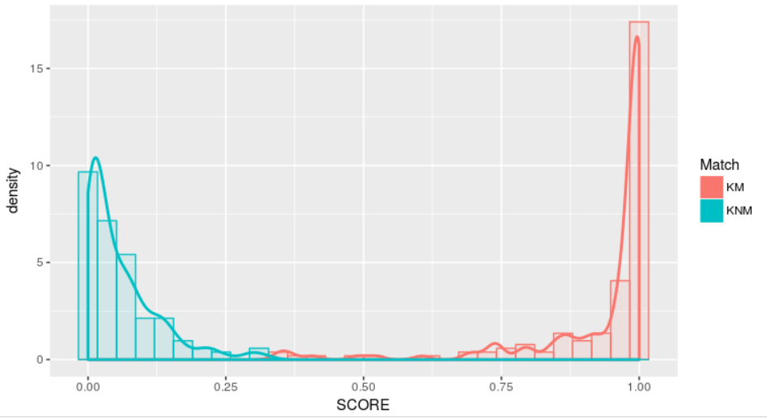

## Reasonable model
- Kolmogorov-Smirnov test, Cremer-von Mises test, Anderson-Darling test, and so on..

 1. Start with Beta distribution, Beta(s1, s2).
 2. Get MLE of s1 and s2 and make some variations in each parameter.
 3. Test K-S test and find the reasonable shape parameters that pass the test.
 4. Get density of KM score and KNM score and take the ratio (SLR) at desired score. 

- KM score : 559 reasonable sets of parameters passed K-S test out of 1005.
- KNM score : 2162 reasonable sets of parameters passed K-S test out of 4221.

## Beta distribution with K-S test
- example model

## Distribution of SLR
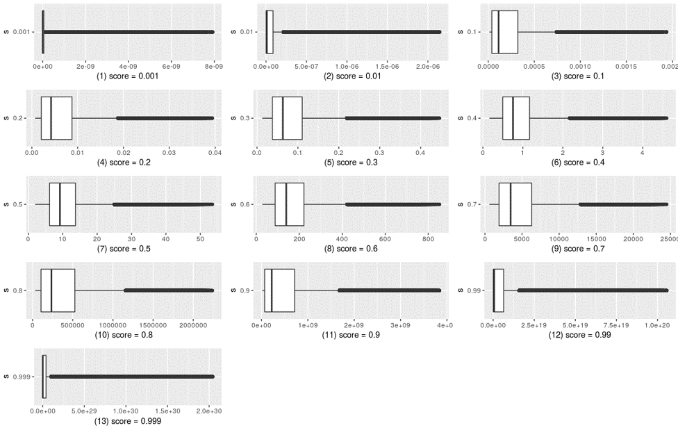

  

# Martin

## My C++ version of Matlab's "imregister"

- Objective is to align images got with the EverOS 2D scanner
- Function works well for small images (around 1/8 of the actual dimensions)
- However, for larger images it's not clear, since it takes so long
- This is not surprising, since each iteration computes pixel difference for almost 7 million pixels
- Working on techniques to accelerate this process, specifically, parallelization in C++
