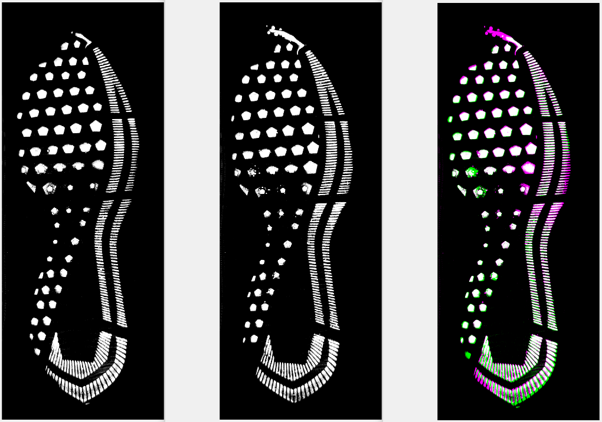
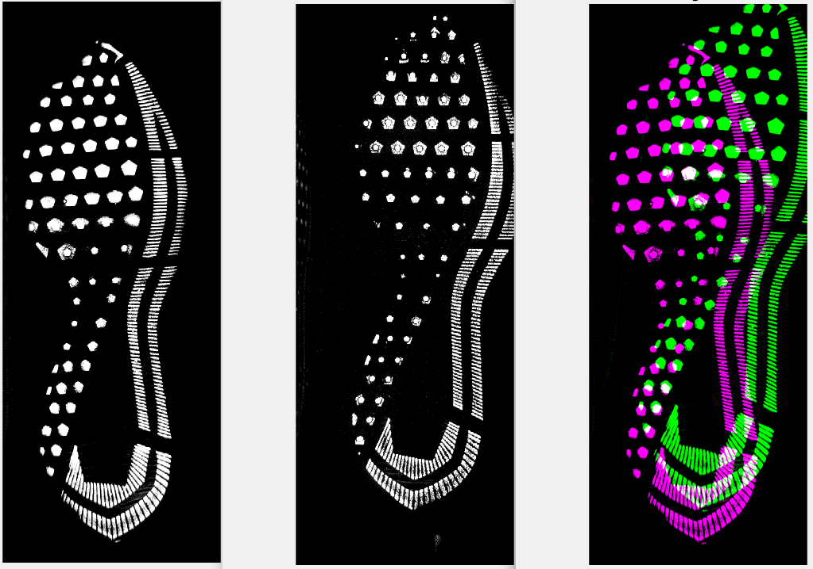

# Show and Tell   March 26

# Sample Speaker

## Sample Slide

- a
- b
- c

# Susan

## Automatically cleaning up shoeprint images

Original | Cleaned Up
-------- | ----------
 |  

Steps: Flatten to 8 shades, remove label, remove background, remove borders, remove straight lines, rotate, crop to lightest columns/rows

# Sam 

## REU planning

- 6 offers out. __ accepted
- Working on setting up a site with [`blogdown`](https://bookdown.org/yihui/blogdown/)
- Lecture & Lunches on Fridays 
- "Working Wednesdays" - spend some time with the students improving their professional skills (e.g. CV/resume, cover letter, workplace communication)
- Writing skills - blogposts, Sarah will advise
- Coding skills - weekly R lectures and assignments 
- Statistics skills - weekly lectures and assigments corresponding to their projects
- Deliverables: poster session at the end of summer, website with their writing
- Ideas for fun events welcome! 

## Glass data

- Still just playing around. Get into more this week. 

# Amy

## Updates
 
- Handwriting Data Collection
    - Interested groups?
    
- Project overview for Secret Service

# Ganesh
## Updates
- NIST scans: Comparing Profiles across all $w_o$ and $w_v$ sizes
- Poster 
[I dont know if this is going to open](images/csafe-poster-ganesh-final.pdf)

# Nate 

## SLR's

- Trying to understand what goes into the construction of an SLR
    - Choosing relevant populations under the prosecution and defense hypotheses
        - Different "anchorings" can result in very different SLR's (Hepler et al. 2012)
    - Choosing score function
        - Including measure of typicality of the unknown source in the score function itself may be necessary (Morrison and Enzinger 2018)
    - Choosing how to model score distributions
        - Well-known tail problems

## SLR's (cont.)
- Questions
    - What choices are amenable to general guidelines/rules? 
    - How can we make SLR's behave more similarly to LR's or to each other?
    - Do the above choices depend on each other? For example, could differences in SLR's be ameliorated by incorporating measures of typicality?
    
# Martin

## Tests of Matlab's "imregister" for large images

## Tests of Matlab's "imregister" for large images

# Jason

## Updates
- Temporarily ditching BART
- Adding extremely randomized trees and random rotation forest algorithms
- Should be able to combine extensions to random forests as well
- Image renamer program in CSAFE GitHub organization

# Soyoung

## Updates
- Working on papers for shoe matching method
- Also working on the efficient number of corners for matching 
- Will find other frequently used features for outsole impressions in the imaging analysis
- (Sam and me) Collaboration work with Lund and Iyer on R-package for uncertainty pyramid
