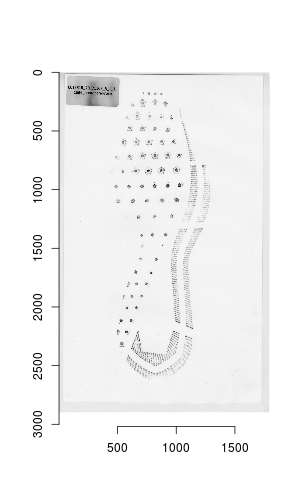
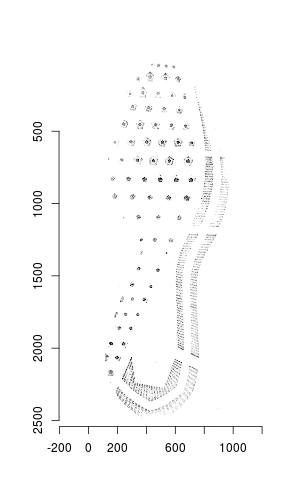
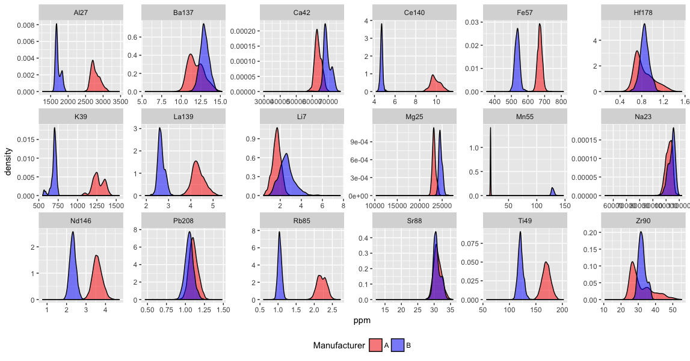

# Show and Tell   March 26

# Sample Speaker

## Sample Slide

- a
- b
- c

# Susan

## Automatically cleaning up shoeprint images

Original | Cleaned Up
-------- | ----------
 |  

Steps: Flatten to 8 shades, remove label, remove background, remove borders, remove straight lines, rotate, crop to lightest columns/rows

# Sam 

## REU planning

- 6 offers out. __ accepted
- Working on setting up a site with [`blogdown`](https://bookdown.org/yihui/blogdown/)
- Lecture & Lunches on Fridays 
- "Working Wednesdays" - spend some time with the students improving their professional skills (e.g. CV/resume, cover letter, workplace communication)
- Writing skills - blogposts, Sarah will advise
- Coding skills - weekly R lectures and assignments 
- Statistics skills - weekly lectures and assigments corresponding to their projects
- Deliverables: poster session at the end of summer, website with their writing
- Ideas for fun events welcome! 

## Glass data

- Still just playing around. Get into more this week. 

# Nate 

## SLR's

- Trying to understand what goes into the construction of an SLR
    - Choosing relevant populations under the prosecution and defense hypotheses
        - Different "anchorings" can result in very different SLR's (Hepler et al. 2012)
    - Choosing score function
        - Including measure of typicality of the unknown source in the score function itself may be necessary (Morrison and Enzinger 2018)
    - Choosing how to model score distributions
        - Well-known tail problems

## SLR's (cont.)
- Questions
    - What choices are amenable to general guidelines/rules? 
    - How can we make SLR's behave more similarly to LR's or to each other?
    - Do the above choices depend on each other? For example, could differences in SLR's be ameliorated by incorporating measures of typicality?