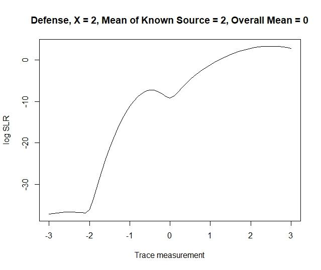
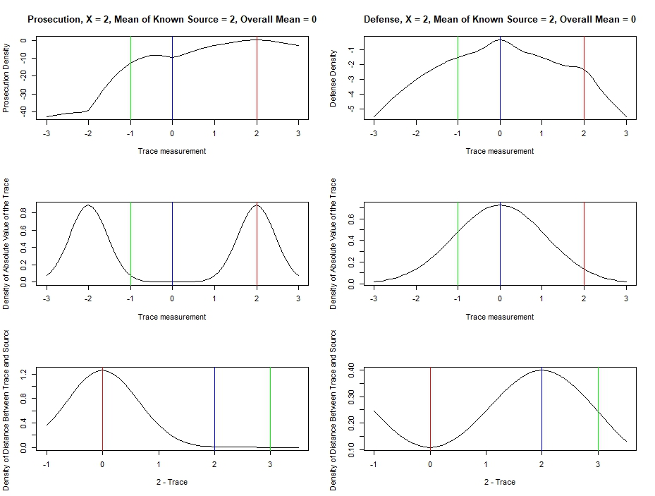

# Show and Tell   April 9

# Sample User

## Sample Slide

A sample list:

1. ~~O-Ren Ishii~~
1. ~~Vernita Green~~
1. Budd
1. Elle Driver
1. Bill

# Kiegan  

## Book Progress & Modeling & Writeups, Oh My!  

1. **Chapman and Hall book**: Progress! Did a lot of research and some writing. Rounding out the chapter this week.  
2. **Grooves Writeup**:  Started a write-up of methods we are trying for groove identification  
3. **Modeling**: Trying out a new method. First predicting whether a groove is there or not!  
4. **Hands-On Stuff**: Going through and identifying where there are grooves/where there are not for test set.  
5. **Reading Group Talk!**: On NIJ Fellowships. Get excited!   
6. Plots coming next week... :)  

# Nate 

## Bivariate SLR Weirdness
  - score(x,y) = (|x - y|, |y|)
  - x is the known source measurement
  - y is the unknown trace measurement

## Bivariate SLR Weirdness cont.

