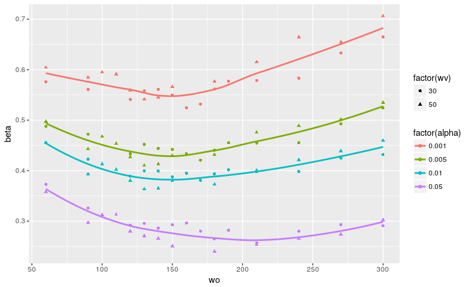
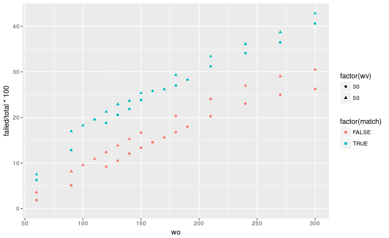
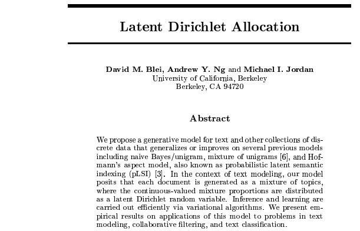

# Show and Tell   April 9

# Sample User

## Sample Slide

A sample list:

1. ~~O-Ren Ishii~~
1. ~~Vernita Green~~
1. Budd
1. Elle Driver
1. Bill

# Ganesh
## Nist Scans: Type II Error rate and Failed Tests
<!-- 
 -->

<!--  -->
<!-- 
 -->

# Kiegan  

## Book Progress & Modeling & Writeups, Oh My!  

1. **Chapman and Hall book**: Progress! Did a lot of research and some writing. Rounding out the chapter this week.  
2. **Grooves Writeup**:  Started a write-up of methods we are trying for groove identification  
3. **Modeling**: Trying out a new method. First predicting whether a groove is there or not!  
4. **Hands-On Stuff**: Going through and identifying where there are grooves/where there are not for test set.  
5. **Reading Group Talk!**: On NIJ Fellowships. Get excited!   
6. Plots coming next week... :)  

# Nate 

## Bivariate SLR Weirdness
  - score(x,y) = (|x - y|, |y|)
  - x is the known source measurement
  - y is the unknown trace measurement

## Bivariate SLR Weirdness cont.

# Sam

## Writing away

- Glass chapter
- Thompson redo
- Judge training
- REU plans, lectures, assignments, etc. 

# Martin

## Shoeprint registration in MATLAB

- Made it work after changing affine transformation to rigid transformation (translation and rotation only)
- The alignment is good enough to make comparisons. Not perfect just due to differences in the images
- Working right now on writing a script to align all images to date  images per size and model

## Example

# Nick

## Cleaning

Stentiford, Fred and R. G. Mortimer. “Some new heuristics for thinning binary handprinted characters for OCR.” IEEE Transactions on Systems, Man, and Cybernetics SMC-13 (1983): 81-84.

- Implement pre-processing from the paper above.
- 13 steps based on masks
- Goals: Remove "spurrious projections", fill "noise holes", limit "necking effect", eliminate "acute angle tails"
     - Current processing fills "noise holes" only
- All of this is done with the goal of making processing more robust so differences in thinned writing come from writing, not processing.

# Amy

## Handwriting

- Latent Dirichlet Allocation (LDA) - Thanks Danica! :)  
- Results from modeling next week!  
  
- **Next:** Nick's graph counts \& next level data!