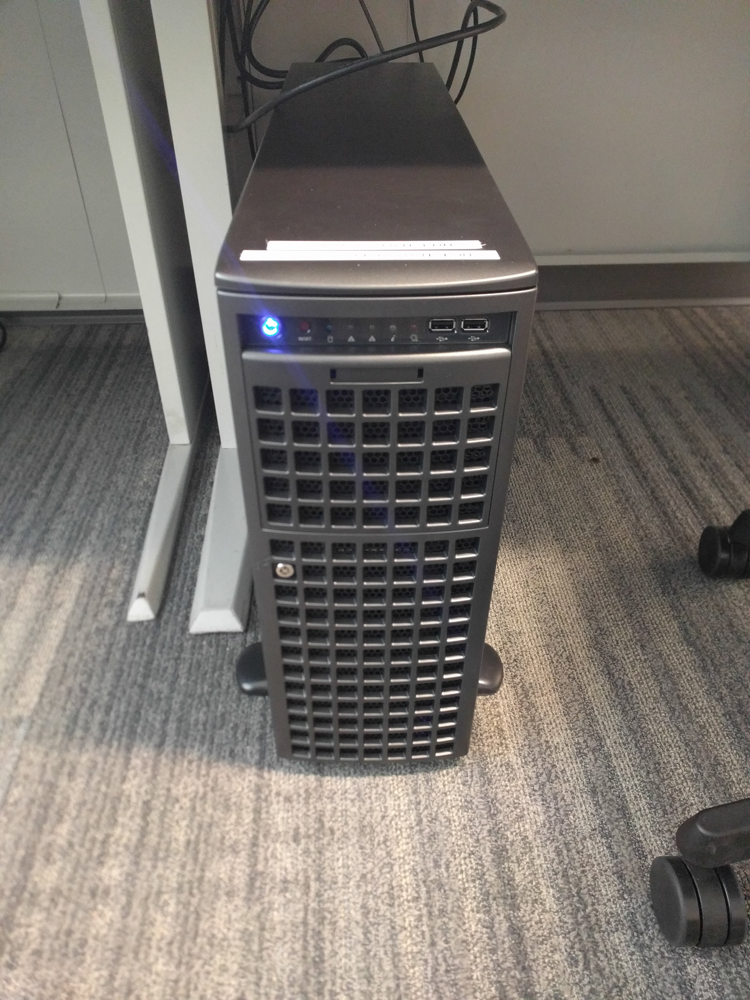
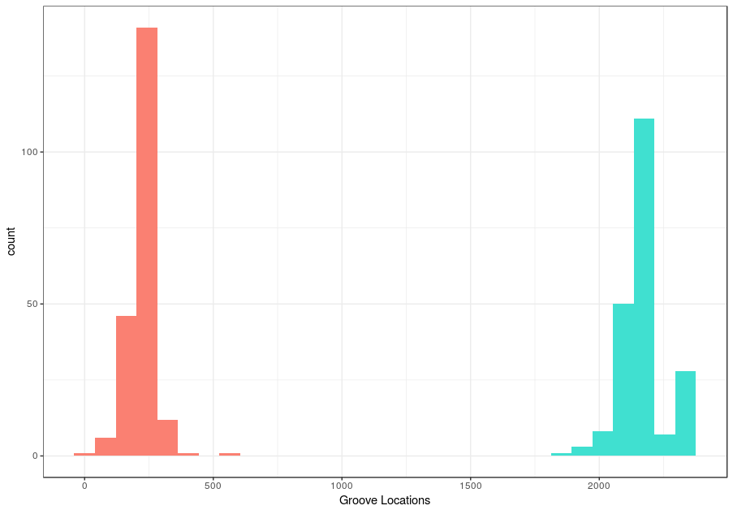
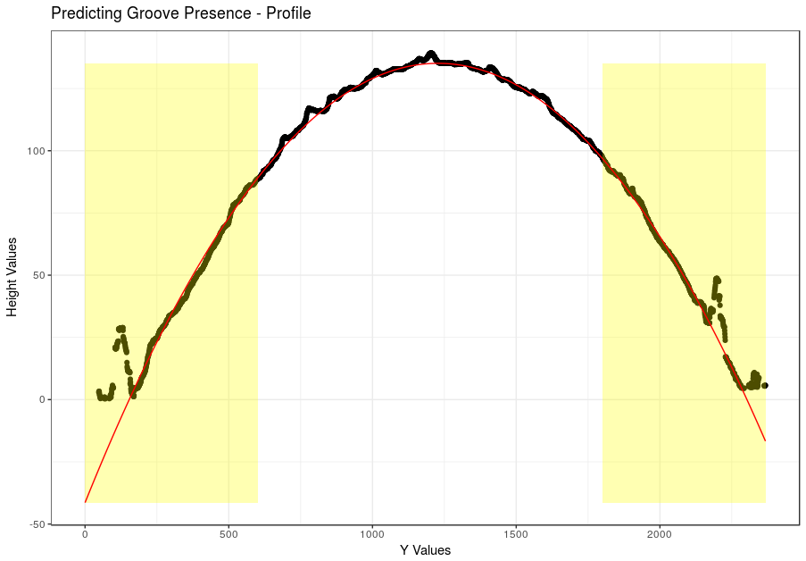
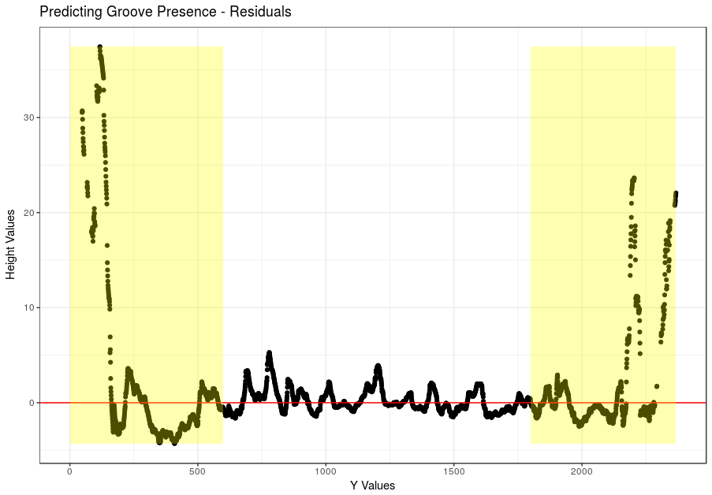

# Show and Tell   April 16

# Sample User

## Sample Slide

A sample list:

1. Where 
1. is 
1. the 
1. ~~love~~ Spring?
1. \>:-(

# Nate 

## Updates 

- Rarity and SLR's
    - Trying to look at some of Morrison's references from speech recognition
- Considering returning to monotone SLR problem
- Dead Idea Documentation

# Susan

## Grant Writing

- 3D shoeprint proposal: almost complete
    - list of proposed staff, affiliations, and roles
    - potential problems, risk mitigation, etc.
    - proofreading, revisions, etc.
- 2D shoeprint proposal:
    - waiting on engineering stuff - designs, rendering of scanner
    - planned scholarly products
    - criminal justice significance
    - project timeline/milestones
    - IRB paperwork
    
## Meet Bigfoot!

    
   
- 24 cores (48 int cores) &nbsp;&nbsp;&nbsp;128 GB of RAM 
- Install OS (Ubuntu 16.04) 
- Diagnose random freezes 
- Hardware benchmarking

# Kiegan  

## Predicting Groove Sides  

  

## Predicting Groove Sides  

  

## Predicting Groove Sides  

  

## Predicting Groove Sides  

  

