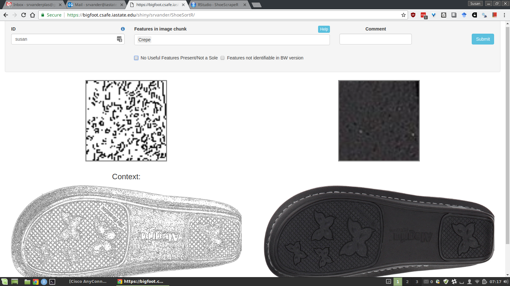
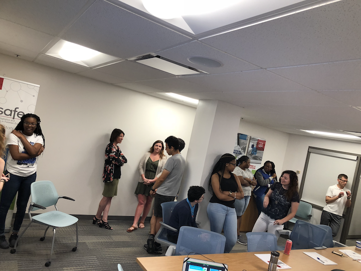

class: inverse
# Sample User

---
class: primary
# Sample Slide

[IMDB](https://www.imdb.com/chart/top) top rated movies on 2018-06-01 (Sample table):

| Rank | Title | Rating |
| :--- | :---- | :----- |
|1 | The Shawshank Redemption (1994) |	9.2 |		
|2 | The Godfather (1972) |	9.2 |		
|3 | The Godfather: Part II (1974) |	9.0	 |	
|4 | The Dark Knight (2008) |	9.0 |		
|5 | 12 Angry Men (1957) |	8.9 |		
|6 | Schindler's List (1993) |	8.9	 |	
|7 | The Lord of the Rings: The Return of the King (2003) |	8.9 |		
|8 | Pulp Fiction (1994) |	8.9	 |

---
class: inverse
# Jimmy 

---
class: primary
# Longitudinal Data Collection

## Final Collection 

**So Far....**

* Scanning and Photography 
    + Completed 
* Powder Prints and Impressions 
    + 1 Pair Remaining
* Database Preparation 
    + Preparing Films for Shipment 
    + Paper Prints on Standby 
    + Reviewing Errors (in the thousands)

---
class: secondary

## **Challenges**
* Women's Shoes and films 
* Errors (In the Thousands):
     + Pressure Mat Files 
     + Incorrect Naming 
     + Location/Size
* 2D Scanner malfunction 
     + Procedure and Practice Changed 
     
---
class: primary 
# This Week

* Meeting to Discuss methods
     + DCI Methods 
     + Continue Collections with a subset. 
* Elementary Schoolers
     + Little Shoe Scientists 
* High Schoolers 
     + Build Lesson Plans
* Review Papers on Shoe Impressions

---
class: inverse 
# Susan

---
class: primary
# Classifying Shoe Tread Patterns

- Script to pull images of shoe tread off of Zappos (1920x1440)
    - Runs daily at 3am and 9pm
- Another script to 
    1. Crop the picture
    2. Edge detect
    3. Flip the picture (sometimes)
    4. Slice the picture up into 64x64, 128x128, 256x256 chunks
    5. Remove any images that are mostly white pixels

---
class: primary
# Classifying Shoe Tread Patterns

- 1392 large photos
- 5668 images to slice (edge detect + flip combinations)
- 1788438 image slices
- MySQL database to manage tracking the images

---
class: primary
# Shiny app - ShoeSortR


Link: https://bigfoot.csafe.iastate.edu/shiny/srvander/ShoeSortR

---
class: primary 
# Coming Up

- Establish better threshold for images with too many white pixels
- Filter images so that there aren't so many
- Establish whether 64x64 is too small to be useful
- Use the Shiny app to rate a LOT of pictures

---
class: inverse
# Nate 

---
class: primary
# Comparing SLRs to LRs

- Do SLRs approximate LRs? If so, why?
    - Might not be because individual score densities are good approximations to actual densities.
    - Even in simple cases, the ratio of an SLR to an LR may be high (> 100).
    - Can we find lower and upper bounds on $P(SLR/LR > k| H_0)$ or $P(SLR/LR < k|H_a)$?
    - Useful inequalities are turning out to be hard to find.

---
class: primary  
# Comparing SLRs to LRs cont.

- Some interesting things...
    - $E[SLR/LR|H_a] = E[SLR|H_0]$
    - $E[(SLR/LR)^{-1}|H_0] = E[SLR|H_a]$
- Are there ways to understand the relationship of an SLR to an LR through these expectations (or similar quantities) which can be computed without knowing the true LR values?

---
class: inverse
# Sam 

---
class: primary 
# New CSAFE slide template

We're now using [`xaringan`](https://github.com/yihui/xaringan)

What's changed: 

- New person slide: 

````
---
class: inverse
# Your Name
````

---
class: secondary

- New content slide with title: 

````
---
class: primary
# Title of slide 

Slide content
````

- New content slide without title: 

````
---
class: secondary

Slide content with no title on slide
````

---
class: primary
# REU Students! 

Website: https://csafe-isu.github.io/reu18/



---
class: primary
# [Microsoft Acquiring GitHub](https://blog.github.com/2018-06-04-github-microsoft/)

Just FYI


