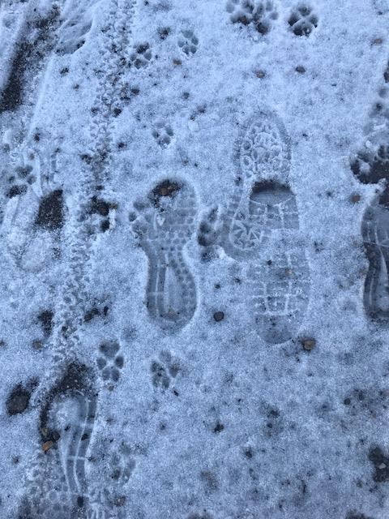
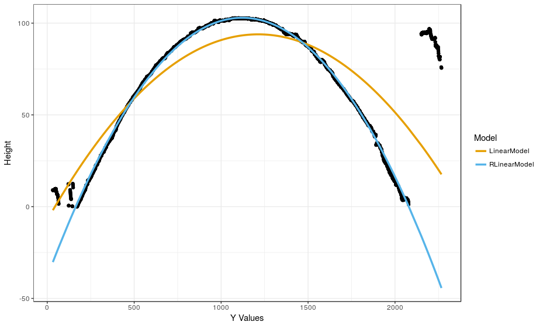
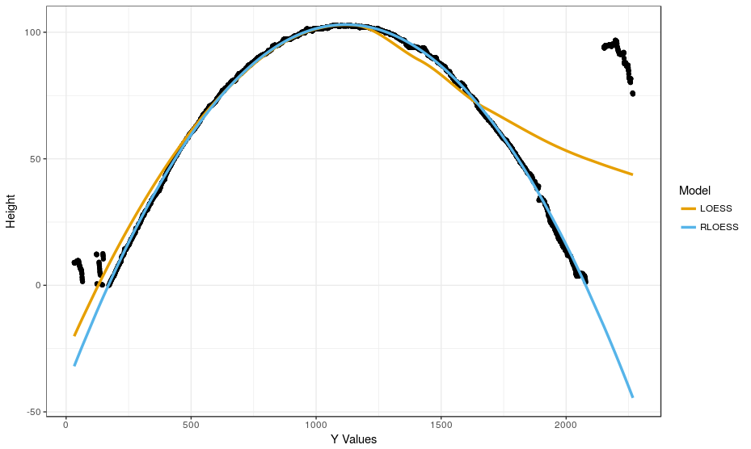
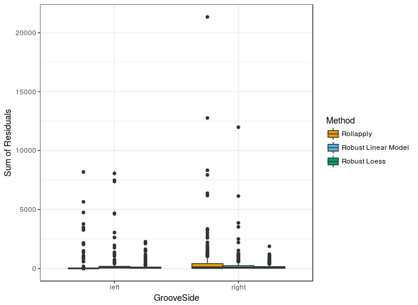
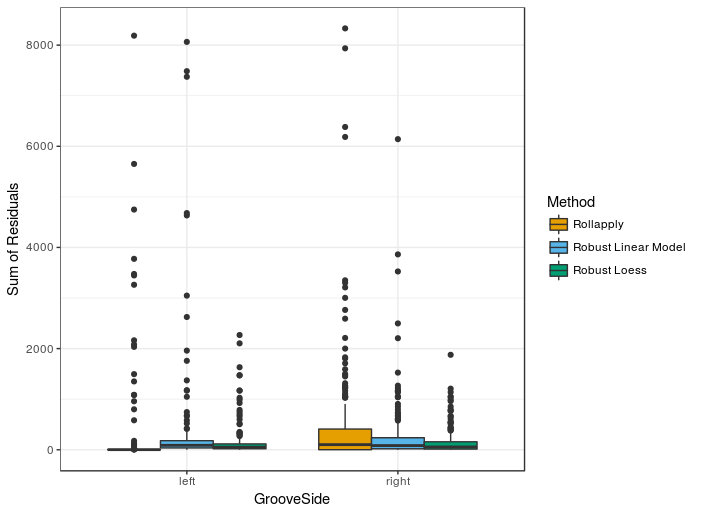
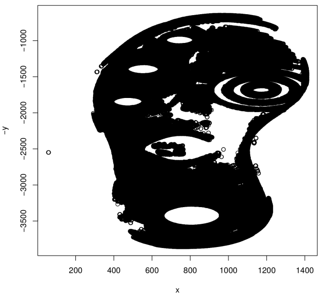

class: inverse
# About Slides

---
class: primary 
# New CSAFE slide template

We're now using [`xaringan`](https://github.com/yihui/xaringan)

What's changed: 

- New person slide: 

````
---
class: inverse
# Your Name
````

---
class: secondary

- New content slide with title: 

````
---
class: primary
# Title of slide 

Slide content
````

- New content slide without title: 

````
---
class: secondary

Slide content with no title on slide
````

---
class: inverse
# Sample User

---
class: primary
# Sample Slide

- Sample Table:

| Team     | Group | W   | D   | L   |
| : ------ | :---- | :-- | :-- | :-- |
| Germany  | F     | 0   | 0   | 1   |
| Mexico   | F     | 1   | 0   | 0   |
| Sweden   | F     | 1   | 0   | 0   |
| S. Korea | F     | 0   | 0   | 1   |


---
class: secondary

- Add your name at the beginning of every image you add to the presentation, e.g., __"images/guillermo_sample_image.JPG"__

 

---
class: inverse
# Jimmy 

---
class: primary
# Longitudinal Data Collection

## Final Collection 

**So Far....**

* Scanning 
    + 1360 Paper prints to be scanned
    + 480 Paper Prints Scanned in a day
    + Cleaning up Storage
* Powder Prints and Impressions 
    + 1 Pair Remaining (Just Got in.)
* "Z" Drive 
    + Reviewing Errors (5438)

---
class: secondary

## **Challenges**
* Errors (5438):
     + Unnamed Vinyl Photos
     + Mat Scanner Files
     + Errors in Final Files
* Women's Shoes
     + 2D Scans
     
---
class: primary 
# This Week

* Get Paper Prints Scanned 
* Get 2D Scans completed
* Get Downloads onto the shoe desktop and laptop to fix errors

* Note: Data collection was received well at the All Hands Meeting

---
class: inverse
# Nate 

---
class: primary
# SLR/LR

- May be some relationship to calibration. 
    - "The LR of the LR is the LR" comes from "The distribution of calibrated likelihood-ratios in speaker recognition" (Leeuwen and Brummer 2013). 
    - Not crystal clear on definition of calibration for LRs. 
- Thoughts from conversations with Chris Saunders at the All Hands Meeting:
    - Is this worth doing for common source propositions?
    - SLRs can behave arbitrarily poorly due to atypical anchored evidence, original dimension of data, etc. (but...)
    - Use of approximate Bayesian computation to explore computationally intractable LRs (?)  


---
class: inverse
# Kiegan 

---
class: primary
# AFTE/STEMversity

- Poster session went well!  
- Lots of interest in work  
- Amy did a fabulous job in Milledgeville!  
- https://www.instagram.com/stemversity_forensic_academy/


---
class: primary
# Grooves update

- A lot of exciting progress! 
    - Using robust LOESS to fit the global structure
    - Using a residual cutoff  

  


---
class: primary
# Grooves update

- A lot of exciting progress! 
    - Using robust LOESS to fit the global structure
    - Using a residual cutoff  

   


---
class: primary
# Next steps  

- Logistic regression with several covariates  
- Change point analysis on the residuals from robust LOESS? 
    - Nate  
    


---
class: inverse
# Amy 

---
class: primary
# What I've been up to:
      
- May 31 (talk): The ABA's Ninth Annual Prescription for Criminal Justice Forensics Program in New York
- June 5 (outreach): 4th and 5th graders for a STEM camp (thanks Jimmy!)
- June 7 and 8 (outreach): STEMversity with middle school students in Milledgeville, GA
- June 11 and 12 (poster): All Hands Meeting
      
---
class: primary
# Next:
      
- Prelim study (next 3 weeks)
- Handwriting!! (again finally)
- July 31 (talk - handwriting): JSM
- August 19-23 (poster? maybe?): The American Society of Questioned Document Examiners (ASQDE)
       
    

class: inverse
# Ganesh
---
class: primary

- Poster sessions!
- Paper complete!! Submitting!! 
 (Thanks everyone and Dr. Hofmann for the huge help and support)
- Possible Next steps: 
  - Setting up a Nosql database for the ever expanding bullet data (local storage)
  - Application development for using the bullet database for comparisons, images, summary etc

---
class: inverse
# Guillermo

---
class: secondary

- Modifications to IRB
- ICP algorithm to compare surfaces is running (more or less) in R
- Perhaps try Matlab version of ICP
    
---
class: inverse
# Martin

---
class: primary
# All Hands Meeting and Alignment Update

- Presented a poster and got some valuable feedback
- Kept working on somehow align shoeprints of two different brands/pattern
- A problem I encountered is finding the optimal threshold to get rid of noise
- I am working on finding a reasoable threshold that works well for most of the prints


---
class: secondary

 
     
---

class: inverse
# Miranda 

---
class: primary
# Shooooooes

- stuff
