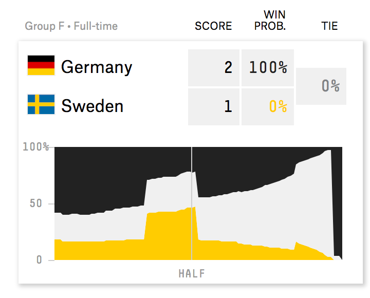
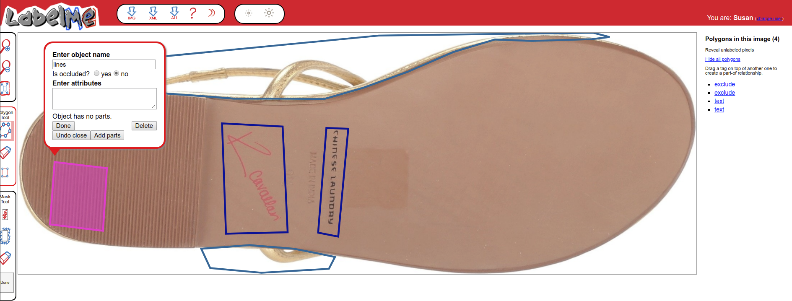
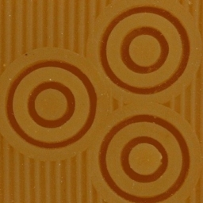
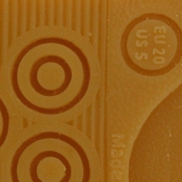
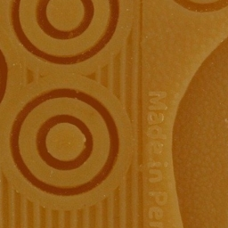
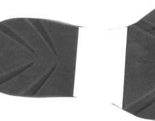

class: inverse
# About Slides

---
class: primary 
# New CSAFE slide template

We're now using [`xaringan`](https://github.com/yihui/xaringan)

What's changed: 

- New person slide: 

````
---
class: inverse
# Your Name
````

---
class: secondary

- New content slide with title: 

````
---
class: primary
# Title of slide 

Slide content
````

- New content slide without title: 

````
---
class: secondary

Slide content with no title on slide
````

---
class: inverse
# Sample User

---
class: primary
# Sample Slide

- Sample Table:

| Team     | Group | W   | D   | L   |
| : ------ | :---- | :-- | :-- | :-- |
| Germany  | F     | 0   | 0   | 1   |
| Mexico   | F     | 1   | 0   | 0   |
| Sweden   | F     | 1   | 0   | 0   |
| S. Korea | F     | 0   | 0   | 1   |


---
class: primary
# Sample Slide

- Sample Graphic:




---
class: secondary

- If you are going to add an image, **create a directory** with your name within "images" folder. For example, "images/**guillermo**/sample_image.JPG"

 
--- 

---

class: inverse 
# Nate 
---

class: primary

# SLRs

- Reading about ABC to be able to understand the papers Chris recommended to me. 
- Assuming no mistakes, $e^{E[log(SLR)|H_0]} \leq E\left[\frac{SLR}{LR} | H_0 \right]$.
    - left side is computable
    - right side is some measure of the average quality of the LR under $H_0$ 
    - still not that useful for bounding probabilities

---
class: secondary

$$
\begin{aligned}
E\left[\frac{SLR}{LR}|H_0\right] &= e^{log\left( E\left[\frac{SLR}{LR} | H_0 \right] \right)} \\
& \geq e^{E\left[ log\left(\frac{SLR}{LR} \right) |H_0 \right]} \\
& = e^{E\left[ log(SLR) |H_0 \right] - E\left[ log(LR) |H_0 \right]} \\
& \geq e^{E\left[ log(SLR) |H_0 \right] - log\left(E\left[ LR |H_0 \right] \right)} \\
& = e^{E\left[ log(SLR) |H_0 \right]}
\end{aligned}
$$
---
class: primary

# Groove ID

- Reading about changepoint detection
- Possible approach similar to some examples given in "Bayesian Retrospective Multiple-Changepoint Identification" (Stephens 1994) in JRSSc. 
    - Doesn't seem fundamentally tied to time series data

---
class: inverse  
# Kiegan  

---
class: primary  
# What I'm Working On  

- I have been banned from working on my paper and the book until after the prelim  
- Prelim is in two weeks!  

---
class: inverse
# Amy 

---
class: primary
# What I've been up to:
      
- May 31 (talk): The ABA's Ninth Annual Prescription for Criminal Justice Forensics Program in New York  

- June 5 (outreach): 4th and 5th graders for a STEM camp (thanks Jimmy!)  

- June 7 and 8 (outreach): STEMversity with middle school students in Milledgeville, GA  

- June 11-12 (meetings and poster): All Hands. Handwriting pre-meeting with the Israei team and Dr. Stern went well.
      
---
class: primary
# Next:  
      
<br />  
<br />  


- Prelim study (next 2 weeks)  

- Handwriting after that (finally)  

- July 31 (talk - handwriting): JSM
- August 19-23 (poster? talk? maybe?): The American Society of Questioned Document Examiners (ASQDE)
 
 
---
class: inverse
# Jimmy 

---
class: primary
# Longitudinal Data Collection
## Final Collection 
* Issues with the 2D Scanner 
    + Phantom Images
    + Theoretically, wont take long
* Possible Causes
    + Past cleaning Procedures
    + Shoes (from being cleaned)
    + Finger Print Powder
* "Z" Drive 
    + Reviewing Errors (5438)

---
class: primary
# This Week
## **Moving Forward**
* Adapt to the Problem
     + Continue Cleaning and figure it out
     + Finish Data Collection

     

---
class:inverse
# Ben and Jenny

---
class:primary
# Working on

## Shoe Tread Classification

* 668 shoes partially/fully classified as of 10am

## Longitudinal shoe project

* Helped Miranda scan shoes Thursday/Friday

---
class:inverse
# Susan

---
class:primary
# Shoe Tread

* (2 weeks ago) set up LabelMe docker container to classify shoes



---
class:primary
# Shoe Tread
* (Last week) Code to "carve up" tread annotations into useful pictures (using Matlab toolbox from LabelMe)





* Pictures tend to look better if the regions are square-ish
    


---
class:primary
# Truthiness

* "When making rapid judgments about the truth of a claim, nonprobative images lead people to believe the claim"
    - Want to know if this holds for charts and graphs
    - Some evidence that brain images cause the person presenting the images to appear more credible in court

* Finding claims that are data-driven and can be made into a chart is hard. 

---
class:primary
# Truthiness
* First step - pilot study with ~ 10 claims
    - Claim alone
    - Claim with nonprobative, related image
    - Claim with probative data display where information is harder to pick out or lacks context (data may be encoded by color alone)
    - Claim with probative chart of explicitly numerical information
    - Claim with nonprobative, unrelated image (from a different claim)
    - Claim with nonprobative, unrelated chart (from a different claim)

---
class:inverse
# Heike

---
class:primary
# The Hamby Set that wasn't

* Background: NIST has two sets of Hamby bullets 44 and 252
* ... or that's what we thought ...

