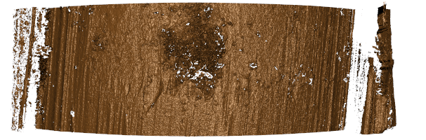
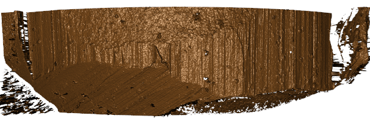
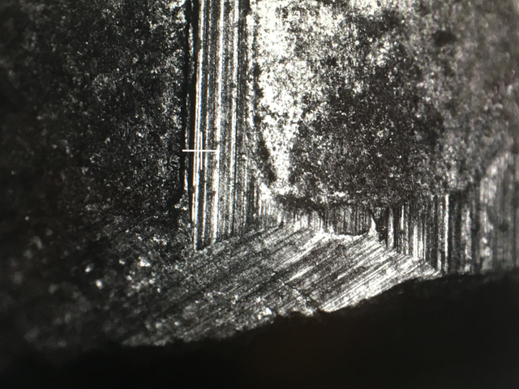
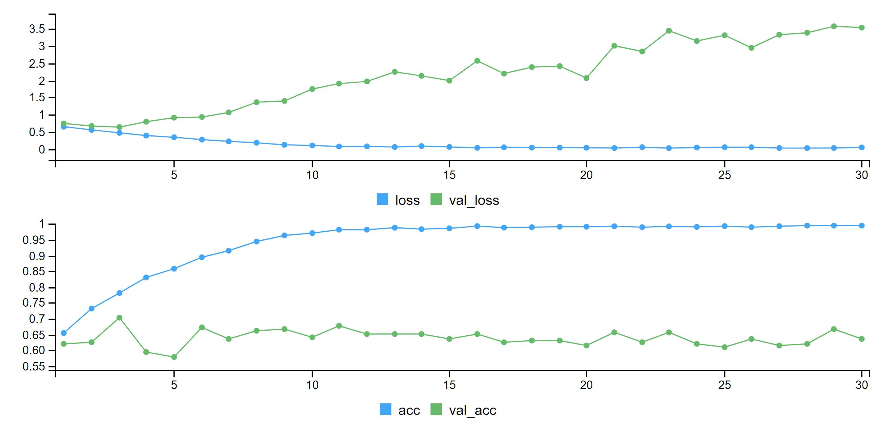
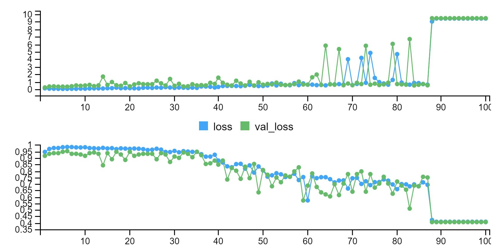

class: inverse
# About Slides

---
class: primary 
# New CSAFE slide template

We're now using [`xaringan`](https://github.com/yihui/xaringan)

What's changed: 

- New person slide: 

````
---
class: inverse
# Your Name
````

---
class: secondary

- New content slide with title: 

````
---
class: primary
# Title of slide 

Slide content
````

- New content slide without title: 

````
---
class: secondary

Slide content with no title on slide
````

---
class: inverse
# Sample User

---
class: primary
# Sample Slide

- Sample Table:

| Team     | Group | Round of 16 |
| : ------ | :---- | :---------- |
| Uruguay  | A     | Yes         | 
| Argentina| D     | No          |  |


---
class: secondary

- If you are going to add an image, **create a directory** with your name within "images" folder. For example, "images/**guillermo**/sample_image.JPG"

 
---
class: inverse
# Jimmy 

---
class: primary
# Longitudinal Data Collection
* Done reviewing existing files:

   + 2D
   + 3D
   + Paper
   + Film
   + Photos

* Still have a high error report: 

   + Mat Scanner 
   + Vinyl Photos


---
class: primary
# This Week
## Moving Forward

* This week: 
   + Re-name vinyl crime scene photos 
   + take care of missing files.

---
class: inverse
# Heike

---
class: primary
# Bullet WhoIsIt ... 

- Hamby Set on NIST database turned out to be Hamby Set 173

- artefact on NIST LEA scan:



---
class: primary
# Individual artefacts 




- artefact on CSAFE LEA scan:


---
class: inverse
# Susan

---
class: primary
# Automating Bullet Data Uploads

- RSelenium package to remote-control a browser
- select links and input fields using CSS/Xpath
- Create barrels first, then add bullets, then add land scans to each bullet
- [https://github.com/CSAFE-ISU/BulletUploads](https://github.com/CSAFE-ISU/BulletUploads)

---
class: secondary
<iframe width="80%" height="400" src="https://www.youtube.com/embed/TvbhXeEzoR4" frameborder="0" allow="autoplay; encrypted-media" allowfullscreen></iframe>

---
class: inverse
# Ben and Jenny

- 1319 shoe annotations (as of 9am)
- Creating materials for realistic crime-scene prints
    - Vinyl flooring sample
    - Wood flooring sample
    
---
class: inverse 
# Nate 
---
class: primary
# Groove Identification

- Time last week spent getting a feel for the bullet data
- Thinking about modeling the residuals from robust loess using piecewise Gaussian processes
    - major computational issues to this approach
        - demands modification to approach taken in the JRSSc paper 
        - I think there are a couple of reasonable remedies for this issue, but I've heard of more in the literature.
    - Going to try a proof of concept on bullet data with sampled subsets of residuals.
---

class: inverse 
# Miranda 
---
class: primary
# Neural Networks
- Preliminary models to classify triangles vs. circles
    - Modified from cat vs. dog examples in "Deep Learning with R"
    - ~ 500 images in each class, plus augmentation 
        -50% training, 25% validation, 25% test
    

---
class:primary
# Expected fitting accuracy
- Training a convnet from scratch (1st example from book)
- Expected about 70% accuracy on test set


---
class:primary
# Unexpected results
- After training classifier on pre-trained VGG16 base, ran fine-tuning step
- Should have increased accuracy from 90% to 96%
- In reality, test set accuracy was ~40%


---
