class: inverse
# About Slides

---
class: primary 
# New CSAFE slide template

We're now using [`xaringan`](https://github.com/yihui/xaringan)

What's changed: 

- New person slide: 

````
---
class: inverse
# Your Name
````

---
class: secondary

- New content slide with title: 

````
---
class: primary
# Title of slide 

Slide content
````

- New content slide without title: 

````
---
class: secondary

Slide content with no title on slide
````

---
class: inverse
# Sample User

---
class: primary
# Sample Slide

- Sample Table:

| Team     | Probability | 
| : ------ | :---------- | 
| France   | 29%         |  
| England  | 27%         | 
| Belgium  | 26          | 
| Croatia  | 18          | 


---
class: secondary

- If you are going to add an image, **create a directory** with your name within "images" folder. For example, "images/**guillermo**/sample_image.JPG"

 


---
class:inverse
# Miranda

---
class:primary
# Neural Networks

- Most recent model (classifying circles vs. triangles) using VGG16 has **94.8% accuracy** on test set!
- Next questions
    - Is VGG19 (more layers) better than VGG16?
    - Effect of different classes on accuracy? (e.g., quadrilateral, text)
    - How to handle multi-class images? 
        - Binary encoding/classification for each shape
        - Multi-label neural network
    
---
class: primary
# Architecture

- **Convolutional layers** learn local patterns by analyzing the image through a sliding window
- **Max-Pooling layers** combine patterns learned in single windows, downsampling huge feature maps and creating feature hierarchies of importance

 

---
class:primary
# Visualizing Filters

 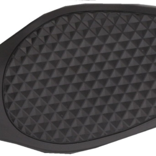
 
---
class:secondary

1st Convolutional Layer
 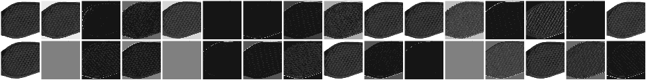
 
2nd Convolutional Layer
 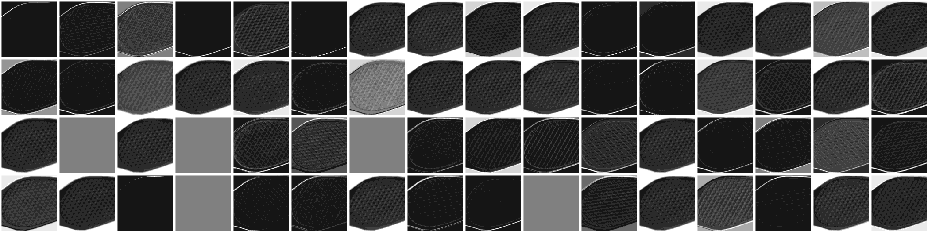

*A blank square means the filter's pattern is not found in the image

---
class:secondary

3rd Convolutional Layer
 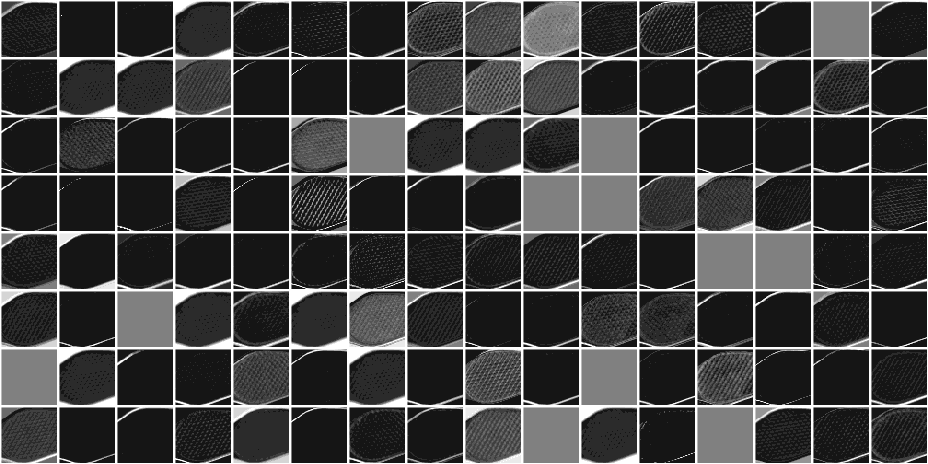
 
---
class:secondary

4th Convolutional Layer
 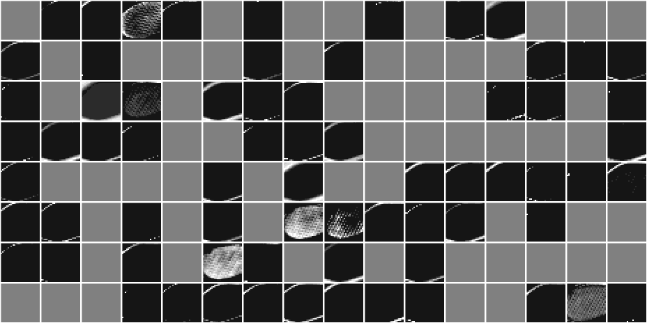

---
class: inverse  
# Jenny and Ben  

---
class: primary
# Shoe tread classifications

- 1645 classifications total

---
class: primary
# Realistic Print Experimental Setup

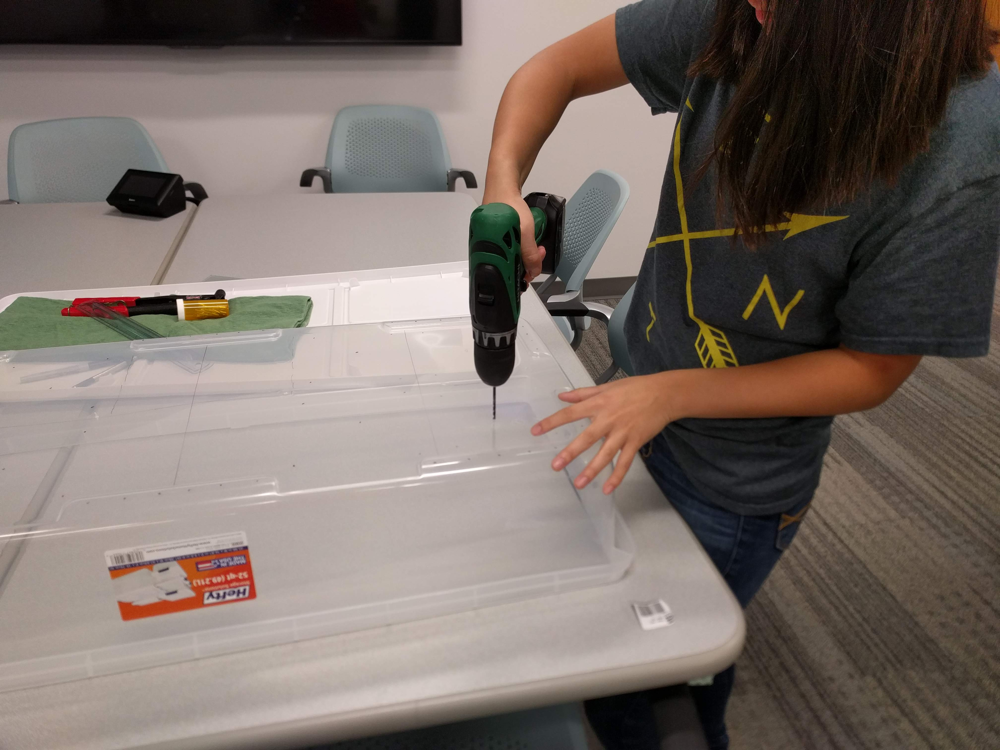
  

---
class: primary
# Realistic Print Experimental Setup

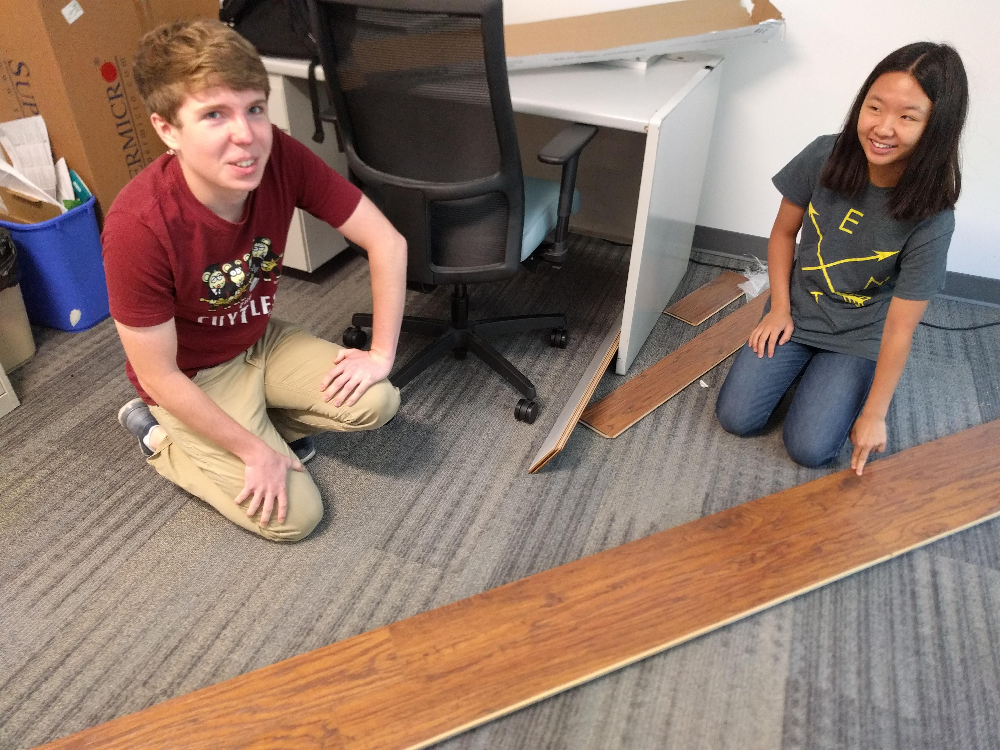


---
class: inverse  
# Susan

---
class: primary
# Realistic Print Experimental Setup

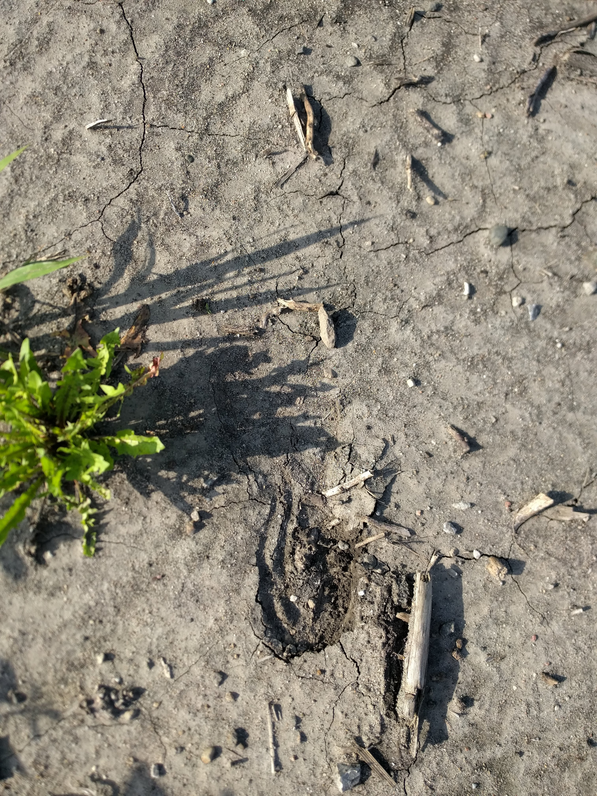
---
class: primary
# Realistic Print Experimental Setup

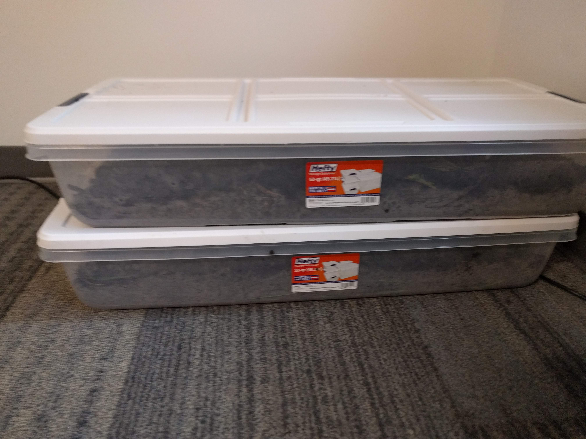

---
class:primary
# Truthiness

- 6 facts down, 6 more to go
- 10 pictures/plots per fact
- Formalized the experimental design

It's surprisingly hard to find specific bits of data, such as the length of a border with a body of water. :-/

---
class: inverse  
# Kiegan  

---
class: primary
# Sorry I can't be there!  

   
 
 
---
class: inverse
# Sam

---
class: primary
# Summer activities thus far

- REU https://csafe-isu.github.io/reu18/
- Judge/lawyer training for ABA annual meeting in Chicago in August
- Working on submitting paper to JCGS before JSM 

---
class: inverse
# Jimmy 

---
class: primary
# Longitudinal Data Collection
* Document Development
   + Detailed outline of all changes made during collection
   + Updates on all procedure manuals
* Automated File development
   + Mat Scanner Files
   + These should be all remaining errors


--- 
class: inverse
# Nate 
---
class: primary
# Bullet Changepoint
 - Changepoint analysis with Gibbs is currently running
    - Currently the samples is a two step, random walk Metropolis within Gibbs.
 - Preliminary results on next few slides
---
class: secondary
- Vertical lines show posterior means of the changepoints
- So far, so good.


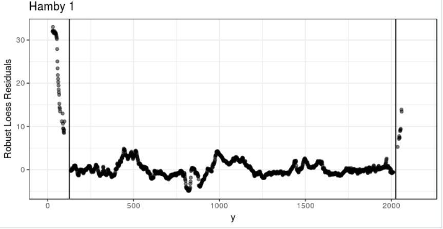 
---
class: secondary
- This is what happens when only one shoulder(?) is present.


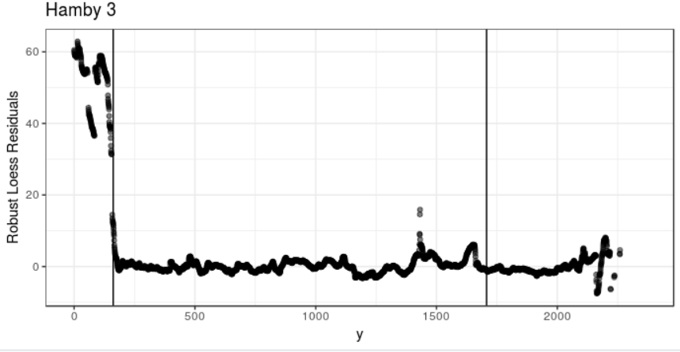
---
class: secondary
- The case when there is little data after a shoulder might be challenging.


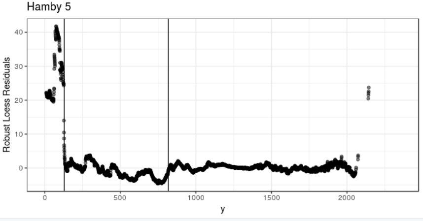
---
class: secondary
- This looks fine so far. Starting values are dashed lines.


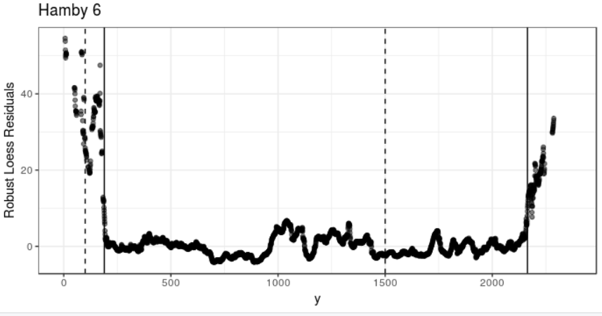
---
class: secondary
- When bad starting values are used.


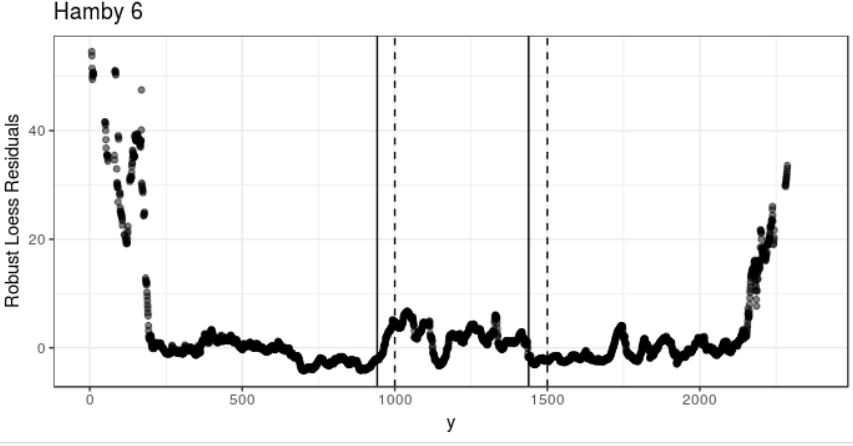 
---
class: secondary
- When bad starting values are used but a high proposal variance is used.


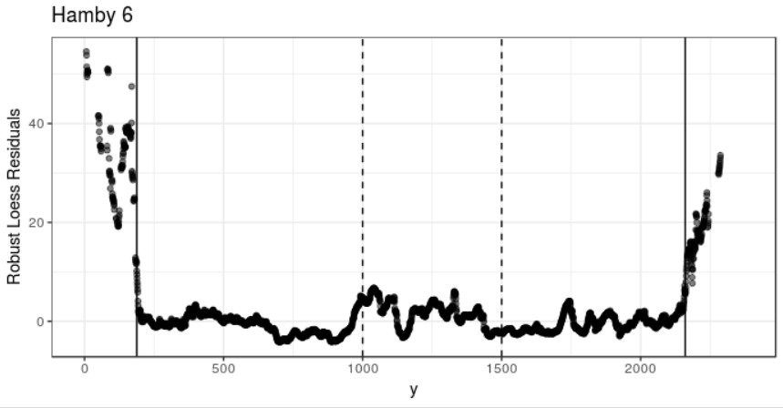 

---
class: inverse
# REU Students 

---
class: primary
# Yolonda

- 10/54 documents completed
- Problems with telling letters apart

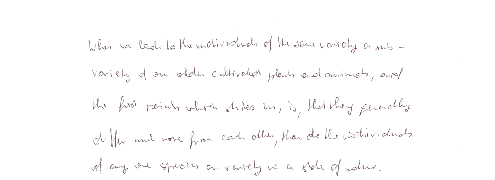
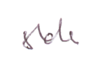
Author 26, document 4

---
class: primary
# Da'Monie
Handwriting
- Assigned a total of 54 documents from 9 different writers to classify handwritten letters.
- In a week, I have completed 8/54 documents.

Errors: 
- Can only select a "square" region.
- Some letters overlap with the next letter in the word.

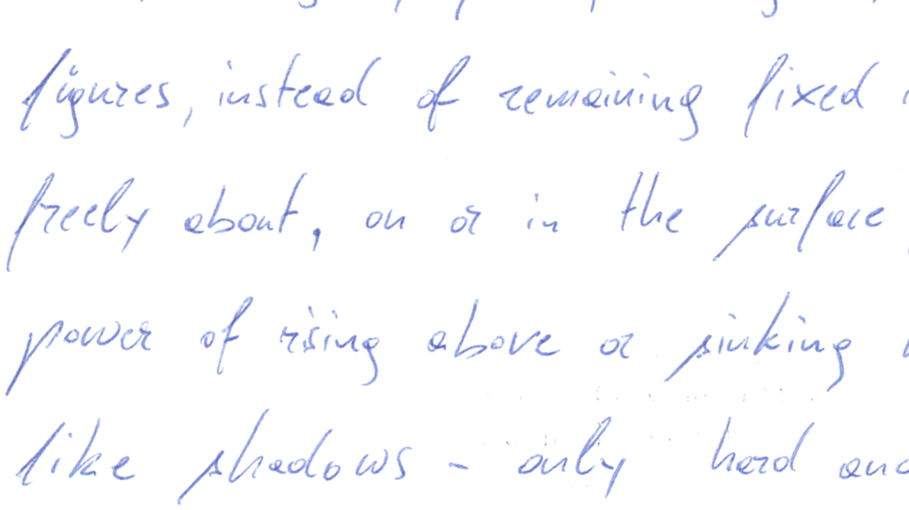

---
class: primary
# Alese
Making models and graphs using mock jury survey data.


---
class: primary
# Badiah 
- Jury project
  + Initial Verdict
- Fitting different models
- Changing ordinal data to numerical data

---
class: primary
# Carley
- Taking images of letters to train computer to classify letters
- Completed 12 out of 54 of my documents
- Issues
  - Letters that look the same
  
  
  n
  
  a
  
  u

---
class: primary
# Mark Lancaster

Mind map regarding the evaluation of evidence


https://mm.tt/1119875312?t=Z5g2sHX4AO
