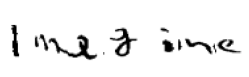

class: inverse
# About Slides

---
class: primary 
# New CSAFE slide template

We're now using [`xaringan`](https://github.com/yihui/xaringan)

What's changed: 

- New person slide: 

````
---
class: inverse
# Your Name
````

---
class: secondary

- New content slide with title: 

````
---
class: primary
# Title of slide 

Slide content
````

- New content slide without title: 

````
---
class: secondary

Slide content with no title on slide
````

---
class: inverse
# Sample User

---
class: primary
# Sample Slide

- Sample Table:

| Team     | Probability | 
| : ------ | :---------- | 
| France   | 29%         |  
| England  | 27%         | 
| Belgium  | 26%         | 
| Croatia  | 18%         | 


---
class: secondary

- If you are going to add an image, **create a directory** with your name within "images" folder. For example, "images/**guillermo**/sample_image.JPG"

 


---
class: inverse
# Susan

---
class: primary
# Feeding the Neural Network

.left-column[


]
.right-column[
- Processing annotated images in R (greater control)
- Adding multi-class labels to use for one-hot encoding
- Adding attributes (rounded, elongated) and textures as labels
- Resizing images to 256x256
- Splitting up images that are more than 384x384 into multiple images with the same labels
]

---
class:primary
# `bulletxtrctr`

- Writing tests for the new processing sub-package of what is now `bulletr`
    - Structure of output (e.g. function returns a data frame with the right number of columns)
    - Numerical correctness of output (function returns the "correct" result when given the same input)
- Goal: Make it easier to detect downstream effects of small changes to parameters in the processing algorithms


---
class: inverse
# Ben and Jenny

---
class:secondary

.center[]

---
class:secondary

.center[]

---
class:secondary

.center[]

---
class: inverse
# Jim

---
class: primary
# Data Collection (Shoes): Part 1 

* All Data collection -> compleated
* 19,200 files (Before replicates)
* Working with IT: Archiver 
* Under 100 errors
* Manual on procedures and subsaquent changes -> Done

---
class: primary
# Data Collection (Shoes): Part 2

* Continue with a subset of the 160 shoes
* Realistic Shoe outsole impressions
* Prints will be lifted/cast using realistic methods
   + Some older methods may carry over to this collection (ie. 3D scanning, 2D scanning)
* Currently in the development stage


---
class: inverse
# Kiegan  

---
class: primary
# Groove ID  

- Writing up paper for AFTE Journal
    - Submitting by end of summer  
- Getting slides ready for JSM  
    - On robust approach, logistic regression (if time!)  

---
class: primary
# C&H Book  

- Meeting with publisher at JSM 
    - Hoping to get contract signed soon
- On pause until paper submitted to AFTE Journal
- Good progress! 
    - 1 of the 3 main chapters almost ready
    - 2nd in development 
    

---
class: inverse
# Heike  

---
class: primary
# Refactoring software

- Taking package `bulletr` apart and piecing it (better) together
- new package `bulletxtrctr` 
- follow along: https://github.com/heike/bulletxtrctr

---
class: inverse
# Nate 

---
class: primary
# SLRs

- "Lack of Confidence in ABC Model Choice" (Robert et al. 2011)
    - Not always a relationship between an LR and an SLR. 
    - Not obvious that same issues will arise in the forensic context
- What is the worst case scenario for an SLR under some mild assumptions (i.e. model identifiability, finite second moments)?
    - Information loss based on insufficient statistic is maximized when the data distribution has maximum entropy (?)
    - With finite second moments I *think* this means the data are independent Normal. 
    - Given a mean and variance, we could get a distribution for the difference in the log(LR) - log(SLR) (or log(SLR) - log(LR))
    
---
class: primary
# Groove ID
- Fixed minor bug in the algorithm (it didn't change any results)
- Implement adjustment to deal with 1 or 0 grooves.

---
class: inverse
# Sam 

---
class: primary
# Judge training

Working on a presentation for Hal, Alicia, Judges Stephanie & Sam for the ABA conference in Chicago on Aug. 4th

- summary of 5 cases where statistics and/or scientific validity played an important role or went wrong 
- US v. Shonubi, Dukes v. WalMart, People v. Collins, US v. Glynn, NC v. McPhaul
- 10:30 AM 12:00 PM on August 4th, Judicial Division, "Gatekeepers of Statistical Scientific Evidence: Legal, Ethical and Educational Responsibilities of Judges and Lawyers"

---
class: primary
# Project proposal

Training videos:

- online 
- different audiences
- different lengths (short v. longer)
- ideas welcome! 

Some ideas are: 

- likelihood ratio explainer
- role of statistics in forensic science
- automatic bullet matching with bulletr

---
class: primary
# JSM

- Presenting on my thesis research
    * Working on a paper to submit to publication ASAP
    * 15 minute talk on Thursday, Aug. 2 in the 10:30-12p session on network analysis
- Chair & organizer of session on the SAFE of CSAFE. 
    * Maria Cuellar, Chris Galbraith, Amy Crawford, Amanda Luby, Xiao Hui Tai
    * Themed session! #LeadWithStatistics 
    
---
class: primary
# REUs 

- All done with the database creation!! 
- Now lives on csafe server (las/research/csafe) in the handwritten-letters-db folder
- one csv with all in one (letterdatabase.csv)
- one csv per document (letters_document_x.csv) where x is a document ID in the CVL database
- 7 authors per document
- Structured similarly to the MNIST data: 28 x 28 pixel grayscale images. 

e.g. Imagine:  


