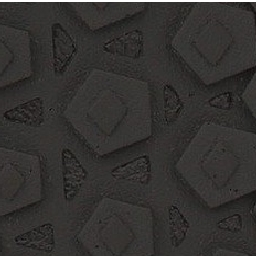
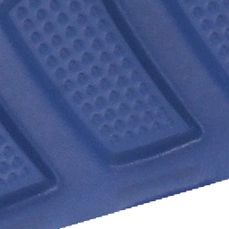
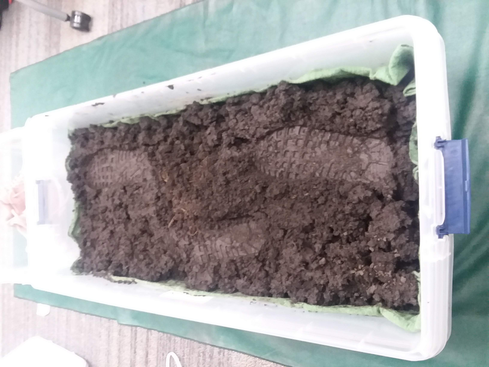
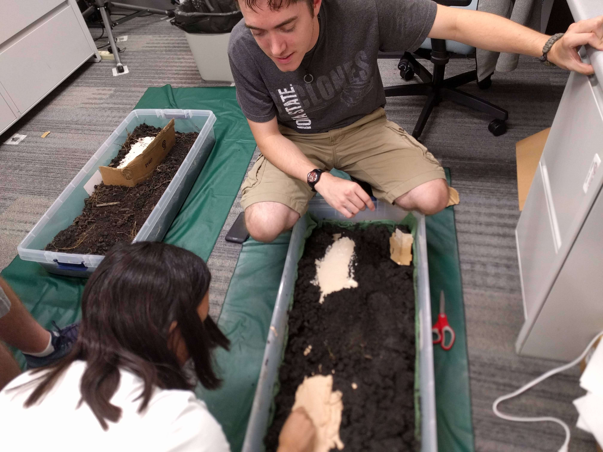
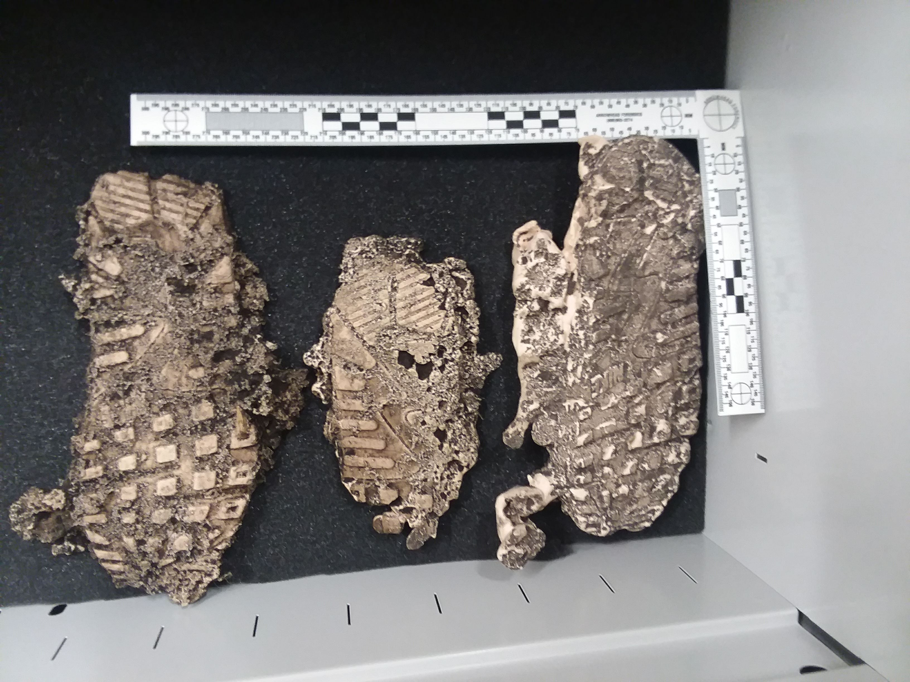

class: inverse
# About Slides

---
class: primary 
# New CSAFE slide template

We're now using [`xaringan`](https://github.com/yihui/xaringan)

What's changed: 

- New person slide: 

````
---
class: inverse
# Your Name
````

---
class: secondary

- New content slide with title: 

````
---
class: primary
# Title of slide 

Slide content
````

- New content slide without title: 

````
---
class: secondary

Slide content with no title on slide
````

---
class: inverse
# Sample User

---
class: primary
# Sample Slide

- Sample Table:

| Team     | Probability | 
| : ------ | :---------- | 
| France   | 29%         |  
| England  | 27%         | 
| Belgium  | 26%         | 
| Croatia  | 18%         | 


---
class: secondary

- If you are going to add an image, **create a directory** with your name within "images" folder. For example, "images/**guillermo**/sample_image.JPG"

 


---
class: inverse
# Susan

---
class: primary
# Feeding the Neural Network

.left-column[


]
.right-column[
- Processing annotated images in R (greater control)
- Adding multi-class labels to use for one-hot encoding
- Adding attributes (rounded, elongated) and textures as labels
- Resizing images to 256x256
- Splitting up images that are more than 384x384 into multiple images with the same labels
]

---
class:primary
# `bulletxtrctr`

- Writing tests for the new processing sub-package of what is now `bulletr`
    - Structure of output (e.g. function returns a data frame with the right number of columns)
    - Numerical correctness of output (function returns the "correct" result when given the same input)
- Goal: Make it easier to detect downstream effects of small changes to parameters in the processing algorithms


---
class: inverse
# Ben and Jenny

---
class:secondary

.center[]

---
class:secondary

.center[]

---
class:secondary

.center[]

---
class: inverse
# Jim

---
class: primary
# Data Collection (Shoes): Part 1 

* All Data collection -> compleated
* 19,200 files (Before replicates)
* Working with IT: Archiver 
* Under 100 errors
* Manual on procedures and subsaquent changes -> Done

---
class: primary
# Data Collection (Shoes): Part 2

* Continue with a subset of the 160 shoes
* Realistic Shoe outsole impressions
* Prints will be lifted/cast using realistic methods
   + Some older methods may carry over to this collection (ie. 3D scanning, 2D scanning)
* Currently in the development stage


---
class: inverse
# Kiegan  

---
class: primary
# Groove ID  

- Writing up paper for AFTE Journal
    - Submitting by end of summer  
- Getting slides ready for JSM  
    - On robust approach, logistic regression (if time!)  


